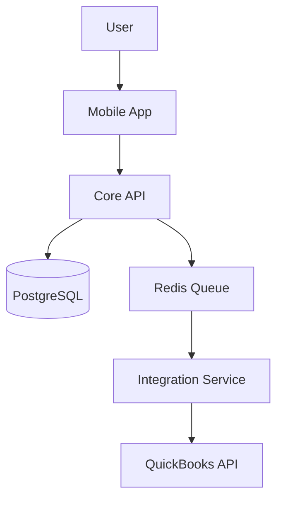
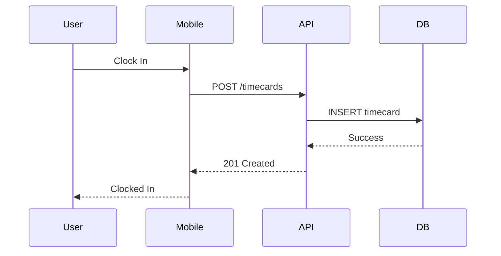
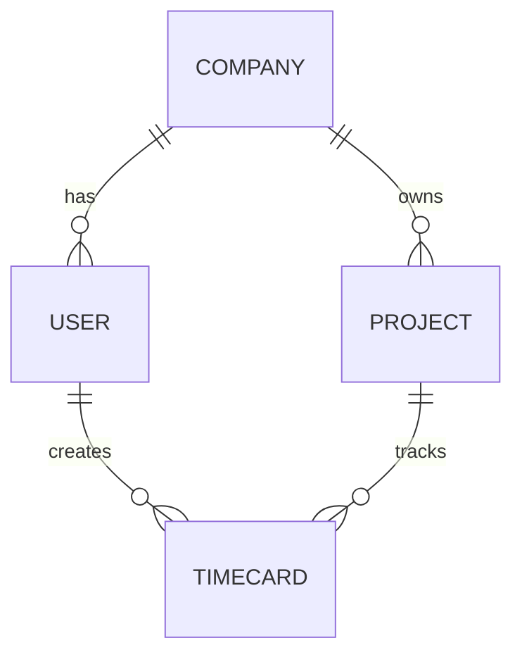

# CrewFlow Technical Architecture PRDs - Master Design
**Date**: 2025-10-22
**Status**: Design Approved
**Type**: Phase-Aligned Technical Architecture PRDs

---

## Executive Summary

This document defines the structure, content, and organization for creating 16 technical architecture Product Requirement Documents (PRDs) for the CrewFlow workforce management platform. The PRDs are organized by development track and implementation phase to enable parallel team development while maintaining alignment with the product roadmap.

**Key Design Decisions:**
- **Organization**: Development track-based (4 tracks × 4 phases = 16 PRDs)
- **Detail Level**: Hybrid approach (architecture overview + critical implementation details)
- **Constraints**: Technology stack decisions, scalability targets, integration requirements included
- **Alignment**: Phase-aligned with existing 5-phase roadmap from construction_app.md

---

## 1. PRD Structure Overview

### 1.1 Development Tracks

**Track 1: Core Platform**
- Authentication and authorization (RBAC)
- Data synchronization engine (offline-first)
- User and company management
- Event-driven architecture foundation
- API gateway and service orchestration

**Track 2: Field Operations**
- Mobile applications (iOS/Android)
- Time tracking and GPS services
- Kiosk mode and facial recognition
- Photo documentation
- Offline-first mobile architecture

**Track 3: Intelligence Layer**
- AI/ML services and model serving
- Analytics engine and dashboards
- Predictive optimization algorithms
- Crew chemistry and productivity scoring
- Data warehouse and reporting

**Track 4: External Integrations**
- Accounting system integrations (QuickBooks, Sage, Xero)
- Payroll system integrations (ADP)
- Integration health monitoring
- Data mapping and sync orchestration
- Fallback and retry mechanisms

### 1.2 Implementation Phases

Aligned with construction_app.md roadmap:

- **Phase 1: MVP** (Months 1-4) - Launch ready with 20 beta customers
- **Phase 2: Competitive Parity** (Months 5-7) - 100 customers, $40K MRR
- **Phase 3: AI Differentiation** (Months 8-10) - Clear competitive advantage
- **Phase 4: Workforce Marketplace** (Months 11-14) - Network effects, additional revenue

### 1.3 PRD Matrix

```
Development Track       | MVP | Competitive | AI Diff | Marketplace
-----------------------|-----|-------------|---------|------------
Core Platform          |  ✓  |      ✓      |    ✓    |     ✓
Field Operations       |  ✓  |      ✓      |    ✓    |     ✓
Intelligence Layer     |  ✓  |      ✓      |    ✓    |     ✓
External Integrations  |  ✓  |      ✓      |    ✓    |     ✓
```

**Total**: 16 Technical Architecture PRDs

---

## 2. Technology Stack Decisions

### 2.1 Core Platform Stack

**Backend Services:**
- **Runtime**: Node.js 18+ with TypeScript 5+
- **API Layer**: GraphQL (Apollo Server 4+) for client APIs + REST for integrations
- **Database**: PostgreSQL 15+ with PostGIS extension for geospatial queries
- **Caching**: Redis 7+ for sessions, rate limiting, and background job queues
- **Real-time**: WebSocket (Socket.io 4+) for live dashboard updates
- **Queue**: Bull (Redis-backed) for async jobs (payroll export, report generation)

**Authentication & Security:**
- JWT tokens with refresh token rotation (15min access, 7-day refresh)
- Biometric passthrough (mobile biometric → backend verification)
- Role-based access control (RBAC) with 5-tier hierarchy
- SOC 2 Type II compliance path from day 1
- TLS 1.3 for all connections
- Encryption at rest (AES-256)

**Infrastructure:**
- **Cloud Provider**: AWS (LOCKED)
- **Container Orchestration**: ECS Fargate (MVP), migration path to EKS (Phase 3+)
- **CDN**: CloudFront for mobile app assets and static content
- **Storage**: S3 for photos/documents with lifecycle policies
- **Monitoring**: CloudWatch + Sentry for error tracking
- **CI/CD**: GitHub Actions → automated testing → ECS deployment

### 2.2 Field Operations Stack

**Mobile Platform:**
- **Framework**: React Native 0.72+ with native modules for critical paths
- **State Management**: Redux Toolkit with Redux Persist
- **Offline Storage**: SQLite (local cache) + AsyncStorage (preferences)
- **GPS/Location**: React Native Geolocation + Geofencing (native modules)
- **Biometrics**: React Native Biometrics (Face ID, Touch ID, fingerprint)
- **Camera**: React Native Camera with automatic compression

**Native Modules (Performance Critical):**
- GPS tracking service (battery-optimized background location)
- Facial recognition for kiosk mode (TensorFlow Lite on-device)
- Offline sync queue management
- Cryptographic operations for data security

**Battery Optimization:**
- Adaptive GPS polling (1min → 5min → 15min based on movement detection)
- Location tracking only during scheduled work hours
- Geofence triggers to reduce active GPS usage
- Background task limits (iOS/Android platform compliance)

### 2.3 Intelligence Layer Stack

**AI/ML Services:**
- **ML Framework**: Python 3.11+ with TensorFlow 2.x and scikit-learn
- **Model Serving**: TensorFlow Serving for production inference
- **On-Device ML**: TensorFlow Lite (facial recognition on kiosk tablets)
- **LLM Integration**: OpenAI API (GPT-4) for smart suggestions and cost code matching
- **Analytics Engine**: Apache Superset + custom React dashboards
- **Data Warehouse**: PostgreSQL with TimescaleDB extension for time-series analytics

**ML Operations:**
- Feature store: Feast or custom Redis-backed solution
- A/B testing framework for model improvements
- Model versioning and rollback capability
- Privacy-preserving analytics (no PII in training data)
- Explainable AI (show reasoning for recommendations)

### 2.4 External Integrations Stack

**Integration Layer:**
- **Service Architecture**: Dedicated microservice (Node.js/TypeScript)
- **Queue System**: Bull/Redis for retry logic and scheduling
- **API Clients**: Custom wrappers with circuit breakers for each integration
- **Data Mapping**: JSON-based mapping configs stored in PostgreSQL
- **Monitoring**: Health check dashboard with real-time status
- **Fallback**: Automated CSV/Excel export if API connectivity fails

**Guaranteed Integrations (API Versions):**

**Phase 1 MVP:**
- QuickBooks Online: OAuth 2.0, API v3, webhooks for bidirectional sync

**Phase 2 Competitive Parity:**
- Sage 300 Construction: REST API v1.0, API key authentication
- Xero: OAuth 2.0, Accounting API v2
- ADP Workforce Now: OAuth 2.0, Worker API v2

---

## 3. Scalability Targets by Phase

### 3.1 Phase 1: MVP (20-50 customers)

**Core Platform:**
- 1,000 concurrent users
- 50,000 time entries/day
- 10 requests/second average
- 99% uptime SLA
- Single region (us-east-1)

**Field Operations:**
- 500 mobile devices
- <3 second app launch time
- <5 second clock-in action completion
- 95% offline operation success rate
- 50MB average app size

**Intelligence Layer:**
- Basic reporting only (no ML inference)
- 5 second max dashboard load time
- Support 20 concurrent report generations

**External Integrations:**
- 50 concurrent integration jobs
- 10,000 records/hour sync capacity
- Support 20 customers with active integrations

### 3.2 Phase 2: Competitive Parity (100 customers)

**Core Platform:**
- 5,000 concurrent users
- 250,000 time entries/day
- 50 requests/second
- 99.5% uptime SLA
- Multi-region capability (us-east-1, us-west-2)

**Field Operations:**
- 2,500 mobile devices
- <2 second app launch
- <3 second clock-in
- 98% offline success rate
- Photo compression to 500KB max

**Intelligence Layer:**
- Predictive analytics foundation
- 10 second max for complex reports
- Support 100 concurrent dashboard users

**External Integrations:**
- 200 concurrent jobs
- 50,000 records/hour sync capacity
- 100 customers, 4 integrations each

### 3.3 Phase 3: AI Differentiation (200+ customers)

**Core Platform:**
- 10,000 concurrent users
- 500,000 time entries/day
- 100 requests/second
- 99.9% uptime SLA
- Horizontal scaling tested and validated

**Field Operations:**
- 5,000+ mobile devices
- <2 second app launch (maintained)
- <2 second clock-in
- 99% offline success rate
- Voice command support

**Intelligence Layer:**
- 50 ML inference requests/second
- <500ms prediction latency
- Model retraining: weekly batch jobs
- Support 10,000 user profiles for ML

**External Integrations:**
- 500 concurrent jobs
- 100,000 records/hour
- 200+ customers with multiple integrations

### 3.4 Phase 4: Workforce Marketplace (300+ customers)

**Core Platform:**
- 15,000 concurrent users
- 750,000 time entries/day
- 150 requests/second
- 99.9% uptime maintained

**Field Operations:**
- 7,500+ mobile devices
- Maintain performance targets
- Add marketplace worker profiles

**Intelligence Layer:**
- Worker-contractor matching algorithms
- Demand forecasting for marketplace liquidity
- Reputation scoring system
- Fraud detection

**External Integrations:**
- Payment processing integration (Stripe)
- Background check APIs
- Maintain scaling targets from Phase 3

---

## 4. Integration Requirements

### 4.1 QuickBooks Online Integration (Phase 1 MVP)

**API Details:**
- **Version**: QuickBooks Online API v3
- **Authentication**: OAuth 2.0
- **Rate Limits**: 500 requests/minute per company
- **Webhooks**: Supported for bidirectional sync

**Entities & Mapping:**
```
CrewFlow Entity          → QuickBooks Entity
--------------------------------------------------
Employee                 → Employee
Timecard                 → TimeActivity
Project                  → Customer
Cost Code                → ServiceItem (or Class)
Company                  → Company (OAuth scope)
```

**API Contract Example:**
```typescript
interface TimecardSyncRequest {
  timecardId: string;
  employeeId: string;        // Maps to QBO Employee.Id
  date: string;              // ISO 8601 format
  hours: number;             // Decimal hours
  customerId: string;        // Maps to QBO Customer (project)
  serviceItemId: string;     // Maps to QBO ServiceItem (cost code)
  billableStatus: 'Billable' | 'NotBillable';
  description?: string;      // Optional notes
}

interface SyncResponse {
  success: boolean;
  qboTimeActivityId?: string;
  errors?: IntegrationError[];
  retryable: boolean;
  syncTimestamp: string;
}
```

**Sync Strategy:**
- **Frequency**: Every 15 minutes for approved timecards
- **Direction**: Primarily CrewFlow → QuickBooks (with employee sync back)
- **Conflict Resolution**: QuickBooks is source of truth for employee data
- **Retry Logic**: Exponential backoff (1min → 5min → 15min → 1hr → 4hr)

### 4.2 Integration Health Monitoring

**Health Check System:**
- Automated daily health checks for all active integrations
- Real-time sync status dashboard
- Alert thresholds:
  - Warning: Sync latency > 30 minutes
  - Critical: No successful sync in 2 hours
  - Emergency: API authentication failure

**Circuit Breaker Pattern:**
- After 5 consecutive failures → pause for 30 minutes
- After 24 hours of retries → move to dead letter queue
- Admin notification for all circuit breaker triggers

**48-Hour Integration Guarantee Implementation:**
1. Pre-built sandbox environments for testing
2. Visual data mapping wizard
3. Test mode with dry-run validation
4. Video call support with integration specialist
5. Automated setup time tracking and SLA monitoring

---

## 5. Cross-Cutting Concerns

### 5.1 Core Data Models

Shared entities across all development tracks:

```typescript
// User Management
interface User {
  id: string;
  email: string;
  role: 'field_worker' | 'foreman' | 'project_manager' | 'admin' | 'owner';
  permissions: string[];
  companyId: string;
  biometricEnabled: boolean;
  certifications: Certification[];
  devices: Device[];
  createdAt: Date;
  updatedAt: Date;
}

// Company/Tenant
interface Company {
  id: string;
  name: string;
  settings: CompanySettings;
  subscriptionTier: string;
  integrations: Integration[];
  costCodes: CostCode[];
  projects: string[]; // Project IDs
  employeeCount: number;
  createdAt: Date;
}

// Time Tracking
interface Timecard {
  id: string;
  workerId: string;
  projectId: string;
  costCodeId: string;
  clockIn: Date;
  clockOut?: Date;
  breaks: Break[];
  gpsCoordinates: GeoLocation[];
  photos: Photo[];
  status: 'draft' | 'submitted' | 'approved' | 'rejected' | 'synced';
  approvedBy?: string;
  syncStatus: SyncStatus;
  notes?: string;
  createdAt: Date;
  updatedAt: Date;
}

// Project Management
interface Project {
  id: string;
  name: string;
  companyId: string;
  budget: number;
  estimatedHours: number;
  actualHours: number;
  crews: Crew[];
  status: 'active' | 'completed' | 'on_hold';
  profitability: number;
  location: GeoLocation;
  geofence: GeofenceConfig;
  createdAt: Date;
}
```

### 5.2 Event-Driven Architecture

**Event Bus Pattern:**
- Core Platform publishes events to central event bus
- Other tracks subscribe to relevant events
- Enables loose coupling between services

**Key Events:**
```typescript
// Core Platform Events
'user.created'
'user.updated'
'user.deleted'
'timecard.submitted'
'timecard.approved'
'timecard.rejected'
'project.created'
'project.updated'
'company.settings.changed'

// Field Operations Events
'timecard.submitted'
'gps.location.updated'
'photo.uploaded'
'offline.sync.completed'

// Intelligence Layer Events
'analytics.report.generated'
'ml.prediction.completed'
'crew.score.updated'

// External Integrations Events
'integration.sync.started'
'integration.sync.completed'
'integration.sync.failed'
'integration.health.degraded'
```

**Event Flow Example:**
1. Field worker submits timecard → Field Operations publishes `timecard.submitted`
2. Core Platform receives event → validates → publishes `timecard.approved`
3. External Integrations receives `timecard.approved` → queues QuickBooks sync
4. Intelligence Layer receives `timecard.approved` → updates analytics
5. External Integrations completes sync → publishes `integration.sync.completed`

### 5.3 Offline-First Sync Strategy

**Architecture Pattern:**
- Event sourcing approach for all data changes
- Local SQLite database maintains full event log
- Sync service processes events in chronological order
- Conflict resolution using last-write-wins with manual override

**Sync Protocol:**
```typescript
interface SyncRequest {
  deviceId: string;
  lastSyncTimestamp: Date;
  events: LocalEvent[];
  schemaVersion: string;
}

interface SyncResponse {
  serverEvents: ServerEvent[];
  conflicts: ConflictEvent[];
  newSyncTimestamp: Date;
  acknowledgement: string[];
}

interface ConflictEvent {
  eventId: string;
  localVersion: any;
  serverVersion: any;
  resolutionStrategy: 'manual' | 'server_wins' | 'client_wins';
}
```

**Sync Flow:**
1. Mobile app collects local changes as events
2. Every 5 minutes (when connected), initiate sync
3. Send local events to server with last sync timestamp
4. Server responds with new server events and any conflicts
5. Mobile app processes server events and updates local DB
6. If conflicts exist, show manual resolution UI

**Offline Capacity:**
- 30 days of local storage (SQLite)
- Automatic cleanup of synced events older than 30 days
- Warning when local storage reaches 80% capacity
- Emergency sync compression for large backlogs

### 5.4 Security Architecture

**Authentication Flow:**
1. User enters credentials on mobile/web
2. Backend validates credentials
3. Issues JWT access token (15 min expiry) + refresh token (7 day expiry)
4. Mobile stores tokens in secure keychain/keystore
5. Access token used for all API requests
6. Auto-refresh using refresh token before expiry

**Biometric Authentication:**
1. User enables biometric login (one-time setup)
2. Backend generates device-specific encryption key
3. Credentials encrypted with key, stored in secure enclave
4. Biometric unlock → decrypt credentials → automatic login
5. Backend validates device ID + credentials

**Role-Based Access Control (RBAC):**
```typescript
interface Permission {
  resource: string;  // e.g., 'timecards', 'projects', 'reports'
  action: string;    // e.g., 'read', 'write', 'approve', 'delete'
  scope: string;     // e.g., 'own', 'team', 'company'
}

const rolePermissions = {
  field_worker: [
    { resource: 'timecards', action: 'read', scope: 'own' },
    { resource: 'timecards', action: 'write', scope: 'own' },
    { resource: 'schedule', action: 'read', scope: 'own' }
  ],
  foreman: [
    // All field_worker permissions plus:
    { resource: 'timecards', action: 'approve', scope: 'team' },
    { resource: 'projects', action: 'read', scope: 'team' },
    { resource: 'reports', action: 'write', scope: 'team' }
  ],
  project_manager: [
    // All foreman permissions plus:
    { resource: 'projects', action: 'write', scope: 'company' },
    { resource: 'crews', action: 'assign', scope: 'company' },
    { resource: 'analytics', action: 'read', scope: 'company' }
  ],
  admin: [
    // Back-office focused permissions
    { resource: 'payroll', action: 'export', scope: 'company' },
    { resource: 'integrations', action: 'manage', scope: 'company' },
    { resource: 'users', action: 'manage', scope: 'company' }
  ],
  owner: [
    // Full access to everything
    { resource: '*', action: '*', scope: 'company' }
  ]
};
```

---

## 6. Development Sequencing & Dependencies

### 6.1 Phase 1 MVP Critical Path

**Weeks 1-4: Foundation**
- **Core Platform**: (MUST START FIRST)
  - Auth service (JWT, RBAC)
  - User/company management
  - Basic REST/GraphQL API
  - Database schema setup
- **External Integrations**: (Parallel)
  - QuickBooks API research
  - Sandbox environment setup
  - OAuth flow implementation

**Weeks 5-8: Core Features**
- **Field Operations**: (Depends on Core Platform auth)
  - Mobile app shell (React Native)
  - Login and biometric setup
  - Basic time clock UI
- **Core Platform**: (Parallel)
  - Offline sync engine
  - Event bus implementation
  - WebSocket for real-time updates
- **Intelligence Layer**: (Parallel)
  - Database schema for analytics
  - Basic dashboard framework

**Weeks 9-12: Feature Completion**
- **Field Operations**:
  - GPS and geofencing
  - Photo capture and compression
  - Timecard submission flow
  - Offline mode implementation
- **External Integrations**:
  - QuickBooks sync implementation
  - Data mapping wizard
  - Retry logic and error handling
- **Intelligence Layer**:
  - Basic reports (hours, costs)
  - Project status dashboard

**Weeks 13-16: Polish & Beta Launch**
- **All Tracks**:
  - Bug fixes and performance optimization
  - Security audit and penetration testing
  - Load testing (target: 50 customers)
- **Core Platform**:
  - Admin panel for user management
  - Company settings configuration
- **External Integrations**:
  - Integration health monitoring dashboard
  - Automated health checks
- **Field Operations**:
  - Offline sync hardening
  - Battery optimization testing

### 6.2 Cross-Track Dependencies

```
Core Platform (Foundation Layer)
    ↓
    ├─→ Field Operations
    │     - Requires: Auth service, sync API, user/company data
    │     - Provides: Timecard events, GPS data, photos
    │
    ├─→ External Integrations
    │     - Requires: Data models, event bus, admin API
    │     - Provides: Sync status events, integration health data
    │
    └─→ Intelligence Layer
          - Requires: Event streams, data warehouse access
          - Provides: Analytics, reports, insights

Field Operations
    ↓
    └─→ Intelligence Layer
          - Requires: Timecard data, GPS data, production metrics
          - Provides: Mobile-optimized reports

External Integrations
    ↓
    └─→ Intelligence Layer
          - Requires: Sync status for monitoring
          - Provides: Integration health analytics
```

### 6.3 Team Allocation

**Phase 1 MVP (Months 1-4):**
- Core Platform: 3 backend engineers
- Field Operations: 2 mobile engineers (1 iOS focus, 1 Android focus) + 1 UI/UX designer
- External Integrations: 2 integration specialists
- Intelligence Layer: 1 data engineer (analytics focus)
- DevOps/Infrastructure: 1 engineer (shared across tracks)
- **Total**: 10 engineers + 1 designer

**Phase 2-3 Scale-Up (Months 5-10):**
- Add 1 ML engineer to Intelligence Layer
- Add 1 backend engineer to Core Platform
- Add 1 integration specialist
- **Total**: 13 engineers + 1 designer

**Phase 4 Marketplace (Months 11-14):**
- Add 1 backend engineer for marketplace
- Add 1 ML engineer for matching algorithms
- **Total**: 15 engineers + 1 designer

---

## 7. PRD Template Structure

Each of the 16 PRDs will follow this standardized structure:

```markdown
# [Track Name] - [Phase Name] Technical PRD

## Document Metadata
- **Track**: [Core Platform | Field Operations | Intelligence Layer | External Integrations]
- **Phase**: [MVP | Competitive Parity | AI Differentiation | Marketplace]
- **Phase Timeline**: [Month range]
- **Version**: 1.0
- **Last Updated**: [Date]
- **Authors**: [Names]
- **Status**: [Draft | In Review | Approved | In Development | Complete]

## 1. Executive Summary
- Phase objectives (what we're building and why)
- Key deliverables (specific features/systems)
- Success criteria (measurable outcomes)
- Timeline and milestones
- Dependencies on other tracks/phases

## 2. Architecture Overview
- System context diagram (how this fits in overall system)
- Component architecture diagram
- Data flow diagrams (request/response flows)
- Technology stack for this phase (locked decisions marked)
- Changes from previous phase (if applicable)

## 3. Technical Requirements

### 3.1 Functional Requirements
- User stories and use cases
- Feature specifications
- API endpoints required
- Data model requirements

### 3.2 Non-Functional Requirements
- Performance targets (latency, throughput)
- Scalability targets (from Section 3)
- Security requirements
- Reliability/availability targets
- Compliance requirements

### 3.3 Phase-Specific Scalability Targets
- Concurrent users
- Data volume
- Request rate
- Storage requirements
- Geographic distribution

### 3.4 Dependencies
- Prerequisites from other tracks
- External service dependencies
- Infrastructure requirements

## 4. API Specifications

### 4.1 REST Endpoints
```
GET /api/v1/resource
POST /api/v1/resource
PUT /api/v1/resource/:id
DELETE /api/v1/resource/:id
```

### 4.2 GraphQL Schema
```graphql
type Resource {
  id: ID!
  field: String!
}

type Query {
  resource(id: ID!): Resource
}
```

### 4.3 Request/Response Schemas
```typescript
interface Request {
  // TypeScript interface
}

interface Response {
  // TypeScript interface
}
```

### 4.4 Authentication & Authorization
- Auth requirements per endpoint
- Required permissions/roles
- Token handling

### 4.5 Error Handling
- Error codes and messages
- Retry strategies
- Fallback behaviors

## 5. Data Models

### 5.1 Database Schemas
```sql
CREATE TABLE resource (
  id UUID PRIMARY KEY,
  field VARCHAR(255),
  created_at TIMESTAMP DEFAULT NOW()
);
```

### 5.2 Entity Relationships
- ER diagrams
- Foreign key constraints
- Indexes required

### 5.3 Migration Strategy
- Migration scripts approach
- Rollback procedures
- Data seeding requirements

### 5.4 Data Retention Policies
- Archive schedules
- Deletion policies
- Backup requirements

## 6. Integration Contracts

### 6.1 External API Requirements
- Third-party APIs used
- API versions locked
- Authentication methods
- Rate limits and quotas

### 6.2 Data Mapping Specifications
- Source → destination field mappings
- Transformation rules
- Validation requirements

### 6.3 Sync Strategies
- Sync frequency
- Bidirectional vs unidirectional
- Conflict resolution rules
- Delta sync vs full sync

### 6.4 Fallback Mechanisms
- What happens when integration fails
- Manual export/import procedures
- User notification strategies

## 7. Critical Implementation Details

### 7.1 Complex Algorithms
- Pseudocode or detailed descriptions
- Examples: offline sync, ML models, matching algorithms
- Performance considerations

### 7.2 Performance Optimization Strategies
- Caching strategies
- Database query optimization
- Lazy loading approaches
- Background job processing

### 7.3 Edge Cases & Error Handling
- Known edge cases and solutions
- Error recovery procedures
- Graceful degradation strategies

### 7.4 Security Considerations
- Data encryption (in-transit, at-rest)
- Authentication flows
- Authorization checks
- Audit logging requirements
- PII handling

## 8. Testing Strategy

### 8.1 Unit Testing
- Coverage targets (80%+)
- Critical paths requiring tests
- Mocking strategies

### 8.2 Integration Testing
- Test scenarios
- External service mocking
- Database test fixtures

### 8.3 Performance Testing
- Load test scenarios
- Benchmarks to achieve
- Tools and frameworks

### 8.4 UAT Criteria
- User acceptance test cases
- Beta testing requirements
- Success metrics

## 9. Deployment & Operations

### 9.1 Infrastructure Requirements
- AWS services needed
- Resource sizing (CPU, memory, storage)
- Network configuration
- Regions and availability zones

### 9.2 Deployment Process
- CI/CD pipeline steps
- Blue-green deployment strategy
- Database migration execution
- Rollback procedures

### 9.3 Monitoring & Alerting
- Key metrics to track
- Alert thresholds
- Dashboards required
- Log aggregation

### 9.4 Operational Runbooks
- Common operational tasks
- Troubleshooting guides
- Incident response procedures

## 10. Success Metrics

### 10.1 Technical KPIs
- API latency (p50, p95, p99)
- Error rates
- Uptime percentage
- Database query performance

### 10.2 Business KPIs
- User adoption rates
- Feature usage metrics
- Customer satisfaction (NPS)
- Support ticket volume

### 10.3 Quality Metrics
- Test coverage percentage
- Bug escape rate
- Mean time to resolution (MTTR)
- Deployment frequency

## 11. Risks & Mitigations

### 11.1 Technical Risks
- Technology limitations
- Performance bottlenecks
- Integration failures
- Mitigation strategies for each

### 11.2 Dependency Risks
- Delays in prerequisite features
- Third-party API changes
- Resource constraints
- Mitigation approaches

### 11.3 Timeline Risks
- Complexity underestimation
- Scope creep
- Resource availability
- Contingency plans

## 12. Open Questions
- Unresolved technical decisions
- Items requiring stakeholder input
- Trade-offs requiring product decision
- Research spikes needed

## Appendix

### A. Glossary
- Technical terms and acronyms

### B. References
- Related documents
- External documentation links
- Research materials

### C. Revision History
- Version history
- Change log
```

---

## 8. PRD Naming Convention

**Format**: `PRD-[TrackCode]-[PhaseNumber]-[PhaseName].md`

**Track Codes:**
- CP = Core Platform
- FO = Field Operations
- IL = Intelligence Layer
- EI = External Integrations

**Phase Numbers:**
- 01 = MVP
- 02 = Competitive Parity
- 03 = AI Differentiation
- 04 = Marketplace

**Examples:**
```
PRD-CP-01-MVP.md
PRD-CP-02-CompetitiveParity.md
PRD-CP-03-AIDifferentiation.md
PRD-CP-04-Marketplace.md

PRD-FO-01-MVP.md
PRD-FO-02-CompetitiveParity.md
PRD-FO-03-AIDifferentiation.md
PRD-FO-04-Marketplace.md

PRD-IL-01-MVP.md
PRD-IL-02-CompetitiveParity.md
PRD-IL-03-AIDifferentiation.md
PRD-IL-04-Marketplace.md

PRD-EI-01-MVP.md
PRD-EI-02-CompetitiveParity.md
PRD-EI-03-AIDifferentiation.md
PRD-EI-04-Marketplace.md
```

**File Organization:**
```
docs/
└── prds/
    ├── core-platform/
    │   ├── PRD-CP-01-MVP.md
    │   ├── PRD-CP-02-CompetitiveParity.md
    │   ├── PRD-CP-03-AIDifferentiation.md
    │   └── PRD-CP-04-Marketplace.md
    ├── field-operations/
    │   ├── PRD-FO-01-MVP.md
    │   ├── PRD-FO-02-CompetitiveParity.md
    │   ├── PRD-FO-03-AIDifferentiation.md
    │   └── PRD-FO-04-Marketplace.md
    ├── intelligence-layer/
    │   ├── PRD-IL-01-MVP.md
    │   ├── PRD-IL-02-CompetitiveParity.md
    │   ├── PRD-IL-03-AIDifferentiation.md
    │   └── PRD-IL-04-Marketplace.md
    └── external-integrations/
        ├── PRD-EI-01-MVP.md
        ├── PRD-EI-02-CompetitiveParity.md
        ├── PRD-EI-03-AIDifferentiation.md
        └── PRD-EI-04-Marketplace.md
```

---

## 9. Content Standards

### 9.1 Detail Level Guidelines

**Hybrid Approach** (Architecture + Critical Implementation):

**Include HIGH detail for:**
- Complex algorithms (offline sync, conflict resolution, ML models)
- Security-critical flows (authentication, authorization, encryption)
- Performance-sensitive operations (GPS tracking, real-time sync)
- Integration contracts (exact API versions, field mappings)
- Data models (complete schemas with indexes and constraints)

**Include MEDIUM detail for:**
- Standard CRUD operations (summarize patterns, don't repeat)
- UI flows (high-level description, mockups separate)
- Testing approaches (strategy and key scenarios, not every test case)
- Deployment procedures (checklist and key steps)

**Include LOW detail for:**
- Well-established patterns (e.g., "standard JWT refresh flow")
- Vendor documentation (link to official docs instead of duplicating)
- Implementation minutiae (variable names, code style - covered in style guide)

### 9.2 Technology Decision Marking

Use explicit markers for technology decisions:

**LOCKED** - Decision is final, do not change without escalation
```
Database: PostgreSQL 15+ [LOCKED]
```

**RECOMMENDED** - Strong preference, but alternatives acceptable with justification
```
Mobile Framework: React Native [RECOMMENDED]
(Alternative: Native Swift/Kotlin with shared backend)
```

**TBD** - Decision deferred, options provided
```
Analytics Engine: [TBD]
Options:
1. Apache Superset (open source, self-hosted)
2. Metabase (simpler, good for MVP)
3. Custom React dashboards (full control)
Decision by: End of Week 2
```

### 9.3 Diagram Requirements

All PRDs must include diagrams using Mermaid syntax:

**System Context Diagram** (required):


**Sequence Diagrams** (for critical flows):


**Data Model ER Diagrams** (for complex relationships):


### 9.4 Code Example Standards

Use TypeScript for all API contract examples:

```typescript
// Good: Complete interface with JSDoc comments
/**
 * Request to clock in a worker at a job site
 */
interface ClockInRequest {
  /** Worker's unique ID */
  workerId: string;

  /** Project ID where work is performed */
  projectId: string;

  /** Cost code for the work activity */
  costCodeId: string;

  /** GPS coordinates of clock-in location */
  location: GeoLocation;

  /** Optional photo URL (required for some projects) */
  photoUrl?: string;

  /** Client timestamp of clock-in (ISO 8601) */
  timestamp: string;
}
```

Use pseudocode for algorithms:

```
FUNCTION resolveConflict(localEvent, serverEvent):
  IF localEvent.timestamp > serverEvent.timestamp:
    RETURN 'client_wins'
  ELSE IF serverEvent.timestamp > localEvent.timestamp:
    RETURN 'server_wins'
  ELSE:
    // Same timestamp - manual resolution required
    RETURN 'manual'
  END IF
END FUNCTION
```

---

## 10. AI Features Breakdown by Phase

### Phase 1: MVP - No AI/ML (Rule-Based Only)

**Intelligence Layer Focus:**
- Basic reporting and dashboards
- Simple pattern detection (duplicate entries, unusual hours)
- Historical data visualization
- **No machine learning models**

**Smart Duplication (MVP):**
- Simple "copy yesterday" button
- No prediction, just duplication
- Manual crew templates (save and reuse)

### Phase 2: Competitive Parity - Data Collection

**Intelligence Layer Focus:**
- Production tracking metrics
- Budget vs. actual trending
- Overtime alerts (threshold-based rules)
- **Begin collecting training data for future ML**

**Smart Duplication (Enhanced):**
- "Copy last Monday" (day-of-week matching)
- Recent history quick-select
- Still rule-based, no ML

### Phase 3: AI Differentiation - Core ML Features

**Crew Chemistry Analyzer:**
- Algorithm: Collaborative filtering
- Input: Historical productivity data when workers paired
- Output: Productivity multiplier for each worker pair
- Training: Requires 3+ months of timecard data
- Retraining: Weekly batch job

**Smart Scheduling Assistant:**
- Algorithm: LSTM time-series forecasting
- Input: Historical labor demand by project type, day of week, season
- Output: Predicted labor needs for next 2 weeks
- Training: Requires 6+ months of project data
- Retraining: Weekly

**AI Cost Code Suggestions:**
- Algorithm: NLP (GPT-4 API) + historical pattern matching
- Input: Project name, description, recent cost codes used
- Output: Top 3 cost code suggestions with confidence scores
- Training: Fine-tuning on customer's cost code history

**Productivity Scoring:**
- Algorithm: XGBoost gradient boosting
- Input: Hours logged, production quantities, project complexity, crew composition
- Output: Efficiency score (% of estimated productivity)
- Training: Requires 3+ months of production data
- Retraining: Weekly

**Smart Duplication (AI-Powered):**
- Algorithm: Pattern recognition (scikit-learn)
- Input: Last 7 days of timecards, day of week, current location
- Output: Predicted timecard with confidence score
- Display: "You usually work at Miller Residential on Mondays (95% confidence)"

**Model Specifications:**
```python
# Crew Chemistry Model
Model: CollaborativeFiltering
Framework: scikit-learn (Surprise library)
Algorithm: SVD (Singular Value Decomposition)
Input Features:
  - worker_id_1
  - worker_id_2
  - project_id
  - task_type
Target: productivity_score (0.0 - 2.0, where 1.0 = baseline)
Training Data: Minimum 1000 paired work sessions

# Smart Scheduling Model
Model: LSTMForecaster
Framework: TensorFlow/Keras
Layers:
  - LSTM(64 units)
  - Dropout(0.2)
  - LSTM(32 units)
  - Dense(1)
Input Features (time series):
  - daily_labor_hours (7-day window)
  - project_type (one-hot encoded)
  - day_of_week (one-hot)
  - weather_forecast
Target: labor_hours_needed (next 14 days)
Training Data: Minimum 6 months of historical data
```

### Phase 4: Marketplace - Matching Intelligence

**Worker-Contractor Matching:**
- Algorithm: Hybrid (collaborative filtering + skill embeddings)
- Input: Worker skills, certifications, ratings, location, availability + Contractor job requirements, past hiring patterns
- Output: Ranked list of worker matches with fit scores
- Training: Cold start problem - use content-based initially, transition to collaborative

**Demand Forecasting:**
- Algorithm: Time-series forecasting (Prophet or LSTM)
- Input: Historical marketplace activity, seasonality, regional construction trends
- Output: Predicted marketplace supply/demand balance
- Purpose: Proactive worker recruitment in undersupplied regions

**Reputation Scoring:**
- Algorithm: Bayesian rating system (Wilson score interval)
- Input: Star ratings, completion rate, dispute rate, time on platform
- Output: Reputation score (0-100) with confidence interval
- Anti-gaming: Decay old ratings, weight verified jobs higher

**Fraud Detection:**
- Algorithm: Anomaly detection (Isolation Forest)
- Input: Account activity patterns, device fingerprints, payment patterns
- Output: Fraud risk score (0-1)
- Actions: Flag for manual review if score > 0.7

---

## 11. Development Track Priorities

### 11.1 Core Platform (Highest Priority - Foundation)

**Phase 1 Must-Haves:**
- Authentication service (JWT, biometrics)
- User/company management with RBAC
- REST + GraphQL API gateway
- PostgreSQL database with schemas
- Offline sync engine (event sourcing)
- Redis for caching and queuing
- WebSocket for real-time updates

**Why Critical:**
All other tracks depend on Core Platform APIs and data models. No other track can proceed to production without Core Platform stability.

**Success Criteria:**
- 99% uptime during beta
- <200ms API response time (p95)
- Zero data loss during offline sync
- Support 50 companies with 20-50 employees each

### 11.2 Field Operations (High Priority - User-Facing)

**Phase 1 Must-Haves:**
- React Native mobile app (iOS + Android)
- Clock in/out with GPS verification
- Photo capture and upload
- Timecard submission and approval flow
- Offline mode with 30-day capacity
- Battery-optimized GPS tracking

**Why Critical:**
This is the primary user interface for 80% of users (field workers and foremen). User experience here determines adoption success.

**Success Criteria:**
- <3 second clock-in time
- 95% offline operation success
- 4.5+ app store rating
- <5% support tickets related to mobile app

### 11.3 External Integrations (High Priority - Business Critical)

**Phase 1 Must-Haves:**
- QuickBooks Online integration (bidirectional sync)
- Data mapping wizard
- Integration health monitoring
- Automated retry logic with circuit breaker
- Manual CSV export fallback

**Why Critical:**
Integration failure is a top reason customers churn (from market research). The 48-hour guarantee is a key differentiator.

**Success Criteria:**
- 98%+ successful sync rate
- Average integration setup time <2 hours
- Zero data corruption incidents
- 100% of beta customers using QuickBooks sync

### 11.4 Intelligence Layer (Medium Priority - Progressive Enhancement)

**Phase 1 Must-Haves:**
- Basic reporting dashboard (hours, costs, project status)
- PostgreSQL with TimescaleDB for time-series
- Real-time dashboard updates (WebSocket)
- Export reports to PDF/Excel

**Why Medium Priority:**
Analytics are important but not blocking for MVP. Customers can start using the product with basic reports.

**Success Criteria:**
- <5 second dashboard load time
- 10 pre-built reports available
- Custom report builder (drag-and-drop)
- 70%+ of users access reports weekly

---

## 12. Risk Assessment & Mitigation

### 12.1 Technical Risks

**Risk 1: Offline Sync Complexity**
- **Probability**: High
- **Impact**: Critical (core feature)
- **Mitigation**:
  - Use battle-tested event sourcing library (e.g., EventStore)
  - Extensive testing with poor network conditions
  - Conflict resolution UI ready from day 1
  - Limit offline capacity to 30 days to avoid edge cases

**Risk 2: GPS Battery Drain**
- **Probability**: Medium
- **Impact**: High (user dissatisfaction)
- **Mitigation**:
  - Adaptive polling (reduce frequency when stationary)
  - Geofence triggers to wake GPS
  - Only track during work hours
  - Extensive battery testing on real devices
  - User setting to disable GPS if needed

**Risk 3: Integration API Changes**
- **Probability**: Medium
- **Impact**: High (breaks customer workflows)
- **Mitigation**:
  - Version locking where possible (QuickBooks API v3)
  - Subscribe to vendor API change notifications
  - Automated daily health checks detect breakage
  - Fallback to CSV export if API fails
  - Dedicated integration team monitors for deprecations

**Risk 4: Scalability Bottlenecks**
- **Probability**: Medium
- **Impact**: Medium (growth limited)
- **Mitigation**:
  - Load testing at 2x target scale before each phase
  - Horizontal scaling architecture from day 1
  - Database query optimization (indexes, caching)
  - CDN for static assets
  - Auto-scaling policies in AWS

**Risk 5: ML Model Accuracy (Phase 3)**
- **Probability**: Medium
- **Impact**: Medium (feature underutilization)
- **Mitigation**:
  - Collect training data in Phase 1-2 (6+ months)
  - Start with rule-based MVP, transition to ML gradually
  - Always show explainable reasoning for predictions
  - Allow users to override AI suggestions
  - A/B testing to validate model improvements

### 12.2 Business Risks

**Risk 6: Low Mobile App Adoption**
- **Probability**: Medium
- **Impact**: Critical (product fails if workers don't use it)
- **Mitigation**:
  - Obsessive focus on UX simplicity (<5 taps for clock-in)
  - Zero-training onboarding (5-minute setup)
  - Foreman incentives for team adoption
  - In-person onboarding for beta customers
  - 15-minute support response for mobile issues

**Risk 7: Integration Setup Too Complex**
- **Probability**: Medium
- **Impact**: High (breaks 48-hour guarantee)
- **Mitigation**:
  - Pre-built sandbox for testing before production
  - Visual data mapping wizard (no JSON editing)
  - Video call support for all integration setups
  - Automated setup time tracking and alerts
  - Internal SLA: 24 hours (customer promise: 48 hours buffer)

**Risk 8: Marketplace Cold Start (Phase 4)**
- **Probability**: High
- **Impact**: Medium (marketplace has no liquidity)
- **Mitigation**:
  - Launch in single city first (e.g., Austin, TX)
  - Directly recruit 50 workers before contractor launch
  - Contractor subsidies for first 10 bookings
  - Partnerships with trade schools for worker pipeline
  - Fallback: Marketplace is add-on, not core product

### 12.3 Timeline Risks

**Risk 9: MVP Timeline Slip**
- **Probability**: High (software is always late)
- **Impact**: Medium (delays market entry)
- **Mitigation**:
  - Ruthless scope control (MVP means MINIMUM)
  - Weekly sprint reviews with stakeholders
  - Two-week buffer built into 16-week timeline
  - Parallel development where possible
  - Clear "must-have" vs "nice-to-have" feature classification

**Risk 10: Dependency Delays**
- **Probability**: Medium
- **Impact**: High (blocks dependent tracks)
- **Mitigation**:
  - Core Platform gets extra engineering resources
  - API contracts defined upfront (allow parallel mock development)
  - Daily standup across all tracks (surface blockers early)
  - Fallback plans (e.g., stub external integrations if needed)

---

## 13. Success Metrics Summary

### 13.1 Technical Metrics (All Phases)

| Metric | MVP Target | Phase 2 | Phase 3 | Phase 4 |
|--------|-----------|---------|---------|---------|
| API Latency (p95) | <200ms | <150ms | <100ms | <100ms |
| Uptime SLA | 99% | 99.5% | 99.9% | 99.9% |
| Mobile App Launch | <3s | <2s | <2s | <2s |
| Clock-In Time | <5s | <3s | <2s | <2s |
| Offline Success Rate | 95% | 98% | 99% | 99% |
| Integration Sync Success | 98% | 99% | 99.5% | 99.5% |
| Test Coverage | 80% | 85% | 90% | 90% |

### 13.2 Business Metrics

| Metric | MVP Target | Phase 2 | Phase 3 | Phase 4 |
|--------|-----------|---------|---------|---------|
| Paying Customers | 20 | 100 | 200 | 300 |
| MRR | $8K | $40K | $80K | $120K |
| Monthly Churn Rate | <10% | <5% | <3% | <2% |
| NPS Score | 40+ | 50+ | 60+ | 70+ |
| Support Response Time | <30min | <15min | <15min | <15min |
| Setup Time (Avg) | <4hr | <2hr | <1hr | <1hr |

### 13.3 User Adoption Metrics

| Metric | MVP Target | Phase 2 | Phase 3 | Phase 4 |
|--------|-----------|---------|---------|---------|
| Daily Active Users (DAU) | 60% | 70% | 75% | 80% |
| Mobile App Rating | 4.0+ | 4.3+ | 4.5+ | 4.7+ |
| Feature Adoption (Core) | 90% | 95% | 95% | 95% |
| Feature Adoption (Advanced) | N/A | 50% | 70% | 80% |
| Time to First Clock-In | <24hr | <12hr | <6hr | <1hr |

---

## 14. Next Steps

### 14.1 Design Approval

**Action**: Review this master design document with stakeholders
**Timeline**: Within 1 week
**Stakeholders**: Product, Engineering, Executive team

### 14.2 PRD Creation Plan

**Recommended Order** (based on dependencies):

**Week 1-2: Core Platform PRDs**
1. PRD-CP-01-MVP.md (highest priority - foundation)
2. PRD-CP-02-CompetitiveParity.md
3. PRD-CP-03-AIDifferentiation.md
4. PRD-CP-04-Marketplace.md

**Week 3-4: Field Operations PRDs**
5. PRD-FO-01-MVP.md (critical path for user adoption)
6. PRD-FO-02-CompetitiveParity.md
7. PRD-FO-03-AIDifferentiation.md
8. PRD-FO-04-Marketplace.md

**Week 5-6: External Integrations PRDs**
9. PRD-EI-01-MVP.md (business critical)
10. PRD-EI-02-CompetitiveParity.md
11. PRD-EI-03-AIDifferentiation.md
12. PRD-EI-04-Marketplace.md

**Week 7-8: Intelligence Layer PRDs**
13. PRD-IL-01-MVP.md (can develop in parallel)
14. PRD-IL-02-CompetitiveParity.md
15. PRD-IL-03-AIDifferentiation.md (most complex - ML features)
16. PRD-IL-04-Marketplace.md

### 14.3 Resource Allocation

**Writers**: 2-3 technical writers or senior engineers
**Review Cycle**: 2 days per PRD (write → review → revise)
**Total Effort**: ~8 weeks for all 16 PRDs (with 2 writers in parallel)

### 14.4 Tooling Setup

**Required Before Starting:**
- Create `docs/prds/` directory structure
- Set up Mermaid diagram rendering in documentation tool
- Create PRD template file (from Section 7)
- Set up review/approval workflow (e.g., GitHub PRs)

---

## 15. Appendix

### 15.1 Glossary

- **RBAC**: Role-Based Access Control
- **JWT**: JSON Web Token
- **SLA**: Service Level Agreement
- **MRR**: Monthly Recurring Revenue
- **NPS**: Net Promoter Score
- **DAU**: Daily Active Users
- **LSTM**: Long Short-Term Memory (neural network architecture)
- **SVD**: Singular Value Decomposition (matrix factorization technique)
- **TBD**: To Be Determined

### 15.2 References

- **Original Design Doc**: `construction_app.md` (990 lines)
- **Brainstorming Skill**: `/home/dat1k/.claude/plugins/cache/superpowers/skills/brainstorming/SKILL.md`
- **Project Instructions**: `.claude/CLAUDE.md`

### 15.3 Revision History

| Version | Date | Author | Changes |
|---------|------|--------|---------|
| 1.0 | 2025-10-22 | Claude | Initial design document created |

---

## Document Status

**Status**: ✅ Design Approved (Ready for PRD Creation)

**Next Action**: Begin creating individual PRDs starting with PRD-CP-01-MVP.md

**Questions/Feedback**: [Add contact information or review process]
