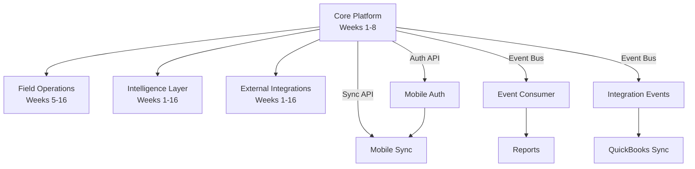

# Phase 1 MVP - Comprehensive Implementation Roadmap

> **For Claude:** This is a high-level roadmap spanning 4 months across 4 parallel tracks. For detailed bite-sized implementation plans, create separate documents for each major component.

**Based on:**
- `docs/prds/phase_1/PRD-CP-01-MVP.md` (Core Platform)
- `docs/prds/phase_1/PRD-FO-01-MVP.md` (Field Operations)
- `docs/prds/phase_1/PRD-IL-01-MVP.md` (Intelligence Layer)
- `docs/prds/phase_1/PRD-EI-01-MVP.md` (External Integrations)

**Timeline:** Months 1-4 (Weeks 1-16)

**Goal:** Deliver production-ready MVP supporting 20-50 beta customers with 20-75 employees each

---

## Current Status (2025-10-25)

### ✅ Completed
- **Phase 1 (Weeks 1-4):** Core Platform Foundation
  - Project setup with Node.js 18 + TypeScript 5
  - Docker Compose (PostgreSQL 15 + TimescaleDB, Redis 7)
  - Prisma ORM with complete database schema
  - JWT authentication service with RBAC
  - Auth REST API (`/api/v1/auth/*`)
  - Test suite (Jest + Supertest)

- **Phase 2 (Weeks 5-8):** User Management API
  - User CRUD REST API
  - Company CRUD REST API
  - Test coverage: 80%+

- **Phase 3 (Weeks 9-12):** Project & Timecard APIs (IN PROGRESS)
  - ✅ Projects REST API complete
  - 🔄 Timecards REST API (current task - tests written, implementation pending)

### 🔄 In Progress
- **Timecards API:** Tests written, implementation needed
- **Background processes:** Test failures indicate async operations not cleaned up

### ⏳ Not Started
- GraphQL API layer
- WebSocket server for real-time updates
- Sync engine for offline-first mobile support
- Event bus implementation
- Field Operations mobile app
- Intelligence Layer analytics
- External Integrations (QuickBooks)

---

## Track 1: Core Platform (Foundation)

### Dependencies
- **None** - This is the foundation track that all others depend on

### Week 1-4: Foundation ✅ COMPLETE
- [x] Infrastructure setup (Docker, PostgreSQL, Redis)
- [x] Authentication service (JWT + RBAC)
- [x] User/Company management
- [x] Basic REST API structure

### Week 5-8: API Layer (CURRENT - Week ~10)
- [x] REST API for Users, Companies
- [x] REST API for Projects
- [ ] **CURRENT TASK:** REST API for Timecards (tests written, needs implementation)
- [ ] REST API for Cost Codes
- [ ] GraphQL schema design
- [ ] GraphQL resolvers for basic queries
- [ ] WebSocket server setup
- [ ] Real-time event broadcasting

**Detailed Plans Available:**
- ✅ `docs/plans/2025-01-23-crewflow-mvp-implementation.md` (Foundation)
- ✅ `docs/plans/2025-10-23-phase2-api-layer.md` (Users/Companies)
- ✅ `docs/plans/2025-10-23-phase3-projects-timecards-api.md` (Projects/Timecards)

**Next Detailed Plan Needed:**
- `docs/plans/2025-10-25-phase3-graphql-websocket.md` (GraphQL + WebSocket)

### Week 9-12: Sync Engine & Event Bus
- [ ] Event sourcing architecture
- [ ] Event store implementation
- [ ] Sync API endpoint (`POST /api/v1/sync`)
- [ ] Conflict detection and resolution
- [ ] Event bus (Redis Pub/Sub)
- [ ] Event publishing for all mutations
- [ ] Integration tests for sync scenarios

**Detailed Plan Needed:**
- `docs/plans/2025-XX-XX-sync-engine-implementation.md`

### Week 13-16: Production Readiness
- [ ] Security audit
- [ ] Load testing (2x target: 2,000 concurrent users)
- [ ] Monitoring setup (CloudWatch, Sentry)
- [ ] Health check endpoints
- [ ] CI/CD pipeline refinement
- [ ] Database backup/restore procedures
- [ ] Documentation (API docs, runbooks)

**Detailed Plan Needed:**
- `docs/plans/2025-XX-XX-production-readiness.md`

---

## Track 2: Field Operations (Mobile Apps)

### Dependencies
- **BLOCKED until Core Platform Week 4:** Needs Auth API, user data models
- **BLOCKED until Core Platform Week 8:** Needs Sync API, timecard/project APIs

### Week 1-4: Foundation (BLOCKED - Core Platform dependency)
- [ ] React Native project setup (0.72+)
- [ ] Navigation structure (React Navigation 6)
- [ ] Design system and component library
- [ ] Authentication integration (biometric support)
- [ ] Basic UI screens (Login, Home, Clock In/Out)

**Detailed Plan Needed:**
- `docs/plans/2025-XX-XX-mobile-foundation.md`

### Week 5-8: Core Features
- [ ] Clock in/out UI and logic
- [ ] GPS integration (react-native-geolocation-service)
- [ ] Photo capture (react-native-vision-camera)
- [ ] Timecard list and detail views
- [ ] Project/cost code selection
- [ ] Offline storage (SQLite setup)

**Detailed Plan Needed:**
- `docs/plans/2025-XX-XX-mobile-core-features.md`

### Week 9-12: Offline & Sync
- [ ] Background sync implementation
- [ ] Conflict resolution UI
- [ ] Sync status indicators
- [ ] Battery optimization (adaptive GPS polling)
- [ ] Push notifications (Firebase)

**Detailed Plan Needed:**
- `docs/plans/2025-XX-XX-mobile-offline-sync.md`

### Week 13-16: Polish & Beta
- [ ] UI/UX refinement
- [ ] Performance optimization
- [ ] E2E testing (Detox)
- [ ] Beta distribution (TestFlight, Google Play Beta)
- [ ] App store submission preparation

**Detailed Plan Needed:**
- `docs/plans/2025-XX-XX-mobile-beta-release.md`

---

## Track 3: Intelligence Layer (Analytics & Reporting)

### Dependencies
- **Required by Week 4:** Event bus (subscribe to Core Platform events)
- **Required by Week 4:** Data access APIs (read timecards, projects, users)
- **Required by Week 12:** WebSocket server for real-time updates

### Week 1-4: Foundation (Parallel with Core Platform)
- [ ] TimescaleDB setup (extension on PostgreSQL)
- [ ] Event subscription infrastructure
- [ ] Data warehouse schema
- [ ] Basic aggregation queries
- [ ] Dashboard framework (React + TailwindCSS)

**Detailed Plan Needed:**
- `docs/plans/2025-XX-XX-analytics-foundation.md`

### Week 5-8: Core Reports
- [ ] Hours summary report
- [ ] Labor cost report
- [ ] Project budget vs. actual
- [ ] Timecard status report
- [ ] PDF export (pdfmake)
- [ ] Excel export (ExcelJS)
- [ ] CSV export (json2csv)

**Detailed Plan Needed:**
- `docs/plans/2025-XX-XX-core-reports.md`

### Week 9-12: Dashboards
- [ ] Executive dashboard
- [ ] Project manager dashboard
- [ ] Foreman dashboard
- [ ] Real-time WebSocket updates
- [ ] Chart components (Chart.js or Recharts)
- [ ] Caching layer (Redis)

**Detailed Plan Needed:**
- `docs/plans/2025-XX-XX-analytics-dashboards.md`

### Week 13-16: Additional Reports & Polish
- [ ] Remaining 6 reports (overtime, productivity, etc.)
- [ ] Scheduled email reports (node-cron + Bull)
- [ ] Performance optimization
- [ ] Continuous aggregates (TimescaleDB)
- [ ] UI polish and testing

**Detailed Plan Needed:**
- `docs/plans/2025-XX-XX-analytics-polish.md`

---

## Track 4: External Integrations (QuickBooks)

### Dependencies
- **Required by Week 4:** Event bus (subscribe to `timecard.approved`)
- **Required by Week 4:** Timecard, user, project data models
- **Required by Week 8:** Admin API (manage integrations, company settings)

### Week 1-4: Foundation & Research
- [ ] QuickBooks API research
- [ ] Sandbox account setup
- [ ] OAuth 2.0 flow implementation
- [ ] Data model mapping (CrewFlow ↔ QuickBooks)
- [ ] Integration service architecture

**Detailed Plan Needed:**
- `docs/plans/2025-XX-XX-quickbooks-foundation.md`

### Week 5-8: Core Sync Logic
- [ ] Timecard sync (CrewFlow → QuickBooks TimeActivity)
- [ ] Employee sync (QuickBooks → CrewFlow)
- [ ] Customer sync (QuickBooks → CrewFlow Projects)
- [ ] Retry logic (async-retry + exponential backoff)
- [ ] Error handling
- [ ] Data mapping configuration

**Detailed Plan Needed:**
- `docs/plans/2025-XX-XX-quickbooks-sync-core.md`

### Week 9-12: Tools & Monitoring
- [ ] Visual data mapping wizard
- [ ] Integration health dashboard
- [ ] OAuth setup wizard (3-step flow)
- [ ] Test mode (dry-run sync)
- [ ] Email alerts
- [ ] Audit log

**Detailed Plan Needed:**
- `docs/plans/2025-XX-XX-quickbooks-tools-monitoring.md`

### Week 13-16: Reliability & Testing
- [ ] Circuit breaker (opossum)
- [ ] Fallback CSV export
- [ ] Rate limiting (bottleneck)
- [ ] Comprehensive integration tests
- [ ] Load testing (50 customers)
- [ ] Beta customer onboarding
- [ ] 48-hour setup guarantee tracking

**Detailed Plan Needed:**
- `docs/plans/2025-XX-XX-quickbooks-reliability.md`

---

## Critical Path Analysis

### Week 1-4: Core Platform Foundation
**Status:** ✅ COMPLETE

**Critical Deliverables:**
- ✅ Authentication service
- ✅ User/Company APIs
- ✅ Database schema
- ✅ RBAC implementation

**Unblocks:**
- All other tracks can begin Week 5

---

### Week 5-8: API Layer Completion
**Status:** 🔄 IN PROGRESS (Week ~10)

**Critical Deliverables:**
- [x] Projects API
- [ ] **CURRENT:** Timecards API (HIGH PRIORITY - tests written)
- [ ] GraphQL API
- [ ] WebSocket server
- [ ] Event bus

**Unblocks:**
- Field Operations: Can integrate with backend APIs
- Intelligence Layer: Can subscribe to events
- External Integrations: Can sync timecards

**BLOCKERS:** Timecards API must complete before other tracks can meaningfully progress

---

### Week 9-12: Sync Engine & Real-time Features
**Status:** ⏳ NOT STARTED

**Critical Deliverables:**
- [ ] Sync engine (offline-first)
- [ ] Event bus operational
- [ ] Real-time updates working
- [ ] Conflict resolution

**Unblocks:**
- Field Operations: Can implement offline sync
- Intelligence Layer: Can build real-time dashboards
- External Integrations: Can use event-driven sync

---

### Week 13-16: Production Readiness & Beta
**Status:** ⏳ NOT STARTED

**Critical Deliverables:**
- [ ] Security audit passed
- [ ] Load testing passed
- [ ] All tracks production-ready
- [ ] Beta customer onboarding ready

**Enables:**
- Beta launch with 20 customers

---

## Recommended Next Steps

### Immediate (This Week)
1. **Complete Timecards API** (highest priority - unblocks all tracks)
   - Follow existing pattern from Projects API
   - Tests already written in `tests/integration/timecard.api.test.ts`
   - Need to implement:
     - `src/controllers/timecard.controller.ts`
     - `src/routes/timecard.routes.ts`
     - Mount in `src/index.ts`

2. **Fix background test processes**
   - Tests show "Jest did not exit one second after the test run"
   - Need to properly close database connections and Redis in test cleanup

### Short Term (Next 2 Weeks)
3. **GraphQL API Layer**
   - Create detailed implementation plan
   - Implement Apollo Server integration
   - Build basic schema for Users, Companies, Projects, Timecards
   - Add resolvers with RBAC
   - Write integration tests

4. **WebSocket Server**
   - Create detailed implementation plan
   - Set up Socket.io
   - Implement room-based broadcasting (company-scoped)
   - Add authentication for WebSocket connections
   - Test real-time updates

5. **Event Bus**
   - Implement Redis Pub/Sub
   - Publish events for all mutations (timecard.submitted, timecard.approved, etc.)
   - Add event subscription infrastructure
   - Write integration tests

### Medium Term (Weeks 11-14)
6. **Sync Engine**
   - Design event sourcing architecture
   - Implement event store
   - Build sync endpoint
   - Add conflict detection/resolution
   - Test offline scenarios

7. **Mobile App Foundation**
   - Set up React Native project
   - Integrate authentication
   - Build core UI components
   - Set up offline storage (SQLite)

8. **Analytics Foundation**
   - Set up TimescaleDB
   - Create time-series tables
   - Implement event consumers
   - Build first report (Hours Summary)

9. **QuickBooks Foundation**
   - Set up sandbox
   - Implement OAuth flow
   - Map data models
   - Test basic sync

### Long Term (Weeks 15-16)
10. **Production Readiness**
    - Security audit
    - Load testing
    - Monitoring setup
    - Documentation
    - Beta onboarding process

---

## Success Metrics (Phase 1 End - Week 16)

### Technical KPIs
- [ ] API latency p95: <200ms
- [ ] Uptime: 99%
- [ ] Offline sync success: 95%
- [ ] Test coverage: 80%+
- [ ] Zero critical security vulnerabilities

### Business KPIs
- [ ] Support 20 beta customers
- [ ] 1,000 concurrent users capacity
- [ ] 50,000 time entries/day
- [ ] Setup time: <4 hours
- [ ] Support tickets: <5 per customer/month

### Quality Metrics
- [ ] All critical paths have integration tests
- [ ] Security audit passed
- [ ] All APIs documented (OpenAPI/GraphQL schema)
- [ ] Mobile app: 4.0+ rating in beta

---

## Risk Mitigation

### HIGH RISK: Timeline Slippage
**Mitigation:**
- Focus on Core Platform completion (Weeks 5-8)
- Parallelize other tracks only after Core Platform stable
- Consider reducing scope of Intelligence Layer for MVP

### MEDIUM RISK: Offline Sync Complexity
**Mitigation:**
- Allocate 4 full weeks (Weeks 9-12)
- Consider using proven library (WatermelonDB, Realm)
- Extensive testing with real devices

### MEDIUM RISK: Mobile Platform Differences
**Mitigation:**
- Test on both iOS and Android frequently
- Use platform-specific code sparingly
- Hire experienced React Native developer if needed

### LOW RISK: QuickBooks API Changes
**Mitigation:**
- Version locking
- Subscribe to API change notifications
- Maintain good test coverage

---

## Dependencies Map

---

## Appendix: Detailed Plan Documents

### Existing Plans ✅
1. `2025-01-23-crewflow-mvp-implementation.md` - Core Platform Foundation (Weeks 1-4)
2. `2025-10-23-phase2-api-layer.md` - User/Company APIs (Weeks 5-6)
3. `2025-10-23-phase3-projects-timecards-api.md` - Projects/Timecards APIs (Weeks 7-10)

### Plans Needed 📝
4. `2025-10-25-phase3-graphql-websocket.md` - GraphQL + WebSocket (Weeks 10-11)
5. `2025-XX-XX-sync-engine-implementation.md` - Sync Engine (Weeks 11-12)
6. `2025-XX-XX-mobile-foundation.md` - Mobile App Foundation (Weeks 5-8)
7. `2025-XX-XX-mobile-core-features.md` - Mobile Core Features (Weeks 9-12)
8. `2025-XX-XX-mobile-offline-sync.md` - Mobile Offline Sync (Weeks 13-14)
9. `2025-XX-XX-mobile-beta-release.md` - Mobile Beta Release (Weeks 15-16)
10. `2025-XX-XX-analytics-foundation.md` - Analytics Foundation (Weeks 1-4)
11. `2025-XX-XX-core-reports.md` - Core Reports (Weeks 5-8)
12. `2025-XX-XX-analytics-dashboards.md` - Analytics Dashboards (Weeks 9-12)
13. `2025-XX-XX-analytics-polish.md` - Analytics Polish (Weeks 13-16)
14. `2025-XX-XX-quickbooks-foundation.md` - QuickBooks Foundation (Weeks 1-4)
15. `2025-XX-XX-quickbooks-sync-core.md` - QuickBooks Sync Core (Weeks 5-8)
16. `2025-XX-XX-quickbooks-tools-monitoring.md` - QuickBooks Tools (Weeks 9-12)
17. `2025-XX-XX-quickbooks-reliability.md` - QuickBooks Reliability (Weeks 13-16)
18. `2025-XX-XX-production-readiness.md` - Production Readiness (Weeks 13-16)

---

**Document Status:** Master Roadmap
**Last Updated:** 2025-10-25
**Next Review:** After Timecards API completion
