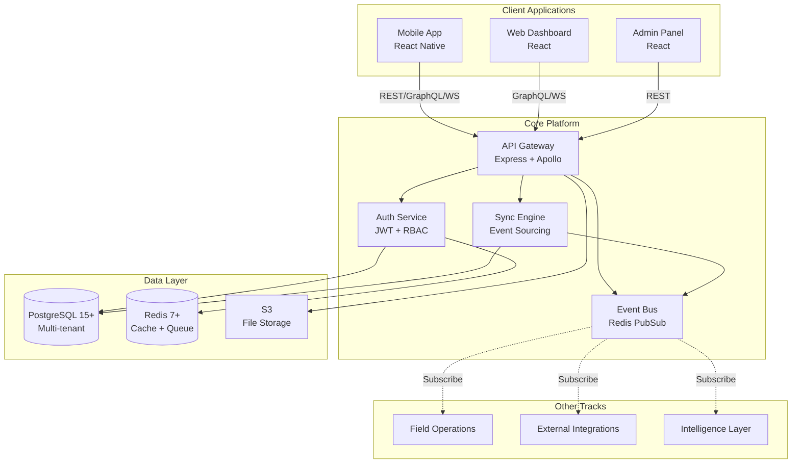
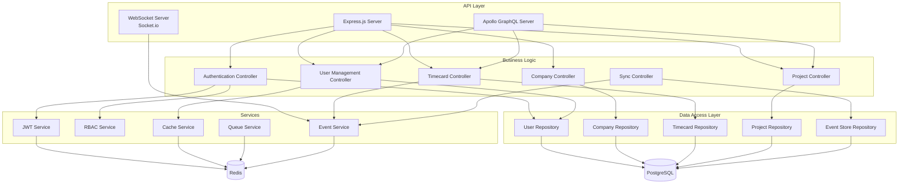
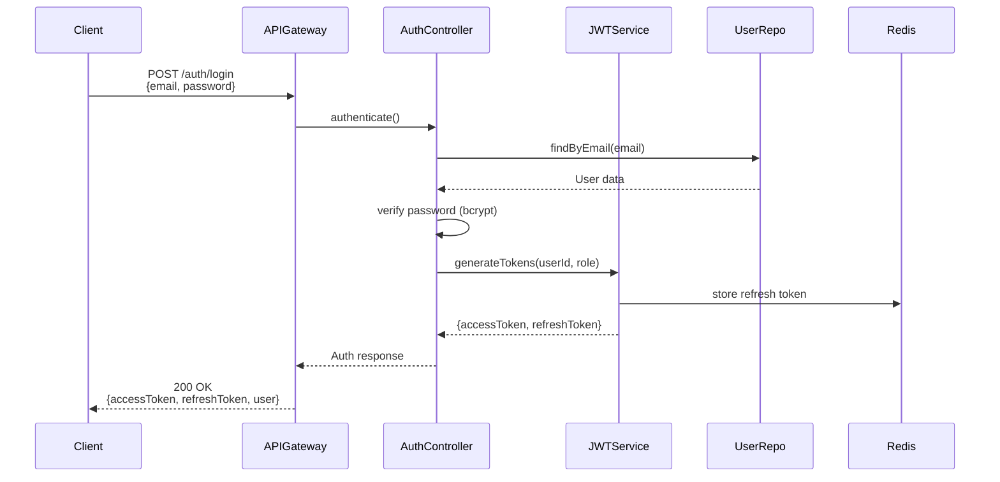
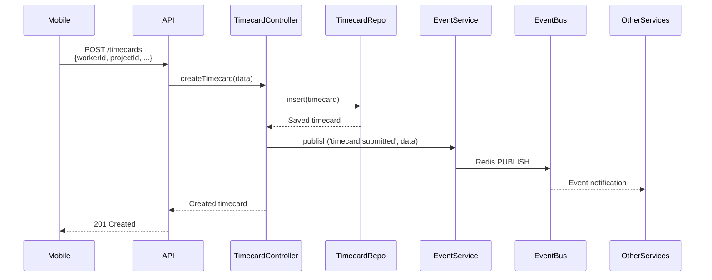
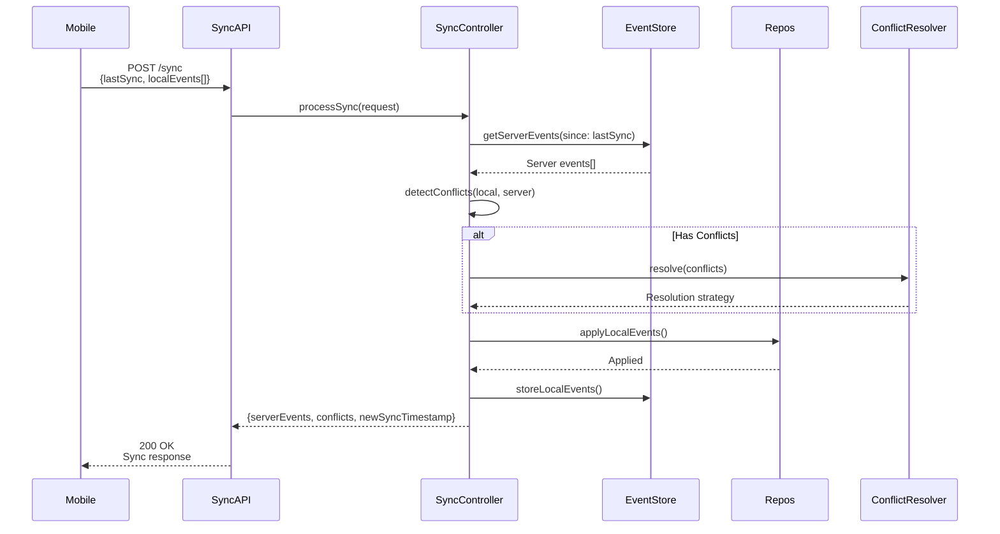
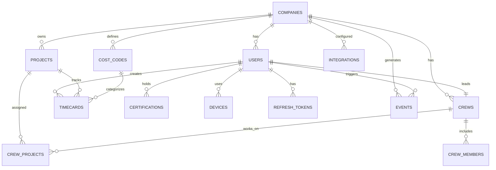

# Core Platform - MVP Technical PRD

## Document Metadata
- **Track**: Core Platform
- **Phase**: MVP (Phase 1)
- **Phase Timeline**: Months 1-4 (Weeks 1-16)
- **Version**: 1.0
- **Last Updated**: 2025-10-22
- **Authors**: Product & Engineering Team
- **Status**: Approved
- **Dependencies**: None (Foundation layer - all other tracks depend on this)

---

## 1. Executive Summary

### 1.1 Phase Objectives

The Core Platform MVP establishes the foundational infrastructure and services that all other development tracks depend on. This phase delivers a production-ready authentication, data synchronization, and API layer capable of supporting 20-50 beta customers with 20-75 employees each.

**Primary Goals:**
1. Enable secure, multi-tenant user authentication with role-based access control
2. Provide offline-first data synchronization for mobile clients
3. Deliver stable REST and GraphQL APIs for all client applications
4. Support real-time updates via WebSocket for dashboard features
5. Achieve 99% uptime with <200ms API response time (p95)

### 1.2 Key Deliverables

**Authentication & Authorization Service:**
- JWT-based authentication with biometric support
- 5-tier role-based access control (Field Worker, Foreman, PM, Admin, Owner)
- Refresh token rotation for security
- Device management and session tracking

**Data Synchronization Engine:**
- Event-sourced offline-first architecture
- Conflict resolution with last-write-wins + manual override
- 30-day offline capacity for mobile clients
- Real-time sync status tracking

**API Gateway:**
- RESTful API for integrations and simple operations
- GraphQL API for complex client queries
- WebSocket support for real-time dashboard updates
- API versioning (v1) with clear deprecation policy

**Multi-Tenant Infrastructure:**
- PostgreSQL database with tenant isolation
- Redis caching and job queuing
- Event bus for cross-service communication
- Monitoring and health check endpoints

### 1.3 Success Criteria

**Technical KPIs:**
- API latency p95: <200ms
- API latency p99: <500ms
- Uptime SLA: 99% (7.2 hours downtime/month allowed)
- Offline sync success rate: 95%
- Zero critical security vulnerabilities
- Zero data loss incidents

**Business KPIs:**
- Support 20 beta customers
- 1,000 concurrent users capacity
- 50,000 time entries/day
- Setup time for new customer: <4 hours
- Support ticket volume: <5 per customer/month

**Quality Metrics:**
- Test coverage: 80%
- All critical paths have integration tests
- Security audit passed before beta launch
- All APIs documented with OpenAPI/GraphQL schema

### 1.4 Timeline and Milestones

**Week 1-4: Foundation**
- PostgreSQL and Redis infrastructure setup
- Authentication service (JWT, RBAC)
- Basic user/company management
- Development environment configuration

**Week 5-8: API Layer**
- REST API endpoints for CRUD operations
- GraphQL schema and resolvers
- Event-sourced sync engine core
- WebSocket server for real-time updates

**Week 9-12: Integration**
- Admin panel for user management
- Event bus implementation
- Integration test suite
- Performance optimization

**Week 13-16: Production Readiness**
- Security audit and fixes
- Load testing (2x target scale)
- Monitoring and alerting setup
- Beta customer onboarding tools

### 1.5 Dependencies on Other Tracks

**This track has NO dependencies** - it is the foundation layer.

**Other tracks depend on Core Platform:**
- **Field Operations**: Requires auth service, sync API, user data models
- **External Integrations**: Requires event bus, data models, admin APIs
- **Intelligence Layer**: Requires event streams, data access APIs

**Critical Path:** Core Platform must complete Weeks 1-8 before other tracks can begin meaningful integration work.

---

## 2. Architecture Overview

### 2.1 System Context Diagram



### 2.2 Component Architecture



### 2.3 Data Flow Diagrams

#### Authentication Flow


#### Timecard Submission Flow (with Events)


#### Offline Sync Flow


### 2.4 Technology Stack (LOCKED Decisions)

**Runtime & Language:**
- Node.js 18 LTS [LOCKED]
- TypeScript 5.x [LOCKED]
- Reason: Shared language with frontend, excellent async I/O, strong ecosystem

**API Framework:**
- Express.js 4.x [LOCKED] - REST API
- Apollo Server 4.x [LOCKED] - GraphQL
- Socket.io 4.x [LOCKED] - WebSocket
- Reason: Battle-tested, excellent documentation, large community

**Database:**
- PostgreSQL 15+ [LOCKED]
- PostGIS extension [LOCKED] - Geospatial queries
- Reason: ACID compliance, JSON support, mature replication, PostGIS for GPS

**Caching & Queue:**
- Redis 7+ [LOCKED]
- Bull 4.x [LOCKED] - Job queue
- Reason: Fast, reliable, perfect for session store and job queue

**Authentication:**
- jsonwebtoken (JWT) [LOCKED]
- bcrypt [LOCKED] - Password hashing
- passport.js [RECOMMENDED] - Auth middleware
- Reason: Industry standard, proven security

**ORM/Query Builder:**
- [TBD - Options below]
  1. **Prisma** - Type-safe, great DX, migrations built-in
  2. **TypeORM** - Decorator-based, more flexible
  3. **Knex.js** - Query builder, full control
- Decision by: End of Week 2
- Recommendation: Prisma for MVP speed

**Testing:**
- Jest [LOCKED] - Unit tests
- Supertest [LOCKED] - API integration tests
- @faker-js/faker [LOCKED] - Test data generation

**Infrastructure:**
- AWS [LOCKED]
- Docker [LOCKED] - Containerization
- GitHub Actions [LOCKED] - CI/CD

### 2.5 Changes from Previous Phase

N/A - This is Phase 1 (MVP)

---

## 3. Technical Requirements

### 3.1 Functional Requirements

#### FR-1: User Authentication
**As a user**, I want to securely log in to the system so that I can access my account.

**Acceptance Criteria:**
- User can log in with email and password
- System validates credentials against database
- Successful login returns JWT access token (15min expiry) and refresh token (7 days)
- Failed login returns clear error message
- Account lockout after 5 failed attempts (15-minute cooldown)
- Biometric authentication supported (mobile passthrough)

**API Endpoint:**
```typescript
POST /api/v1/auth/login
Request: { email: string, password: string, deviceId?: string }
Response: { accessToken: string, refreshToken: string, user: User }
```

#### FR-2: Token Refresh
**As a user**, I want my session to extend automatically so that I don't get logged out frequently.

**Acceptance Criteria:**
- Client can exchange refresh token for new access token
- System validates refresh token from Redis
- New access token issued with updated expiry
- Refresh token rotated (old one invalidated, new one issued)
- Expired refresh tokens rejected with 401

**API Endpoint:**
```typescript
POST /api/v1/auth/refresh
Request: { refreshToken: string }
Response: { accessToken: string, refreshToken: string }
```

#### FR-3: Role-Based Access Control (RBAC)
**As an admin**, I want to control what each user can do based on their role.

**Acceptance Criteria:**
- 5 roles supported: field_worker, foreman, project_manager, admin, owner
- Each role has defined permissions (see Section 3.1.1)
- API endpoints check permissions before allowing access
- GraphQL fields return only data user has permission to see
- Unauthorized access returns 403 Forbidden

**Roles & Permissions:**
```typescript
// Defined in Section 5.1.3
```

#### FR-4: User Management
**As an admin**, I want to create, update, and delete user accounts.

**Acceptance Criteria:**
- Create user with email, name, role, companyId
- Update user profile (name, role, status)
- Deactivate user (soft delete - preserve history)
- List users with filtering (by company, role, status)
- Invite user via email (sends signup link)

**API Endpoints:**
```typescript
POST   /api/v1/users              // Create user
GET    /api/v1/users              // List users (paginated)
GET    /api/v1/users/:id          // Get user by ID
PUT    /api/v1/users/:id          // Update user
DELETE /api/v1/users/:id          // Deactivate user
POST   /api/v1/users/:id/invite   // Send invite email
```

#### FR-5: Company (Tenant) Management
**As an owner**, I want to manage my company settings and configuration.

**Acceptance Criteria:**
- Create company with name, settings, subscription tier
- Update company settings (cost codes, projects, integrations)
- Configure company-wide preferences (timezone, currency, overtime rules)
- View company usage metrics (users, projects, storage)
- Tenant isolation enforced (users can only see their company data)

**API Endpoints:**
```typescript
POST /api/v1/companies           // Create company
GET  /api/v1/companies/:id       // Get company
PUT  /api/v1/companies/:id       // Update company
GET  /api/v1/companies/:id/usage // Usage metrics
```

#### FR-6: Timecard Management
**As a foreman**, I want to create, approve, and manage timecards for my crew.

**Acceptance Criteria:**
- Create timecard with worker, project, cost code, clock in/out times
- Submit timecard for approval
- Approve/reject timecard (foreman+ only)
- Edit timecard before approval (foreman can edit crew, worker can edit own)
- View timecard history with audit trail
- Filter timecards by date, project, worker, status

**API Endpoints:**
```typescript
POST   /api/v1/timecards              // Create timecard
GET    /api/v1/timecards              // List timecards (filtered)
GET    /api/v1/timecards/:id          // Get timecard
PUT    /api/v1/timecards/:id          // Update timecard
POST   /api/v1/timecards/:id/submit   // Submit for approval
POST   /api/v1/timecards/:id/approve  // Approve timecard
POST   /api/v1/timecards/:id/reject   // Reject timecard
```

#### FR-7: Project Management
**As a project manager**, I want to create and manage projects.

**Acceptance Criteria:**
- Create project with name, budget, location, geofence
- Assign crews to project
- Update project status (active, completed, on_hold)
- Track project hours and budget consumption
- View project profitability

**API Endpoints:**
```typescript
POST /api/v1/projects           // Create project
GET  /api/v1/projects           // List projects
GET  /api/v1/projects/:id       // Get project
PUT  /api/v1/projects/:id       // Update project
GET  /api/v1/projects/:id/stats // Project statistics
```

#### FR-8: Offline Sync
**As a mobile user**, I want my changes to sync automatically when I reconnect.

**Acceptance Criteria:**
- Mobile client sends local events with last sync timestamp
- Server returns new server events since last sync
- Server detects conflicts (same entity edited locally and on server)
- Conflicts resolved using strategy: last-write-wins or manual
- Successful sync returns new sync timestamp
- Sync supports up to 30 days of offline data

**API Endpoint:**
```typescript
POST /api/v1/sync
Request: {
  deviceId: string,
  lastSyncTimestamp: string,
  events: LocalEvent[],
  schemaVersion: string
}
Response: {
  serverEvents: ServerEvent[],
  conflicts: ConflictEvent[],
  newSyncTimestamp: string,
  acknowledgement: string[]
}
```

#### FR-9: Real-Time Updates
**As a dashboard user**, I want to see live updates without refreshing the page.

**Acceptance Criteria:**
- Client connects to WebSocket server
- Client subscribes to company-specific room
- Server pushes events to subscribed clients (timecard.submitted, user.created, etc.)
- Client receives only events user has permission to see
- Connection auto-reconnects on disconnect

**WebSocket Protocol:**
```typescript
// Client → Server
{ event: 'subscribe', room: 'company:123' }

// Server → Client
{ event: 'timecard.submitted', data: { timecardId, workerId, ... } }
```

#### FR-10: Health Check & Monitoring
**As DevOps**, I want to monitor service health and performance.

**Acceptance Criteria:**
- Health check endpoint returns service status
- Metrics endpoint exposes Prometheus-compatible metrics
- Database connection health checked
- Redis connection health checked
- API latency tracked (p50, p95, p99)

**API Endpoints:**
```typescript
GET /health       // { status: 'healthy', uptime: 123456 }
GET /health/db    // Database health
GET /health/redis // Redis health
GET /metrics      // Prometheus metrics
```

### 3.2 Non-Functional Requirements

#### NFR-1: Performance
- API latency p95: <200ms
- API latency p99: <500ms
- GraphQL query resolution: <300ms (simple queries)
- Database query time: <50ms (indexed queries)
- WebSocket message delivery: <100ms

#### NFR-2: Scalability
- Support 1,000 concurrent users
- Handle 50,000 time entries/day
- Process 10 requests/second (average)
- Database: Up to 10 million timecard records
- File storage: 50GB per company (photos)

#### NFR-3: Availability
- Uptime SLA: 99% (7.2 hours downtime/month)
- Graceful degradation (Redis down → no caching, but API works)
- Database failover: <5 minutes
- Zero-downtime deployments (blue-green)

#### NFR-4: Security
- All passwords hashed with bcrypt (cost factor 12)
- JWT tokens signed with RS256 (asymmetric keys)
- API rate limiting: 100 requests/min per user
- SQL injection prevention (parameterized queries)
- XSS prevention (input sanitization)
- HTTPS only (TLS 1.3)
- Secrets managed via environment variables (never in code)
- No PII logged (GDPR/CCPA compliance)

#### NFR-5: Reliability
- No data loss (ACID transactions)
- Offline sync success rate: 95%
- Idempotent API endpoints (duplicate requests safe)
- Automatic retry for transient failures (exponential backoff)
- Database backups: Daily (retained 30 days)

#### NFR-6: Maintainability
- Test coverage: 80%+
- All public APIs documented (OpenAPI for REST, GraphQL schema introspection)
- Code follows TypeScript strict mode
- ESLint + Prettier for code quality
- Conventional commits for git history

### 3.3 Phase-Specific Scalability Targets

**Concurrent Users:** 1,000
- Assumption: 20 companies × 50 employees, 10% concurrent

**Data Volume:**
- Time entries: 50,000/day = 1.5M/month = 18M/year
- Users: 1,000 active users
- Companies: 20 customers
- Projects: 500 active projects
- Storage: 1TB total (photos, documents)

**Request Rate:**
- Average: 10 requests/second
- Peak: 50 requests/second (morning clock-in rush)
- Sync requests: 500/hour (mobile apps syncing every 5 min)

**Geographic Distribution:**
- Single region: us-east-1
- Latency target: <100ms within US East Coast

**Database Sizing:**
- PostgreSQL: 100GB storage (with indexes and overhead)
- Redis: 4GB memory (sessions, cache, queue)

### 3.4 Dependencies

**Prerequisites from Other Tracks:** None (this is the foundation)

**External Service Dependencies:**
- AWS Services: EC2/ECS, RDS, ElastiCache, S3
- Email service: SendGrid or AWS SES (for invites, password reset)
- Monitoring: CloudWatch, Sentry

**Infrastructure Requirements:**
- PostgreSQL 15+ (RDS instance: db.t3.medium or larger)
- Redis 7+ (ElastiCache: cache.t3.micro for MVP)
- S3 bucket (with lifecycle policies)
- Application server: 2× t3.medium instances (for redundancy)
- Load balancer: Application Load Balancer

---

## 4. API Specifications

### 4.1 REST Endpoints

**Base URL:** `https://api.crewflow.com/api/v1`

#### Authentication Endpoints

```typescript
// Login
POST /auth/login
Request: {
  email: string;          // Valid email format
  password: string;       // Min 8 characters
  deviceId?: string;      // Optional device identifier
}
Response: {
  accessToken: string;    // JWT, expires in 15 minutes
  refreshToken: string;   // Opaque token, expires in 7 days
  user: {
    id: string;
    email: string;
    name: string;
    role: Role;
    companyId: string;
    biometricEnabled: boolean;
  }
}
Status Codes:
  200 OK - Login successful
  400 Bad Request - Invalid input
  401 Unauthorized - Invalid credentials
  429 Too Many Requests - Rate limit exceeded

// Refresh Token
POST /auth/refresh
Request: {
  refreshToken: string;
}
Response: {
  accessToken: string;
  refreshToken: string;   // New refresh token (rotation)
}
Status Codes:
  200 OK
  401 Unauthorized - Invalid/expired refresh token

// Logout
POST /auth/logout
Headers: Authorization: Bearer <accessToken>
Request: {
  refreshToken: string;   // Token to invalidate
}
Response: {
  message: "Logged out successfully"
}
Status Codes:
  200 OK

// Register (Self-signup disabled in MVP, admin creates users)
// Will be added in Phase 2
```

#### User Endpoints

```typescript
// Create User
POST /users
Headers: Authorization: Bearer <accessToken>
Permissions: admin, owner
Request: {
  email: string;
  name: string;
  role: 'field_worker' | 'foreman' | 'project_manager' | 'admin' | 'owner';
  companyId: string;
  sendInvite?: boolean;   // Default: true
}
Response: {
  id: string;
  email: string;
  name: string;
  role: Role;
  companyId: string;
  status: 'active' | 'invited' | 'inactive';
  createdAt: string;
}
Status Codes:
  201 Created
  400 Bad Request
  403 Forbidden - Insufficient permissions
  409 Conflict - Email already exists

// List Users
GET /users?companyId=<id>&role=<role>&status=<status>&page=1&limit=20
Headers: Authorization: Bearer <accessToken>
Permissions: foreman+ (can see company users), field_worker (can see own only)
Response: {
  data: User[];
  pagination: {
    page: number;
    limit: number;
    total: number;
    totalPages: number;
  }
}

// Get User by ID
GET /users/:id
Headers: Authorization: Bearer <accessToken>
Permissions: Own user always, others if foreman+
Response: User

// Update User
PUT /users/:id
Headers: Authorization: Bearer <accessToken>
Permissions: admin/owner (all fields), user (own profile limited fields)
Request: {
  name?: string;
  role?: Role;          // admin/owner only
  status?: Status;      // admin/owner only
  biometricEnabled?: boolean;
}
Response: User

// Deactivate User
DELETE /users/:id
Headers: Authorization: Bearer <accessToken>
Permissions: admin, owner
Response: { message: "User deactivated" }
Status Codes:
  200 OK
  403 Forbidden
  404 Not Found
```

#### Company Endpoints

```typescript
// Create Company
POST /companies
Headers: Authorization: Bearer <accessToken>
Permissions: System admin only (not exposed to customers in MVP)
Request: {
  name: string;
  settings: CompanySettings;
  subscriptionTier: 'standard';  // Only one tier in MVP
}
Response: Company

// Get Company
GET /companies/:id
Headers: Authorization: Bearer <accessToken>
Permissions: Users of that company only
Response: {
  id: string;
  name: string;
  settings: {
    timezone: string;
    currency: string;
    overtimeRules: OvertimeRules;
    costCodes: CostCode[];
  };
  subscriptionTier: string;
  employeeCount: number;
  createdAt: string;
}

// Update Company
PUT /companies/:id
Headers: Authorization: Bearer <accessToken>
Permissions: admin, owner
Request: Partial<CompanySettings>
Response: Company

// Get Company Usage
GET /companies/:id/usage
Headers: Authorization: Bearer <accessToken>
Permissions: owner
Response: {
  users: { active: number, total: number };
  projects: { active: number, total: number };
  storage: { used: number, limit: number, unit: 'GB' };
  timecardsThisMonth: number;
}
```

#### Timecard Endpoints

```typescript
// Create Timecard
POST /timecards
Headers: Authorization: Bearer <accessToken>
Permissions: field_worker+ (can create for self), foreman+ (can create for team)
Request: {
  workerId: string;
  projectId: string;
  costCodeId: string;
  clockIn: string;        // ISO 8601
  clockOut?: string;      // ISO 8601, optional (null = still clocked in)
  breaks?: Break[];
  gpsCoordinates?: GeoLocation[];
  photos?: string[];      // S3 URLs
  notes?: string;
}
Response: Timecard
Status Codes:
  201 Created
  400 Bad Request - Validation error
  403 Forbidden - Cannot create for other workers
  404 Not Found - Invalid workerId/projectId/costCodeId

// List Timecards
GET /timecards?workerId=<id>&projectId=<id>&status=<status>&startDate=<date>&endDate=<date>&page=1&limit=20
Headers: Authorization: Bearer <accessToken>
Permissions: field_worker (own only), foreman+ (team/company)
Response: {
  data: Timecard[];
  pagination: Pagination;
}

// Get Timecard by ID
GET /timecards/:id
Response: Timecard

// Update Timecard
PUT /timecards/:id
Permissions: field_worker (own, if status=draft), foreman+ (team)
Request: Partial<TimecardUpdate>
Response: Timecard

// Submit Timecard
POST /timecards/:id/submit
Permissions: field_worker (own), foreman+ (team)
Response: Timecard with status='submitted'

// Approve Timecard
POST /timecards/:id/approve
Permissions: foreman+
Request: {
  approvedBy: string;   // User ID of approver
  notes?: string;
}
Response: Timecard with status='approved'

// Reject Timecard
POST /timecards/:id/reject
Permissions: foreman+
Request: {
  rejectedBy: string;
  reason: string;
}
Response: Timecard with status='rejected'
```

#### Project Endpoints

```typescript
// Create Project
POST /projects
Headers: Authorization: Bearer <accessToken>
Permissions: project_manager+
Request: {
  name: string;
  companyId: string;
  budget: number;
  estimatedHours: number;
  location: {
    address: string;
    coordinates: { lat: number, lng: number };
  };
  geofence?: {
    radius: number;       // Meters
    enabled: boolean;
  };
  status: 'active';
}
Response: Project

// List Projects
GET /projects?companyId=<id>&status=<status>&page=1&limit=20
Response: { data: Project[], pagination: Pagination }

// Get Project
GET /projects/:id
Response: Project

// Update Project
PUT /projects/:id
Permissions: project_manager+
Response: Project

// Get Project Statistics
GET /projects/:id/stats
Response: {
  totalHours: number;
  totalCost: number;
  budgetRemaining: number;
  percentComplete: number;
  profitability: number;
  crews: CrewSummary[];
}
```

#### Sync Endpoint

```typescript
// Sync
POST /sync
Headers: Authorization: Bearer <accessToken>
Request: {
  deviceId: string;
  lastSyncTimestamp: string;   // ISO 8601
  events: LocalEvent[];        // Events from mobile device
  schemaVersion: string;       // e.g., "1.0"
}
Response: {
  serverEvents: ServerEvent[];
  conflicts: ConflictEvent[];
  newSyncTimestamp: string;
  acknowledgement: string[];   // IDs of successfully processed local events
}
Status Codes:
  200 OK
  409 Conflict - Schema version mismatch (client needs update)
  422 Unprocessable Entity - Invalid event format
```

### 4.2 GraphQL Schema

```graphql
# Core Types

scalar DateTime
scalar JSON

enum Role {
  FIELD_WORKER
  FOREMAN
  PROJECT_MANAGER
  ADMIN
  OWNER
}

enum TimecardStatus {
  DRAFT
  SUBMITTED
  APPROVED
  REJECTED
  SYNCED
}

enum ProjectStatus {
  ACTIVE
  COMPLETED
  ON_HOLD
}

# User Management

type User {
  id: ID!
  email: String!
  name: String!
  role: Role!
  companyId: ID!
  company: Company!
  biometricEnabled: Boolean!
  certifications: [Certification!]!
  devices: [Device!]!
  createdAt: DateTime!
  updatedAt: DateTime!
}

type Company {
  id: ID!
  name: String!
  settings: CompanySettings!
  subscriptionTier: String!
  users(role: Role, status: String): [User!]!
  projects(status: ProjectStatus): [Project!]!
  costCodes: [CostCode!]!
  employeeCount: Int!
  createdAt: DateTime!
}

type CompanySettings {
  timezone: String!
  currency: String!
  overtimeRules: OvertimeRules!
}

type OvertimeRules {
  dailyThreshold: Float!
  weeklyThreshold: Float!
  multiplier: Float!
}

# Timecard Management

type Timecard {
  id: ID!
  worker: User!
  project: Project!
  costCode: CostCode!
  clockIn: DateTime!
  clockOut: DateTime
  breaks: [Break!]!
  totalHours: Float!
  regularHours: Float!
  overtimeHours: Float!
  gpsCoordinates: [GeoLocation!]!
  photos: [Photo!]!
  status: TimecardStatus!
  approvedBy: User
  notes: String
  syncStatus: SyncStatus!
  createdAt: DateTime!
  updatedAt: DateTime!
}

type Break {
  startTime: DateTime!
  endTime: DateTime
  duration: Int!  # Minutes
}

type GeoLocation {
  latitude: Float!
  longitude: Float!
  accuracy: Float!
  timestamp: DateTime!
}

type Photo {
  url: String!
  thumbnail: String
  timestamp: DateTime!
  gpsLocation: GeoLocation
}

type SyncStatus {
  synced: Boolean!
  lastSyncTimestamp: DateTime
  pendingChanges: Int!
}

# Project Management

type Project {
  id: ID!
  name: String!
  company: Company!
  budget: Float!
  estimatedHours: Float!
  actualHours: Float!
  location: Location!
  geofence: Geofence
  status: ProjectStatus!
  crews: [Crew!]!
  timecards(status: TimecardStatus, startDate: DateTime, endDate: DateTime): [Timecard!]!
  profitability: Float!
  percentComplete: Float!
  createdAt: DateTime!
}

type Location {
  address: String!
  coordinates: Coordinates!
}

type Coordinates {
  latitude: Float!
  longitude: Float!
}

type Geofence {
  radius: Float!  # Meters
  enabled: Boolean!
}

type Crew {
  id: ID!
  name: String!
  foreman: User!
  members: [User!]!
  projects: [Project!]!
}

type CostCode {
  id: ID!
  code: String!
  description: String!
  category: String!
  active: Boolean!
}

# Queries

type Query {
  # User queries
  me: User!
  user(id: ID!): User
  users(
    companyId: ID
    role: Role
    status: String
    page: Int
    limit: Int
  ): UserConnection!

  # Company queries
  company(id: ID!): Company

  # Timecard queries
  timecard(id: ID!): Timecard
  timecards(
    workerId: ID
    projectId: ID
    status: TimecardStatus
    startDate: DateTime
    endDate: DateTime
    page: Int
    limit: Int
  ): TimecardConnection!

  # Project queries
  project(id: ID!): Project
  projects(
    companyId: ID
    status: ProjectStatus
    page: Int
    limit: Int
  ): ProjectConnection!
}

# Mutations

type Mutation {
  # User mutations
  createUser(input: CreateUserInput!): User!
  updateUser(id: ID!, input: UpdateUserInput!): User!
  deactivateUser(id: ID!): Boolean!

  # Company mutations
  updateCompany(id: ID!, input: UpdateCompanyInput!): Company!

  # Timecard mutations
  createTimecard(input: CreateTimecardInput!): Timecard!
  updateTimecard(id: ID!, input: UpdateTimecardInput!): Timecard!
  submitTimecard(id: ID!): Timecard!
  approveTimecard(id: ID!, approvedBy: ID!, notes: String): Timecard!
  rejectTimecard(id: ID!, rejectedBy: ID!, reason: String!): Timecard!

  # Project mutations
  createProject(input: CreateProjectInput!): Project!
  updateProject(id: ID!, input: UpdateProjectInput!): Project!
}

# Subscriptions (for real-time updates)

type Subscription {
  timecardSubmitted(companyId: ID!): Timecard!
  timecardApproved(companyId: ID!): Timecard!
  userCreated(companyId: ID!): User!
  projectUpdated(projectId: ID!): Project!
}

# Input Types

input CreateUserInput {
  email: String!
  name: String!
  role: Role!
  companyId: ID!
  sendInvite: Boolean
}

input UpdateUserInput {
  name: String
  role: Role
  biometricEnabled: Boolean
}

input CreateTimecardInput {
  workerId: ID!
  projectId: ID!
  costCodeId: ID!
  clockIn: DateTime!
  clockOut: DateTime
  breaks: [BreakInput!]
  gpsCoordinates: [GeoLocationInput!]
  photos: [String!]
  notes: String
}

input UpdateTimecardInput {
  clockOut: DateTime
  breaks: [BreakInput!]
  notes: String
}

input BreakInput {
  startTime: DateTime!
  endTime: DateTime
}

input GeoLocationInput {
  latitude: Float!
  longitude: Float!
  accuracy: Float!
  timestamp: DateTime!
}

input CreateProjectInput {
  name: String!
  companyId: ID!
  budget: Float!
  estimatedHours: Float!
  location: LocationInput!
  geofence: GeofenceInput
  status: ProjectStatus
}

input UpdateProjectInput {
  name: String
  budget: Float
  estimatedHours: Float
  status: ProjectStatus
}

input LocationInput {
  address: String!
  coordinates: CoordinatesInput!
}

input CoordinatesInput {
  latitude: Float!
  longitude: Float!
}

input GeofenceInput {
  radius: Float!
  enabled: Boolean!
}

input UpdateCompanyInput {
  name: String
  settings: CompanySettingsInput
}

input CompanySettingsInput {
  timezone: String
  currency: String
  overtimeRules: OvertimeRulesInput
}

input OvertimeRulesInput {
  dailyThreshold: Float
  weeklyThreshold: Float
  multiplier: Float
}

# Connection Types (for pagination)

type UserConnection {
  edges: [UserEdge!]!
  pageInfo: PageInfo!
}

type UserEdge {
  node: User!
  cursor: String!
}

type TimecardConnection {
  edges: [TimecardEdge!]!
  pageInfo: PageInfo!
}

type TimecardEdge {
  node: Timecard!
  cursor: String!
}

type ProjectConnection {
  edges: [ProjectEdge!]!
  pageInfo: PageInfo!
}

type ProjectEdge {
  node: Project!
  cursor: String!
}

type PageInfo {
  hasNextPage: Boolean!
  hasPreviousPage: Boolean!
  startCursor: String
  endCursor: String
  total: Int!
}
```

### 4.3 Request/Response Schemas (TypeScript Interfaces)

```typescript
// ============================================
// Authentication
// ============================================

interface LoginRequest {
  email: string;
  password: string;
  deviceId?: string;
}

interface LoginResponse {
  accessToken: string;
  refreshToken: string;
  user: User;
}

interface RefreshTokenRequest {
  refreshToken: string;
}

interface RefreshTokenResponse {
  accessToken: string;
  refreshToken: string;
}

// ============================================
// Core Domain Models
// ============================================

interface User {
  id: string;
  email: string;
  name: string;
  role: 'field_worker' | 'foreman' | 'project_manager' | 'admin' | 'owner';
  companyId: string;
  biometricEnabled: boolean;
  certifications: Certification[];
  devices: Device[];
  status: 'active' | 'invited' | 'inactive';
  createdAt: string;  // ISO 8601
  updatedAt: string;
}

interface Company {
  id: string;
  name: string;
  settings: CompanySettings;
  subscriptionTier: string;
  integrations: Integration[];
  costCodes: CostCode[];
  employeeCount: number;
  createdAt: string;
}

interface CompanySettings {
  timezone: string;          // e.g., "America/New_York"
  currency: string;          // e.g., "USD"
  overtimeRules: OvertimeRules;
}

interface OvertimeRules {
  dailyThreshold: number;    // Hours, e.g., 8.0
  weeklyThreshold: number;   // Hours, e.g., 40.0
  multiplier: number;        // e.g., 1.5 for time-and-a-half
}

interface Timecard {
  id: string;
  workerId: string;
  projectId: string;
  costCodeId: string;
  clockIn: string;           // ISO 8601
  clockOut?: string;         // ISO 8601, null if still clocked in
  breaks: Break[];
  totalHours: number;
  regularHours: number;
  overtimeHours: number;
  gpsCoordinates: GeoLocation[];
  photos: Photo[];
  status: 'draft' | 'submitted' | 'approved' | 'rejected' | 'synced';
  approvedBy?: string;       // User ID
  rejectedBy?: string;       // User ID
  notes?: string;
  syncStatus: SyncStatus;
  createdAt: string;
  updatedAt: string;
}

interface Break {
  startTime: string;         // ISO 8601
  endTime?: string;          // ISO 8601
  duration: number;          // Minutes
}

interface GeoLocation {
  latitude: number;
  longitude: number;
  accuracy: number;          // Meters
  timestamp: string;         // ISO 8601
}

interface Photo {
  url: string;               // S3 URL
  thumbnail?: string;        // Thumbnail URL
  timestamp: string;
  gpsLocation?: GeoLocation;
}

interface SyncStatus {
  synced: boolean;
  lastSyncTimestamp?: string;
  pendingChanges: number;
}

interface Project {
  id: string;
  name: string;
  companyId: string;
  budget: number;
  estimatedHours: number;
  actualHours: number;
  location: Location;
  geofence?: Geofence;
  status: 'active' | 'completed' | 'on_hold';
  crews: Crew[];
  profitability: number;
  percentComplete: number;
  createdAt: string;
}

interface Location {
  address: string;
  coordinates: Coordinates;
}

interface Coordinates {
  latitude: number;
  longitude: number;
}

interface Geofence {
  radius: number;            // Meters
  enabled: boolean;
}

interface Crew {
  id: string;
  name: string;
  foremanId: string;
  memberIds: string[];
  projectIds: string[];
}

interface CostCode {
  id: string;
  code: string;              // e.g., "ELEC-001"
  description: string;       // e.g., "Rough Electrical"
  category: string;          // e.g., "Electrical"
  active: boolean;
}

interface Certification {
  id: string;
  name: string;
  issuer: string;
  licenseNumber: string;
  expirationDate: string;
  documentUrl?: string;
}

interface Device {
  id: string;
  userId: string;
  deviceId: string;
  platform: 'ios' | 'android' | 'web';
  lastSeenAt: string;
}

interface Integration {
  id: string;
  type: 'quickbooks' | 'sage' | 'xero' | 'adp';
  enabled: boolean;
  config: Record<string, any>;
  lastSyncAt?: string;
  status: 'healthy' | 'degraded' | 'failed';
}

// ============================================
// Sync Protocol
// ============================================

interface SyncRequest {
  deviceId: string;
  lastSyncTimestamp: string;
  events: LocalEvent[];
  schemaVersion: string;
}

interface SyncResponse {
  serverEvents: ServerEvent[];
  conflicts: ConflictEvent[];
  newSyncTimestamp: string;
  acknowledgement: string[];
}

interface LocalEvent {
  id: string;
  type: string;              // e.g., "timecard.created"
  entityId: string;
  entityType: string;        // e.g., "timecard"
  data: any;
  timestamp: string;
  deviceId: string;
}

interface ServerEvent {
  id: string;
  type: string;
  entityId: string;
  entityType: string;
  data: any;
  timestamp: string;
  userId: string;
}

interface ConflictEvent {
  eventId: string;
  localVersion: any;
  serverVersion: any;
  resolutionStrategy: 'manual' | 'server_wins' | 'client_wins';
}

// ============================================
// Pagination
// ============================================

interface PaginatedResponse<T> {
  data: T[];
  pagination: {
    page: number;
    limit: number;
    total: number;
    totalPages: number;
  };
}

// ============================================
// Error Response
// ============================================

interface ErrorResponse {
  error: {
    code: string;            // e.g., "INVALID_CREDENTIALS"
    message: string;
    details?: any;
  };
}
```

### 4.4 Authentication & Authorization

**JWT Payload Structure:**
```typescript
interface JWTPayload {
  sub: string;               // User ID
  email: string;
  role: Role;
  companyId: string;
  permissions: string[];     // Computed from role
  iat: number;               // Issued at (Unix timestamp)
  exp: number;               // Expires at (Unix timestamp)
}
```

**Token Generation:**
- Access Token: RS256 signing, 15-minute expiry
- Refresh Token: Random UUID stored in Redis with 7-day TTL

**Authorization Middleware:**
```typescript
// Pseudocode
function requireAuth(req, res, next) {
  const token = extractTokenFromHeader(req.headers.authorization);
  if (!token) return res.status(401).json({ error: 'No token provided' });

  try {
    const payload = verifyJWT(token);
    req.user = payload;
    next();
  } catch (err) {
    return res.status(401).json({ error: 'Invalid token' });
  }
}

function requirePermission(resource: string, action: string) {
  return (req, res, next) => {
    const user = req.user;
    const hasPermission = checkPermission(user.role, resource, action, req.params, req.body);

    if (!hasPermission) {
      return res.status(403).json({ error: 'Forbidden' });
    }

    next();
  };
}
```

**Rate Limiting:**
- Per-user: 100 requests/minute
- Per-IP: 1000 requests/minute
- Login endpoint: 10 attempts/15 minutes

### 4.5 Error Handling

**Standard Error Codes:**
```typescript
const ErrorCodes = {
  // Authentication
  INVALID_CREDENTIALS: 'Email or password is incorrect',
  TOKEN_EXPIRED: 'Access token has expired',
  INVALID_TOKEN: 'Token is invalid or malformed',
  ACCOUNT_LOCKED: 'Account locked due to failed login attempts',

  // Authorization
  FORBIDDEN: 'You do not have permission to access this resource',
  INSUFFICIENT_PERMISSIONS: 'Your role does not allow this action',

  // Validation
  VALIDATION_ERROR: 'Request validation failed',
  MISSING_REQUIRED_FIELD: 'Required field is missing',
  INVALID_FORMAT: 'Field format is invalid',

  // Resources
  NOT_FOUND: 'Resource not found',
  ALREADY_EXISTS: 'Resource already exists',
  CONFLICT: 'Request conflicts with current state',

  // Server
  INTERNAL_ERROR: 'An internal error occurred',
  SERVICE_UNAVAILABLE: 'Service temporarily unavailable',
  DATABASE_ERROR: 'Database operation failed',
};
```

**Error Response Format:**
```json
{
  "error": {
    "code": "VALIDATION_ERROR",
    "message": "Request validation failed",
    "details": {
      "fields": [
        {
          "field": "email",
          "message": "Invalid email format"
        },
        {
          "field": "password",
          "message": "Password must be at least 8 characters"
        }
      ]
    }
  }
}
```

**HTTP Status Code Mapping:**
- 400: Bad Request (validation errors, malformed input)
- 401: Unauthorized (missing/invalid credentials)
- 403: Forbidden (insufficient permissions)
- 404: Not Found (resource doesn't exist)
- 409: Conflict (duplicate resource, state conflict)
- 422: Unprocessable Entity (semantically incorrect)
- 429: Too Many Requests (rate limit exceeded)
- 500: Internal Server Error (unexpected server error)
- 503: Service Unavailable (dependency down, maintenance)

---

## 5. Data Models

### 5.1 Database Schemas

#### 5.1.1 Users Table

```sql
CREATE TABLE users (
  id UUID PRIMARY KEY DEFAULT gen_random_uuid(),
  email VARCHAR(255) NOT NULL UNIQUE,
  password_hash VARCHAR(255) NOT NULL,
  name VARCHAR(255) NOT NULL,
  role VARCHAR(50) NOT NULL CHECK (role IN ('field_worker', 'foreman', 'project_manager', 'admin', 'owner')),
  company_id UUID NOT NULL REFERENCES companies(id) ON DELETE CASCADE,
  biometric_enabled BOOLEAN DEFAULT FALSE,
  status VARCHAR(50) DEFAULT 'active' CHECK (status IN ('active', 'invited', 'inactive')),
  failed_login_attempts INT DEFAULT 0,
  locked_until TIMESTAMP,
  created_at TIMESTAMP DEFAULT NOW(),
  updated_at TIMESTAMP DEFAULT NOW()
);

-- Indexes
CREATE INDEX idx_users_company_id ON users(company_id);
CREATE INDEX idx_users_email ON users(email);
CREATE INDEX idx_users_role ON users(role);
CREATE INDEX idx_users_status ON users(status);
```

#### 5.1.2 Companies Table

```sql
CREATE TABLE companies (
  id UUID PRIMARY KEY DEFAULT gen_random_uuid(),
  name VARCHAR(255) NOT NULL,
  settings JSONB NOT NULL DEFAULT '{}',
  subscription_tier VARCHAR(50) DEFAULT 'standard',
  employee_count INT DEFAULT 0,
  created_at TIMESTAMP DEFAULT NOW(),
  updated_at TIMESTAMP DEFAULT NOW()
);

-- Sample settings JSONB structure:
-- {
--   "timezone": "America/New_York",
--   "currency": "USD",
--   "overtimeRules": {
--     "dailyThreshold": 8.0,
--     "weeklyThreshold": 40.0,
--     "multiplier": 1.5
--   }
-- }
```

#### 5.1.3 Timecards Table

```sql
CREATE TABLE timecards (
  id UUID PRIMARY KEY DEFAULT gen_random_uuid(),
  worker_id UUID NOT NULL REFERENCES users(id) ON DELETE CASCADE,
  project_id UUID NOT NULL REFERENCES projects(id) ON DELETE CASCADE,
  cost_code_id UUID NOT NULL REFERENCES cost_codes(id),
  clock_in TIMESTAMP NOT NULL,
  clock_out TIMESTAMP,
  breaks JSONB DEFAULT '[]',
  total_hours DECIMAL(5,2),
  regular_hours DECIMAL(5,2),
  overtime_hours DECIMAL(5,2),
  gps_coordinates JSONB DEFAULT '[]',
  photos JSONB DEFAULT '[]',
  status VARCHAR(50) DEFAULT 'draft' CHECK (status IN ('draft', 'submitted', 'approved', 'rejected', 'synced')),
  approved_by UUID REFERENCES users(id),
  rejected_by UUID REFERENCES users(id),
  notes TEXT,
  sync_status JSONB DEFAULT '{"synced": false, "pendingChanges": 0}',
  created_at TIMESTAMP DEFAULT NOW(),
  updated_at TIMESTAMP DEFAULT NOW()
);

-- Indexes
CREATE INDEX idx_timecards_worker_id ON timecards(worker_id);
CREATE INDEX idx_timecards_project_id ON timecards(project_id);
CREATE INDEX idx_timecards_status ON timecards(status);
CREATE INDEX idx_timecards_clock_in ON timecards(clock_in);
CREATE INDEX idx_timecards_created_at ON timecards(created_at);

-- Composite indexes for common queries
CREATE INDEX idx_timecards_worker_status ON timecards(worker_id, status);
CREATE INDEX idx_timecards_project_status ON timecards(project_id, status);
```

#### 5.1.4 Projects Table

```sql
CREATE TABLE projects (
  id UUID PRIMARY KEY DEFAULT gen_random_uuid(),
  name VARCHAR(255) NOT NULL,
  company_id UUID NOT NULL REFERENCES companies(id) ON DELETE CASCADE,
  budget DECIMAL(12,2) NOT NULL,
  estimated_hours DECIMAL(8,2) NOT NULL,
  actual_hours DECIMAL(8,2) DEFAULT 0,
  location JSONB NOT NULL,
  geofence JSONB,
  status VARCHAR(50) DEFAULT 'active' CHECK (status IN ('active', 'completed', 'on_hold')),
  profitability DECIMAL(5,2) DEFAULT 0,
  percent_complete DECIMAL(5,2) DEFAULT 0,
  created_at TIMESTAMP DEFAULT NOW(),
  updated_at TIMESTAMP DEFAULT NOW()
);

-- Indexes
CREATE INDEX idx_projects_company_id ON projects(company_id);
CREATE INDEX idx_projects_status ON projects(status);
CREATE INDEX idx_projects_created_at ON projects(created_at);

-- Sample location JSONB:
-- {
--   "address": "123 Main St, Austin, TX",
--   "coordinates": {
--     "latitude": 30.2672,
--     "longitude": -97.7431
--   }
-- }

-- Sample geofence JSONB:
-- {
--   "radius": 100,
--   "enabled": true
-- }
```

#### 5.1.5 Cost Codes Table

```sql
CREATE TABLE cost_codes (
  id UUID PRIMARY KEY DEFAULT gen_random_uuid(),
  company_id UUID NOT NULL REFERENCES companies(id) ON DELETE CASCADE,
  code VARCHAR(50) NOT NULL,
  description VARCHAR(255) NOT NULL,
  category VARCHAR(100),
  active BOOLEAN DEFAULT TRUE,
  created_at TIMESTAMP DEFAULT NOW(),
  updated_at TIMESTAMP DEFAULT NOW(),
  UNIQUE(company_id, code)
);

-- Indexes
CREATE INDEX idx_cost_codes_company_id ON cost_codes(company_id);
CREATE INDEX idx_cost_codes_active ON cost_codes(active);
CREATE INDEX idx_cost_codes_category ON cost_codes(category);
```

#### 5.1.6 Crews Table

```sql
CREATE TABLE crews (
  id UUID PRIMARY KEY DEFAULT gen_random_uuid(),
  name VARCHAR(255) NOT NULL,
  company_id UUID NOT NULL REFERENCES companies(id) ON DELETE CASCADE,
  foreman_id UUID NOT NULL REFERENCES users(id),
  created_at TIMESTAMP DEFAULT NOW(),
  updated_at TIMESTAMP DEFAULT NOW()
);

CREATE TABLE crew_members (
  crew_id UUID NOT NULL REFERENCES crews(id) ON DELETE CASCADE,
  user_id UUID NOT NULL REFERENCES users(id) ON DELETE CASCADE,
  PRIMARY KEY (crew_id, user_id)
);

CREATE TABLE crew_projects (
  crew_id UUID NOT NULL REFERENCES crews(id) ON DELETE CASCADE,
  project_id UUID NOT NULL REFERENCES projects(id) ON DELETE CASCADE,
  PRIMARY KEY (crew_id, project_id)
);

-- Indexes
CREATE INDEX idx_crews_company_id ON crews(company_id);
CREATE INDEX idx_crews_foreman_id ON crews(foreman_id);
CREATE INDEX idx_crew_members_user_id ON crew_members(user_id);
CREATE INDEX idx_crew_projects_project_id ON crew_projects(project_id);
```

#### 5.1.7 Certifications Table

```sql
CREATE TABLE certifications (
  id UUID PRIMARY KEY DEFAULT gen_random_uuid(),
  user_id UUID NOT NULL REFERENCES users(id) ON DELETE CASCADE,
  name VARCHAR(255) NOT NULL,
  issuer VARCHAR(255),
  license_number VARCHAR(100),
  expiration_date DATE,
  document_url VARCHAR(500),
  created_at TIMESTAMP DEFAULT NOW(),
  updated_at TIMESTAMP DEFAULT NOW()
);

-- Indexes
CREATE INDEX idx_certifications_user_id ON certifications(user_id);
CREATE INDEX idx_certifications_expiration_date ON certifications(expiration_date);
```

#### 5.1.8 Devices Table

```sql
CREATE TABLE devices (
  id UUID PRIMARY KEY DEFAULT gen_random_uuid(),
  user_id UUID NOT NULL REFERENCES users(id) ON DELETE CASCADE,
  device_id VARCHAR(255) NOT NULL UNIQUE,
  platform VARCHAR(50) CHECK (platform IN ('ios', 'android', 'web')),
  push_token VARCHAR(500),
  last_seen_at TIMESTAMP DEFAULT NOW(),
  created_at TIMESTAMP DEFAULT NOW()
);

-- Indexes
CREATE INDEX idx_devices_user_id ON devices(user_id);
CREATE INDEX idx_devices_device_id ON devices(device_id);
```

#### 5.1.9 Events Table (for sync)

```sql
CREATE TABLE events (
  id UUID PRIMARY KEY DEFAULT gen_random_uuid(),
  type VARCHAR(100) NOT NULL,
  entity_id UUID NOT NULL,
  entity_type VARCHAR(50) NOT NULL,
  company_id UUID NOT NULL REFERENCES companies(id) ON DELETE CASCADE,
  user_id UUID REFERENCES users(id),
  device_id VARCHAR(255),
  data JSONB NOT NULL,
  timestamp TIMESTAMP DEFAULT NOW(),
  processed BOOLEAN DEFAULT FALSE
);

-- Indexes for sync queries
CREATE INDEX idx_events_timestamp ON events(timestamp);
CREATE INDEX idx_events_company_id_timestamp ON events(company_id, timestamp);
CREATE INDEX idx_events_entity ON events(entity_type, entity_id);
CREATE INDEX idx_events_type ON events(type);
CREATE INDEX idx_events_processed ON events(processed);
```

#### 5.1.10 Refresh Tokens Table

```sql
CREATE TABLE refresh_tokens (
  id UUID PRIMARY KEY DEFAULT gen_random_uuid(),
  user_id UUID NOT NULL REFERENCES users(id) ON DELETE CASCADE,
  token VARCHAR(255) NOT NULL UNIQUE,
  device_id VARCHAR(255),
  expires_at TIMESTAMP NOT NULL,
  created_at TIMESTAMP DEFAULT NOW()
);

-- Indexes
CREATE INDEX idx_refresh_tokens_user_id ON refresh_tokens(user_id);
CREATE INDEX idx_refresh_tokens_token ON refresh_tokens(token);
CREATE INDEX idx_refresh_tokens_expires_at ON refresh_tokens(expires_at);
```

#### 5.1.11 Integrations Table

```sql
CREATE TABLE integrations (
  id UUID PRIMARY KEY DEFAULT gen_random_uuid(),
  company_id UUID NOT NULL REFERENCES companies(id) ON DELETE CASCADE,
  type VARCHAR(50) NOT NULL CHECK (type IN ('quickbooks', 'sage', 'xero', 'adp')),
  enabled BOOLEAN DEFAULT FALSE,
  config JSONB NOT NULL DEFAULT '{}',
  last_sync_at TIMESTAMP,
  status VARCHAR(50) DEFAULT 'healthy' CHECK (status IN ('healthy', 'degraded', 'failed')),
  error_message TEXT,
  created_at TIMESTAMP DEFAULT NOW(),
  updated_at TIMESTAMP DEFAULT NOW(),
  UNIQUE(company_id, type)
);

-- Indexes
CREATE INDEX idx_integrations_company_id ON integrations(company_id);
CREATE INDEX idx_integrations_status ON integrations(status);
```

### 5.2 Entity Relationships



### 5.3 Migration Strategy

**Migration Tool**: Prisma Migrate (recommended) or custom migration scripts

**Migration Workflow:**
1. Create migration file with up/down scripts
2. Test migration on development database
3. Review migration plan (run `prisma migrate diff`)
4. Apply migration to staging environment
5. Validate data integrity and application functionality
6. Apply migration to production (during low-traffic window)
7. Monitor for errors, ready to rollback if needed

**Sample Migration (Prisma):**
```typescript
// prisma/migrations/001_initial_schema.sql
-- This migration creates the initial database schema

CREATE EXTENSION IF NOT EXISTS "uuid-ossp";
CREATE EXTENSION IF NOT EXISTS "postgis";

-- Companies table
CREATE TABLE companies (...);

-- Users table
CREATE TABLE users (...);

-- ... (all other tables)
```

**Rollback Procedure:**
```bash
# Revert last migration
npx prisma migrate resolve --rolled-back <migration_name>

# Restore database from backup if data corruption
pg_restore -d crewflow_production backup_<timestamp>.dump
```

**Data Seeding (Development/Staging):**
```typescript
// prisma/seed.ts
async function seed() {
  // Create demo company
  const company = await prisma.company.create({
    data: {
      name: 'Demo Construction Co.',
      settings: {
        timezone: 'America/New_York',
        currency: 'USD',
        overtimeRules: {
          dailyThreshold: 8.0,
          weeklyThreshold: 40.0,
          multiplier: 1.5
        }
      }
    }
  });

  // Create demo users (admin, foreman, workers)
  // Create demo projects
  // Create demo cost codes
  // ...
}
```

### 5.4 Data Retention Policies

**Production Data:**
- **Timecards**: Retain indefinitely (legal/tax requirements)
- **Users**: Soft delete (mark inactive), retain 7 years after termination
- **Projects**: Retain indefinitely
- **Events**: Archive after 90 days to cold storage (S3 Glacier)
- **Refresh Tokens**: Auto-delete on expiry (7 days)
- **Error Logs**: Retain 30 days (Sentry)

**Automated Cleanup Jobs:**
```typescript
// Daily cron job
async function cleanupExpiredTokens() {
  await db.refreshTokens.deleteMany({
    where: {
      expiresAt: { lt: new Date() }
    }
  });
}

async function archiveOldEvents() {
  const cutoffDate = new Date();
  cutoffDate.setDate(cutoffDate.getDate() - 90);

  const oldEvents = await db.events.findMany({
    where: {
      timestamp: { lt: cutoffDate },
      processed: true
    }
  });

  // Export to S3
  await s3.putObject({
    Bucket: 'crewflow-event-archive',
    Key: `events-${Date.now()}.jsonl`,
    Body: oldEvents.map(e => JSON.stringify(e)).join('\n')
  });

  // Delete from database
  await db.events.deleteMany({
    where: {
      timestamp: { lt: cutoffDate },
      processed: true
    }
  });
}
```

**Backup Strategy:**
- Automated daily backups (AWS RDS automated backups)
- Retain daily backups: 30 days
- Weekly snapshot backups: 1 year
- Point-in-time recovery enabled (5-minute granularity)

---

## 6. Integration Contracts

### 6.1 External API Requirements

**MVP Phase**: No external integrations in Core Platform (handled by External Integrations track)

**Future Phases**: Core Platform exposes webhooks for integrations to consume events.

### 6.2 Internal Event Bus Contracts

**Event Publishing:**

Core Platform publishes events to Redis Pub/Sub for consumption by other tracks.

**Event Types:**

```typescript
// User Events
'user.created' | 'user.updated' | 'user.deleted' | 'user.login'

// Timecard Events
'timecard.created' | 'timecard.submitted' | 'timecard.approved' | 'timecard.rejected' | 'timecard.updated'

// Project Events
'project.created' | 'project.updated' | 'project.completed'

// Company Events
'company.settings.updated' | 'company.subscription.changed'
```

**Event Payload Structure:**

```typescript
interface BaseEvent {
  id: string;                // Event ID (UUID)
  type: string;              // Event type (from above)
  timestamp: string;         // ISO 8601
  companyId: string;         // For multi-tenant filtering
  userId: string;            // User who triggered event
  entityId: string;          // ID of the entity (user, timecard, etc.)
  entityType: string;        // 'user', 'timecard', 'project', etc.
  data: Record<string, any>; // Event-specific data
}

// Example: timecard.submitted event
{
  id: '123e4567-e89b-12d3-a456-426614174000',
  type: 'timecard.submitted',
  timestamp: '2025-10-22T14:30:00Z',
  companyId: 'company-uuid',
  userId: 'worker-uuid',
  entityId: 'timecard-uuid',
  entityType: 'timecard',
  data: {
    workerId: 'worker-uuid',
    projectId: 'project-uuid',
    clockIn: '2025-10-22T08:00:00Z',
    clockOut: '2025-10-22T16:30:00Z',
    totalHours: 8.5,
    status: 'submitted'
  }
}
```

**Publishing Events (Implementation):**

```typescript
import Redis from 'ioredis';

const redis = new Redis({
  host: process.env.REDIS_HOST,
  port: process.env.REDIS_PORT
});

async function publishEvent(event: BaseEvent) {
  await redis.publish('crewflow:events', JSON.stringify(event));

  // Also publish to company-specific channel
  await redis.publish(`crewflow:events:${event.companyId}`, JSON.stringify(event));
}

// Usage
await publishEvent({
  id: uuidv4(),
  type: 'timecard.submitted',
  timestamp: new Date().toISOString(),
  companyId: timecard.project.companyId,
  userId: timecard.workerId,
  entityId: timecard.id,
  entityType: 'timecard',
  data: {
    workerId: timecard.workerId,
    projectId: timecard.projectId,
    totalHours: timecard.totalHours,
    status: 'submitted'
  }
});
```

**Subscribing to Events (Other Tracks):**

```typescript
// Example: External Integrations track subscribing
const subscriber = new Redis(...);

subscriber.subscribe('crewflow:events', (err, count) => {
  if (err) console.error('Failed to subscribe:', err);
  console.log(`Subscribed to ${count} channel(s)`);
});

subscriber.on('message', (channel, message) => {
  const event = JSON.parse(message);

  if (event.type === 'timecard.approved') {
    // Trigger QuickBooks sync
    queueQuickBooksSync(event.entityId);
  }
});
```

### 6.3 Sync API Contract

See Section 4.1 (REST Endpoints) for the `/sync` endpoint specification.

**Conflict Resolution Strategies:**

```typescript
enum ResolutionStrategy {
  LAST_WRITE_WINS = 'last_write_wins',   // Automatically use most recent timestamp
  SERVER_WINS = 'server_wins',            // Server version always wins
  CLIENT_WINS = 'client_wins',            // Client version always wins
  MANUAL = 'manual'                       // Require user to resolve
}

function resolveConflict(localEvent: LocalEvent, serverEvent: ServerEvent): ResolutionStrategy {
  // Same entity edited locally and on server
  if (localEvent.entityId !== serverEvent.entityId) {
    throw new Error('Cannot resolve conflict for different entities');
  }

  // For timecards in 'approved' state on server, server always wins
  if (serverEvent.entityType === 'timecard' && serverEvent.data.status === 'approved') {
    return ResolutionStrategy.SERVER_WINS;
  }

  // For draft timecards, client wins (user is actively editing)
  if (localEvent.entityType === 'timecard' && localEvent.data.status === 'draft') {
    return ResolutionStrategy.CLIENT_WINS;
  }

  // Default: last write wins
  if (new Date(localEvent.timestamp) > new Date(serverEvent.timestamp)) {
    return ResolutionStrategy.CLIENT_WINS;
  } else {
    return ResolutionStrategy.SERVER_WINS;
  }
}
```

---

## 7. Critical Implementation Details

### 7.1 Offline Sync Algorithm

**Event Sourcing Approach:**

All data changes are stored as immutable events. The current state is derived by replaying events.

**Implementation:**

```typescript
// Event Store
interface Event {
  id: string;
  type: string;
  entityId: string;
  entityType: string;
  data: any;
  timestamp: string;
  userId: string;
  deviceId?: string;
}

// Sync flow
async function processSync(request: SyncRequest): Promise<SyncResponse> {
  const { deviceId, lastSyncTimestamp, events, schemaVersion } = request;

  // 1. Validate schema version
  if (schemaVersion !== CURRENT_SCHEMA_VERSION) {
    throw new Error('Schema version mismatch - client needs update');
  }

  // 2. Get server events since last sync
  const serverEvents = await getServerEventsSince(lastSyncTimestamp, request.companyId);

  // 3. Detect conflicts
  const conflicts = detectConflicts(events, serverEvents);

  // 4. Apply local events to server
  const acknowledgements: string[] = [];
  for (const localEvent of events) {
    try {
      await applyEvent(localEvent);
      await storeEvent(localEvent);
      acknowledgements.push(localEvent.id);
    } catch (error) {
      console.error(`Failed to apply event ${localEvent.id}:`, error);
      // Continue processing other events
    }
  }

  // 5. Return response
  return {
    serverEvents,
    conflicts,
    newSyncTimestamp: new Date().toISOString(),
    acknowledgement: acknowledgements
  };
}

function detectConflicts(localEvents: LocalEvent[], serverEvents: ServerEvent[]): ConflictEvent[] {
  const conflicts: ConflictEvent[] = [];

  for (const localEvent of localEvents) {
    for (const serverEvent of serverEvents) {
      // Same entity edited locally and on server?
      if (localEvent.entityId === serverEvent.entityId &&
          localEvent.entityType === serverEvent.entityType) {

        // Check if changes conflict
        const hasConflict = checkDataConflict(localEvent.data, serverEvent.data);

        if (hasConflict) {
          conflicts.push({
            eventId: localEvent.id,
            localVersion: localEvent.data,
            serverVersion: serverEvent.data,
            resolutionStrategy: resolveConflict(localEvent, serverEvent)
          });
        }
      }
    }
  }

  return conflicts;
}

function checkDataConflict(localData: any, serverData: any): boolean {
  // Simple deep equality check
  // In production, use a library like 'deep-diff'
  return JSON.stringify(localData) !== JSON.stringify(serverData);
}

async function applyEvent(event: Event) {
  switch (event.type) {
    case 'timecard.created':
      await db.timecards.create({ data: event.data });
      break;
    case 'timecard.updated':
      await db.timecards.update({ where: { id: event.entityId }, data: event.data });
      break;
    case 'timecard.deleted':
      await db.timecards.delete({ where: { id: event.entityId } });
      break;
    // ... other event types
  }
}
```

**30-Day Offline Capacity:**

Mobile client stores up to 30 days of events locally in SQLite. This requires:
- Efficient storage (compress old events)
- Pagination for sync (don't send all 30 days at once)
- Automatic cleanup of synced events

### 7.2 JWT Token Security

**Token Generation:**

```typescript
import jwt from 'jsonwebtoken';
import fs from 'fs';

const privateKey = fs.readFileSync(process.env.JWT_PRIVATE_KEY_PATH);
const publicKey = fs.readFileSync(process.env.JWT_PUBLIC_KEY_PATH);

function generateAccessToken(user: User): string {
  const payload: JWTPayload = {
    sub: user.id,
    email: user.email,
    role: user.role,
    companyId: user.companyId,
    permissions: getPermissionsForRole(user.role),
    iat: Math.floor(Date.now() / 1000),
    exp: Math.floor(Date.now() / 1000) + (15 * 60) // 15 minutes
  };

  return jwt.sign(payload, privateKey, { algorithm: 'RS256' });
}

function verifyAccessToken(token: string): JWTPayload {
  return jwt.verify(token, publicKey, { algorithms: ['RS256'] }) as JWTPayload;
}

function generateRefreshToken(): string {
  return require('crypto').randomBytes(32).toString('hex');
}

async function storeRefreshToken(userId: string, token: string, deviceId?: string) {
  await db.refreshTokens.create({
    data: {
      userId,
      token,
      deviceId,
      expiresAt: new Date(Date.now() + 7 * 24 * 60 * 60 * 1000) // 7 days
    }
  });
}
```

**Refresh Token Rotation:**

When a refresh token is used, invalidate it and issue a new one:

```typescript
async function refreshAccessToken(refreshToken: string): Promise<{ accessToken: string, refreshToken: string }> {
  // 1. Validate refresh token
  const storedToken = await db.refreshTokens.findUnique({
    where: { token: refreshToken },
    include: { user: true }
  });

  if (!storedToken) {
    throw new Error('Invalid refresh token');
  }

  if (storedToken.expiresAt < new Date()) {
    throw new Error('Refresh token expired');
  }

  // 2. Generate new tokens
  const newAccessToken = generateAccessToken(storedToken.user);
  const newRefreshToken = generateRefreshToken();

  // 3. Invalidate old refresh token and store new one
  await db.refreshTokens.delete({ where: { token: refreshToken } });
  await storeRefreshToken(storedToken.userId, newRefreshToken, storedToken.deviceId);

  return {
    accessToken: newAccessToken,
    refreshToken: newRefreshToken
  };
}
```

### 7.3 Role-Based Access Control (RBAC)

**Permission Model:**

```typescript
interface Permission {
  resource: string;   // 'users', 'timecards', 'projects', etc.
  action: string;     // 'read', 'write', 'delete', 'approve', etc.
  scope: string;      // 'own', 'team', 'company'
}

const ROLE_PERMISSIONS: Record<Role, Permission[]> = {
  field_worker: [
    { resource: 'timecards', action: 'read', scope: 'own' },
    { resource: 'timecards', action: 'write', scope: 'own' },
    { resource: 'timecards', action: 'submit', scope: 'own' },
    { resource: 'projects', action: 'read', scope: 'assigned' },
    { resource: 'schedule', action: 'read', scope: 'own' },
    { resource: 'profile', action: 'read', scope: 'own' },
    { resource: 'profile', action: 'write', scope: 'own' }
  ],

  foreman: [
    // All field_worker permissions plus:
    { resource: 'timecards', action: 'read', scope: 'team' },
    { resource: 'timecards', action: 'write', scope: 'team' },
    { resource: 'timecards', action: 'approve', scope: 'team' },
    { resource: 'timecards', action: 'reject', scope: 'team' },
    { resource: 'projects', action: 'read', scope: 'assigned' },
    { resource: 'crew', action: 'manage', scope: 'own' },
    { resource: 'reports', action: 'create', scope: 'team' }
  ],

  project_manager: [
    // All foreman permissions plus:
    { resource: 'timecards', action: 'read', scope: 'company' },
    { resource: 'timecards', action: 'approve', scope: 'company' },
    { resource: 'projects', action: 'read', scope: 'company' },
    { resource: 'projects', action: 'write', scope: 'company' },
    { resource: 'projects', action: 'create', scope: 'company' },
    { resource: 'crews', action: 'assign', scope: 'company' },
    { resource: 'analytics', action: 'read', scope: 'company' },
    { resource: 'budgets', action: 'read', scope: 'company' }
  ],

  admin: [
    // Back-office focused (no field operations)
    { resource: 'users', action: 'manage', scope: 'company' },
    { resource: 'company', action: 'manage', scope: 'own' },
    { resource: 'integrations', action: 'manage', scope: 'company' },
    { resource: 'payroll', action: 'export', scope: 'company' },
    { resource: 'cost_codes', action: 'manage', scope: 'company' },
    { resource: 'reports', action: 'read', scope: 'company' }
  ],

  owner: [
    // Full access to everything
    { resource: '*', action: '*', scope: 'company' }
  ]
};

function getPermissionsForRole(role: Role): Permission[] {
  const permissions = ROLE_PERMISSIONS[role] || [];

  // Inherit lower role permissions
  if (role === 'foreman') {
    permissions.push(...ROLE_PERMISSIONS.field_worker);
  } else if (role === 'project_manager') {
    permissions.push(...ROLE_PERMISSIONS.foreman, ...ROLE_PERMISSIONS.field_worker);
  }

  return permissions;
}

function checkPermission(
  userRole: Role,
  resource: string,
  action: string,
  params: any,
  body: any
): boolean {
  const permissions = getPermissionsForRole(userRole);

  // Owner has full access
  if (userRole === 'owner') {
    return true;
  }

  // Check if user has permission
  const hasPermission = permissions.some(p => {
    if (p.resource === '*' || p.resource === resource) {
      if (p.action === '*' || p.action === action) {
        return checkScope(p.scope, params, body);
      }
    }
    return false;
  });

  return hasPermission;
}

function checkScope(scope: string, params: any, body: any): boolean {
  // Simplified scope checking
  // In production, implement full logic based on user's relationships

  switch (scope) {
    case 'own':
      // User can only access their own resources
      return params.userId === body.userId || params.id === body.userId;

    case 'team':
      // User can access resources of their team members
      // (would query crew_members table in production)
      return true; // Placeholder

    case 'company':
      // User can access all resources in their company
      return true; // Placeholder

    default:
      return false;
  }
}
```

### 7.4 Database Query Optimization

**Indexes Strategy:**

All tables have indexes on:
- Primary key (automatic)
- Foreign keys (for joins)
- Frequently filtered columns (status, dates, etc.)
- Composite indexes for common query patterns

**Query Optimization Examples:**

```typescript
// BAD: N+1 query problem
const timecards = await db.timecards.findMany({ where: { projectId } });
for (const timecard of timecards) {
  const worker = await db.users.findUnique({ where: { id: timecard.workerId } });
  // ... use worker
}

// GOOD: Use include (joins)
const timecards = await db.timecards.findMany({
  where: { projectId },
  include: {
    worker: true,
    project: true,
    costCode: true
  }
});

// GOOD: Pagination with cursor-based approach
const timecards = await db.timecards.findMany({
  where: { projectId },
  take: 20,
  skip: (page - 1) * 20,
  orderBy: { createdAt: 'desc' }
});

// BETTER: Cursor-based pagination (more efficient for large datasets)
const timecards = await db.timecards.findMany({
  where: { projectId },
  take: 20,
  cursor: lastTimecardId ? { id: lastTimecardId } : undefined,
  orderBy: { createdAt: 'desc' }
});
```

**Caching Strategy:**

```typescript
import Redis from 'ioredis';

const redis = new Redis(...);

async function getCachedUser(userId: string): Promise<User | null> {
  // Try cache first
  const cached = await redis.get(`user:${userId}`);
  if (cached) {
    return JSON.parse(cached);
  }

  // Cache miss - query database
  const user = await db.users.findUnique({ where: { id: userId } });
  if (user) {
    // Cache for 15 minutes
    await redis.setex(`user:${userId}`, 900, JSON.stringify(user));
  }

  return user;
}

async function invalidateUserCache(userId: string) {
  await redis.del(`user:${userId}`);
}
```

### 7.5 WebSocket Real-Time Updates

**Server Setup:**

```typescript
import { Server } from 'socket.io';
import { createServer } from 'http';

const httpServer = createServer(app);
const io = new Server(httpServer, {
  cors: {
    origin: process.env.CORS_ORIGIN,
    credentials: true
  }
});

// Authentication middleware
io.use(async (socket, next) => {
  const token = socket.handshake.auth.token;

  try {
    const payload = verifyAccessToken(token);
    socket.data.user = payload;
    next();
  } catch (err) {
    next(new Error('Authentication error'));
  }
});

// Connection handling
io.on('connection', (socket) => {
  const user = socket.data.user;

  // Subscribe to company-specific room
  socket.join(`company:${user.companyId}`);

  console.log(`User ${user.email} connected to company room ${user.companyId}`);

  socket.on('disconnect', () => {
    console.log(`User ${user.email} disconnected`);
  });
});

// Emit events to specific rooms
export function emitToCompany(companyId: string, event: string, data: any) {
  io.to(`company:${companyId}`).emit(event, data);
}

// Usage: When timecard is submitted
await publishEvent(timecardEvent);
emitToCompany(timecard.project.companyId, 'timecard.submitted', {
  timecardId: timecard.id,
  workerId: timecard.workerId,
  projectId: timecard.projectId
});
```

**Client Usage (React example):**

```typescript
import { io } from 'socket.io-client';

const socket = io('https://api.crewflow.com', {
  auth: {
    token: accessToken
  }
});

socket.on('connect', () => {
  console.log('Connected to WebSocket');
});

socket.on('timecard.submitted', (data) => {
  console.log('New timecard submitted:', data);
  // Update UI
  refetchTimecards();
});

socket.on('disconnect', () => {
  console.log('Disconnected from WebSocket');
});
```

---

## 8. Testing Strategy

### 8.1 Unit Testing

**Coverage Target**: 80%+

**Critical Paths Requiring Tests:**
- Authentication (login, token refresh, logout)
- Authorization (RBAC permission checks)
- Timecard calculations (hours, overtime)
- Sync conflict resolution
- Event publishing

**Testing Framework**: Jest

**Sample Unit Tests:**

```typescript
// auth.test.ts
describe('Authentication Service', () => {
  describe('generateAccessToken', () => {
    it('should generate a valid JWT token', () => {
      const user = { id: '123', email: 'test@example.com', role: 'field_worker', companyId: 'company-1' };
      const token = generateAccessToken(user);

      expect(token).toBeDefined();
      const payload = verifyAccessToken(token);
      expect(payload.sub).toBe(user.id);
      expect(payload.role).toBe(user.role);
    });

    it('should set expiry to 15 minutes', () => {
      const user = { ... };
      const token = generateAccessToken(user);
      const payload = verifyAccessToken(token);

      const expiresIn = payload.exp - payload.iat;
      expect(expiresIn).toBe(15 * 60); // 15 minutes in seconds
    });
  });

  describe('verifyAccessToken', () => {
    it('should throw error for expired token', () => {
      const expiredToken = '...'; // Generate token with past expiry

      expect(() => verifyAccessToken(expiredToken)).toThrow('jwt expired');
    });

    it('should throw error for invalid signature', () => {
      const invalidToken = 'eyJhbGciOiJIUzI1NiIsInR5cCI6IkpXVCJ9.invalid.signature';

      expect(() => verifyAccessToken(invalidToken)).toThrow();
    });
  });
});

// rbac.test.ts
describe('RBAC Permission Checker', () => {
  it('should allow field worker to read own timecards', () => {
    const hasPermission = checkPermission('field_worker', 'timecards', 'read', {}, { userId: 'worker-1' });
    expect(hasPermission).toBe(true);
  });

  it('should deny field worker from approving timecards', () => {
    const hasPermission = checkPermission('field_worker', 'timecards', 'approve', {}, {});
    expect(hasPermission).toBe(false);
  });

  it('should allow foreman to approve team timecards', () => {
    const hasPermission = checkPermission('foreman', 'timecards', 'approve', {}, {});
    expect(hasPermission).toBe(true);
  });

  it('should allow owner to perform any action', () => {
    const hasPermission = checkPermission('owner', 'anything', 'any_action', {}, {});
    expect(hasPermission).toBe(true);
  });
});
```

### 8.2 Integration Testing

**Tool**: Supertest (for API testing)

**Test Scenarios:**

```typescript
// timecards.integration.test.ts
import request from 'supertest';
import app from '../app';

describe('Timecards API', () => {
  let accessToken: string;
  let workerToken: string;

  beforeAll(async () => {
    // Setup test database
    await setupTestDatabase();

    // Create test users and get tokens
    accessToken = await loginAs('foreman@example.com', 'password');
    workerToken = await loginAs('worker@example.com', 'password');
  });

  afterAll(async () => {
    await cleanupTestDatabase();
  });

  describe('POST /api/v1/timecards', () => {
    it('should create timecard with valid data', async () => {
      const response = await request(app)
        .post('/api/v1/timecards')
        .set('Authorization', `Bearer ${workerToken}`)
        .send({
          workerId: 'worker-1',
          projectId: 'project-1',
          costCodeId: 'cost-code-1',
          clockIn: '2025-10-22T08:00:00Z',
          clockOut: '2025-10-22T16:30:00Z'
        });

      expect(response.status).toBe(201);
      expect(response.body.id).toBeDefined();
      expect(response.body.totalHours).toBe(8.5);
    });

    it('should return 401 without authentication', async () => {
      const response = await request(app)
        .post('/api/v1/timecards')
        .send({ ... });

      expect(response.status).toBe(401);
    });

    it('should return 403 when creating timecard for another worker', async () => {
      const response = await request(app)
        .post('/api/v1/timecards')
        .set('Authorization', `Bearer ${workerToken}`)
        .send({
          workerId: 'another-worker',  // Not the authenticated user
          ...
        });

      expect(response.status).toBe(403);
    });
  });

  describe('POST /api/v1/timecards/:id/approve', () => {
    it('should allow foreman to approve timecard', async () => {
      const timecard = await createTestTimecard();

      const response = await request(app)
        .post(`/api/v1/timecards/${timecard.id}/approve`)
        .set('Authorization', `Bearer ${accessToken}`)
        .send({ approvedBy: 'foreman-1' });

      expect(response.status).toBe(200);
      expect(response.body.status).toBe('approved');
    });

    it('should deny field worker from approving', async () => {
      const timecard = await createTestTimecard();

      const response = await request(app)
        .post(`/api/v1/timecards/${timecard.id}/approve`)
        .set('Authorization', `Bearer ${workerToken}`)
        .send({ approvedBy: 'worker-1' });

      expect(response.status).toBe(403);
    });
  });
});
```

### 8.3 Performance Testing

**Tool**: Artillery or k6

**Benchmark Scenarios:**

```yaml
# artillery-config.yml
config:
  target: 'https://api-staging.crewflow.com'
  phases:
    - duration: 60
      arrivalRate: 5
      name: Warm up
    - duration: 300
      arrivalRate: 10
      name: Sustained load
    - duration: 120
      arrivalRate: 20
      name: Peak load
  processor: "./auth-processor.js"

scenarios:
  - name: Login and create timecard
    flow:
      - post:
          url: "/api/v1/auth/login"
          json:
            email: "{{ $randomEmail }}"
            password: "password123"
          capture:
            - json: "$.accessToken"
              as: "token"
      - post:
          url: "/api/v1/timecards"
          headers:
            Authorization: "Bearer {{ token }}"
          json:
            workerId: "{{ workerId }}"
            projectId: "{{ projectId }}"
            costCodeId: "{{ costCodeId }}"
            clockIn: "{{ clockIn }}"

  - name: List timecards
    flow:
      - get:
          url: "/api/v1/timecards?page=1&limit=20"
          headers:
            Authorization: "Bearer {{ token }}"
```

**Performance Targets:**

| Endpoint | p50 | p95 | p99 |
|----------|-----|-----|-----|
| POST /auth/login | <100ms | <200ms | <300ms |
| POST /timecards | <150ms | <250ms | <400ms |
| GET /timecards | <100ms | <200ms | <350ms |
| POST /sync | <200ms | <400ms | <600ms |

### 8.4 UAT Criteria

**User Acceptance Test Cases:**

| Test Case | Description | Expected Result |
|-----------|-------------|-----------------|
| UAT-001 | Admin creates new user and sends invite | User receives email, can set password and login |
| UAT-002 | Field worker clocks in and out | Timecard created with correct hours |
| UAT-003 | Foreman approves crew timecards | All timecards move to 'approved' status |
| UAT-004 | Mobile app works offline for 24 hours | All changes sync when reconnected |
| UAT-005 | Project manager views real-time dashboard | Dashboard updates live when timecards submitted |
| UAT-006 | Token refresh works seamlessly | User not logged out after 15 minutes |
| UAT-007 | RBAC prevents unauthorized actions | Field worker cannot approve timecards (403 error) |

**Beta Testing Requirements:**

- 5 companies actively using the system
- Each company uses system for at least 2 weeks
- Collect feedback via surveys and interviews
- Track all bugs and feature requests
- Monitor performance metrics (latency, uptime)

---

## 9. Deployment & Operations

### 9.1 Infrastructure Requirements

**AWS Services:**

| Service | Purpose | Sizing (MVP) |
|---------|---------|--------------|
| RDS PostgreSQL | Primary database | db.t3.medium (2 vCPU, 4GB RAM, 100GB SSD) |
| ElastiCache Redis | Cache + queue | cache.t3.micro (2GB RAM) |
| ECS Fargate | Application containers | 2× tasks (1 vCPU, 2GB RAM each) |
| Application Load Balancer | Load balancing | Standard ALB |
| S3 | File storage (photos) | Standard storage class |
| CloudFront | CDN for static assets | Standard distribution |
| CloudWatch | Monitoring + logs | Standard tier |
| Route 53 | DNS | Hosted zone |

**Network Configuration:**

- VPC with public and private subnets (multi-AZ)
- Public subnets: ALB
- Private subnets: ECS tasks, RDS, ElastiCache
- NAT Gateway for outbound traffic from private subnets
- Security groups:
  - ALB: Allow 443 from 0.0.0.0/0
  - ECS: Allow 3000 from ALB security group
  - RDS: Allow 5432 from ECS security group
  - ElastiCache: Allow 6379 from ECS security group

**Estimated Monthly Cost (MVP):**

| Service | Monthly Cost |
|---------|--------------|
| RDS db.t3.medium | ~$60 |
| ElastiCache t3.micro | ~$15 |
| ECS Fargate (2 tasks) | ~$30 |
| ALB | ~$20 |
| S3 (1TB) | ~$25 |
| CloudFront | ~$10 |
| Data transfer | ~$20 |
| **Total** | **~$180/month** |

### 9.2 Deployment Process

**CI/CD Pipeline (GitHub Actions):**

```yaml
# .github/workflows/deploy.yml
name: Deploy to Production

on:
  push:
    branches: [main]

jobs:
  test:
    runs-on: ubuntu-latest
    steps:
      - uses: actions/checkout@v3
      - uses: actions/setup-node@v3
        with:
          node-version: 18
      - run: npm ci
      - run: npm run lint
      - run: npm test
      - run: npm run test:integration

  build:
    needs: test
    runs-on: ubuntu-latest
    steps:
      - uses: actions/checkout@v3
      - name: Configure AWS credentials
        uses: aws-actions/configure-aws-credentials@v2
        with:
          aws-access-key-id: ${{ secrets.AWS_ACCESS_KEY_ID }}
          aws-secret-access-key: ${{ secrets.AWS_SECRET_ACCESS_KEY }}
          aws-region: us-east-1
      - name: Login to Amazon ECR
        uses: aws-actions/amazon-ecr-login@v1
      - name: Build and push Docker image
        run: |
          docker build -t crewflow-api:${{ github.sha }} .
          docker tag crewflow-api:${{ github.sha }} ${{ secrets.ECR_REPOSITORY }}:latest
          docker push ${{ secrets.ECR_REPOSITORY }}:latest

  deploy:
    needs: build
    runs-on: ubuntu-latest
    steps:
      - name: Deploy to ECS
        run: |
          aws ecs update-service \
            --cluster crewflow-prod \
            --service crewflow-api \
            --force-new-deployment
```

**Blue-Green Deployment:**

1. Deploy new version to "green" environment
2. Run smoke tests on green environment
3. Gradually shift traffic (10% → 50% → 100%)
4. Monitor error rates and latency
5. If errors increase, rollback (shift traffic back to blue)
6. If successful, decommission blue environment

**Database Migration Execution:**

```bash
# Run migrations (zero-downtime approach)
npm run migrate:up

# Migrations are backward-compatible
# - Additive changes only (new tables, new columns)
# - No destructive changes (drop table, drop column)
# - Destructive changes deferred to maintenance window
```

### 9.3 Monitoring & Alerting

**CloudWatch Metrics:**

| Metric | Threshold | Alert |
|--------|-----------|-------|
| API Latency (p95) | >300ms | Warning |
| API Latency (p99) | >500ms | Critical |
| Error Rate | >1% | Critical |
| CPU Utilization | >80% | Warning |
| Memory Utilization | >85% | Warning |
| Database Connections | >80% of max | Warning |
| Disk Space | >80% | Critical |

**CloudWatch Dashboard:**

- Request rate (requests/min)
- Response times (p50, p95, p99)
- Error rate (%)
- Active WebSocket connections
- Database query time
- Redis hit rate

**Sentry (Error Tracking):**

```typescript
import * as Sentry from '@sentry/node';

Sentry.init({
  dsn: process.env.SENTRY_DSN,
  environment: process.env.NODE_ENV,
  tracesSampleRate: 0.1,  // Sample 10% of transactions
  beforeSend(event, hint) {
    // Don't send errors for known issues
    if (event.exception?.values?.[0]?.type === 'KnownError') {
      return null;
    }
    return event;
  }
});

// Usage
try {
  await riskyOperation();
} catch (error) {
  Sentry.captureException(error, {
    tags: { operation: 'riskyOperation' },
    user: { id: userId, email: userEmail }
  });
  throw error;
}
```

**Alert Channels:**

- Email: engineering@crewflow.com
- Slack: #alerts channel
- PagerDuty: Critical alerts only (after-hours)

### 9.4 Operational Runbooks

#### Runbook: High API Latency

**Symptoms**: CloudWatch alert "API Latency p95 > 300ms"

**Diagnosis:**
1. Check CloudWatch dashboard for spike in request rate
2. Check Sentry for increase in slow queries
3. Check RDS Performance Insights for slow queries
4. Check Redis metrics (cache hit rate)

**Resolution:**
- If slow database queries: Add indexes, optimize queries
- If high request rate: Scale up ECS tasks
- If low cache hit rate: Increase Redis memory, adjust TTL
- If external service slow: Add timeout, implement circuit breaker

#### Runbook: Database Connection Pool Exhausted

**Symptoms**: Errors "Cannot acquire database connection"

**Diagnosis:**
1. Check RDS metrics for connection count
2. Check application logs for long-running queries
3. Check for leaked connections (not properly closed)

**Resolution:**
- Immediate: Increase max connections in RDS parameter group
- Short-term: Restart application to reset connection pool
- Long-term: Fix connection leaks in code, implement connection timeout

#### Runbook: Deployment Rollback

**Trigger**: Error rate >5% after deployment

**Steps:**
1. Immediately shift traffic back to previous version (blue environment)
2. Notify team in Slack #incidents channel
3. Investigate errors in Sentry and CloudWatch
4. If database migration was run, check if rollback needed
5. Fix issue in development
6. Re-deploy after testing

---

## 10. Success Metrics

### 10.1 Technical KPIs

| Metric | Target | Measurement |
|--------|--------|-------------|
| API Latency p50 | <100ms | CloudWatch |
| API Latency p95 | <200ms | CloudWatch |
| API Latency p99 | <500ms | CloudWatch |
| Uptime | 99% | CloudWatch |
| Error Rate | <0.5% | Sentry + CloudWatch |
| Offline Sync Success | 95% | Application metrics |
| Database Query Time | <50ms (p95) | RDS Performance Insights |
| WebSocket Message Latency | <100ms | Custom metrics |

### 10.2 Business KPIs

| Metric | Target | Measurement |
|--------|--------|-------------|
| Beta Customers | 20 | CRM tracking |
| Daily Active Users | 60% | Analytics |
| Timecard Submissions/Day | 1,000+ | Database count |
| Customer Setup Time | <4 hours | Onboarding tracking |
| Support Tickets/Customer/Month | <5 | Help desk |
| Time to First Timecard | <24 hours | Analytics |

### 10.3 Quality Metrics

| Metric | Target | Measurement |
|--------|--------|-------------|
| Test Coverage | 80% | Jest coverage report |
| Critical Path Test Coverage | 100% | Manual verification |
| Code Review Approval | 100% | GitHub required reviews |
| Zero Critical Security Issues | Yes | Security audit |
| API Documentation Coverage | 100% | OpenAPI spec completeness |
| Deployment Success Rate | >95% | CI/CD metrics |

**Monitoring Dashboard:**

Create a weekly report showing all metrics with trend lines.

---

## 11. Risks & Mitigations

### 11.1 Technical Risks

| Risk | Probability | Impact | Mitigation |
|------|-------------|--------|------------|
| Offline sync conflicts overwhelming users | Medium | High | Implement smart conflict resolution, default to last-write-wins, show clear UI for manual conflicts |
| Database performance degradation | Medium | Critical | Implement query optimization, add indexes, use read replicas if needed |
| JWT token security breach | Low | Critical | Use RS256 (asymmetric), rotate signing keys quarterly, implement token blacklist for compromised tokens |
| WebSocket connection instability | Medium | Medium | Implement automatic reconnection, queue messages during disconnect, fall back to polling if needed |
| Event sourcing complexity | High | Medium | Extensive testing, clear documentation, consider simpler approach if team inexperienced |

### 11.2 Dependency Risks

| Risk | Probability | Impact | Mitigation |
|------|-------------|--------|------------|
| AWS service outage | Low | Critical | Multi-AZ deployment, automated failover, status page subscription |
| Redis failure | Medium | High | Graceful degradation (app works without cache), Redis cluster with replication |
| PostgreSQL failure | Low | Critical | Automated backups, read replicas, failover testing |
| Team lacks PostgreSQL expertise | Medium | Medium | Training, hire experienced engineer, consulting if needed |

### 11.3 Timeline Risks

| Risk | Probability | Impact | Mitigation |
|------|-------------|--------|------------|
| Sync engine takes longer than estimated | High | High | Start early (Week 1), allocate best engineer, consider using off-the-shelf solution (Firebase, AWS AppSync) |
| RBAC implementation complex | Medium | Medium | Use battle-tested library (Casbin, CASL), don't reinvent wheel |
| API design changes mid-development | Medium | Medium | Freeze API contracts after Week 4, use versioning for changes |
| Insufficient time for performance optimization | Medium | High | Build in 2-week buffer (Weeks 13-14), prioritize optimization from start |

---

## 12. Open Questions

### 12.1 Technical Decisions (TBD)

**Question**: Which ORM should we use - Prisma, TypeORM, or Knex.js?
- **Options**: See Section 2.4
- **Decision by**: End of Week 2
- **Impact**: Development speed, type safety, migration complexity
- **Recommendation**: Prisma (best DX, type-safe, migrations built-in)

**Question**: Should we use GraphQL subscriptions or WebSocket (Socket.io) for real-time updates?
- **Options**:
  1. GraphQL Subscriptions (consistent with GraphQL API)
  2. Socket.io (more flexible, simpler for complex use cases)
- **Decision by**: End of Week 4
- **Impact**: Client implementation, performance
- **Recommendation**: Socket.io (more battle-tested, easier debugging)

**Question**: How do we handle file uploads (photos) - direct to S3 or via backend?
- **Options**:
  1. Direct upload to S3 (presigned URLs) - faster, less server load
  2. Upload via backend - more control, easier to validate
- **Decision by**: Week 6
- **Recommendation**: Direct upload with presigned URLs (better scalability)

### 12.2 Product Decisions (Stakeholder Input Required)

**Question**: Should we enforce geofence restrictions or just show warnings?
- **Context**: If worker clocks in outside geofence, do we block it or just flag it?
- **Impact**: User experience vs. compliance
- **Decision by**: Week 8

**Question**: What happens to timecards when a project is deleted?
- **Options**:
  1. Prevent deletion if timecards exist
  2. Soft delete project but keep timecards
  3. Archive timecards with deleted project
- **Decision by**: Week 3

**Question**: How long should we keep refresh tokens valid?
- **Current**: 7 days
- **Considerations**: Security vs. user convenience
- **Alternative**: 30 days for "Remember me", 7 days otherwise

### 12.3 Research Spikes Needed

**Spike 1: Offline Sync Performance**
- **Duration**: 3 days (Week 5)
- **Goal**: Test sync with 30 days of offline data (worst case)
- **Success Criteria**: Sync completes in <10 seconds with 500 events

**Spike 2: PostgreSQL PostGIS Performance**
- **Duration**: 2 days (Week 6)
- **Goal**: Validate geospatial queries perform well with 10K+ locations
- **Success Criteria**: Geofence check query <10ms

**Spike 3: WebSocket Scalability**
- **Duration**: 3 days (Week 10)
- **Goal**: Test WebSocket server with 1,000 concurrent connections
- **Success Criteria**: Message delivery <100ms, no connection drops

---

## Appendix

### A. Glossary

- **ACID**: Atomicity, Consistency, Isolation, Durability (database transaction properties)
- **API**: Application Programming Interface
- **AWS**: Amazon Web Services
- **CDN**: Content Delivery Network
- **CRUD**: Create, Read, Update, Delete
- **ECS**: Elastic Container Service (AWS)
- **GraphQL**: Query language for APIs
- **JWT**: JSON Web Token
- **MVP**: Minimum Viable Product
- **ORM**: Object-Relational Mapping
- **RBAC**: Role-Based Access Control
- **RDS**: Relational Database Service (AWS)
- **REST**: Representational State Transfer
- **S3**: Simple Storage Service (AWS)
- **SLA**: Service Level Agreement
- **WebSocket**: Full-duplex communication protocol

### B. References

**External Documentation:**
- PostgreSQL 15 Docs: https://www.postgresql.org/docs/15/
- Redis 7 Docs: https://redis.io/docs/
- Express.js Docs: https://expressjs.com/
- Apollo GraphQL Docs: https://www.apollographql.com/docs/
- Socket.io Docs: https://socket.io/docs/
- Prisma Docs: https://www.prisma.io/docs/
- AWS ECS Docs: https://docs.aws.amazon.com/ecs/

**Internal Documents:**
- Master Design Doc: `/docs/plans/2025-10-22-technical-architecture-prds-design.md`
- Original Product Spec: `/construction_app.md`
- Project Instructions: `/.claude/CLAUDE.md`

### C. Revision History

| Version | Date | Author | Changes |
|---------|------|--------|---------|
| 1.0 | 2025-10-22 | Claude | Initial PRD created for Core Platform MVP |

---

**End of PRD-CP-01-MVP.md**

**Next PRD**: PRD-FO-01-MVP.md (Field Operations MVP)
