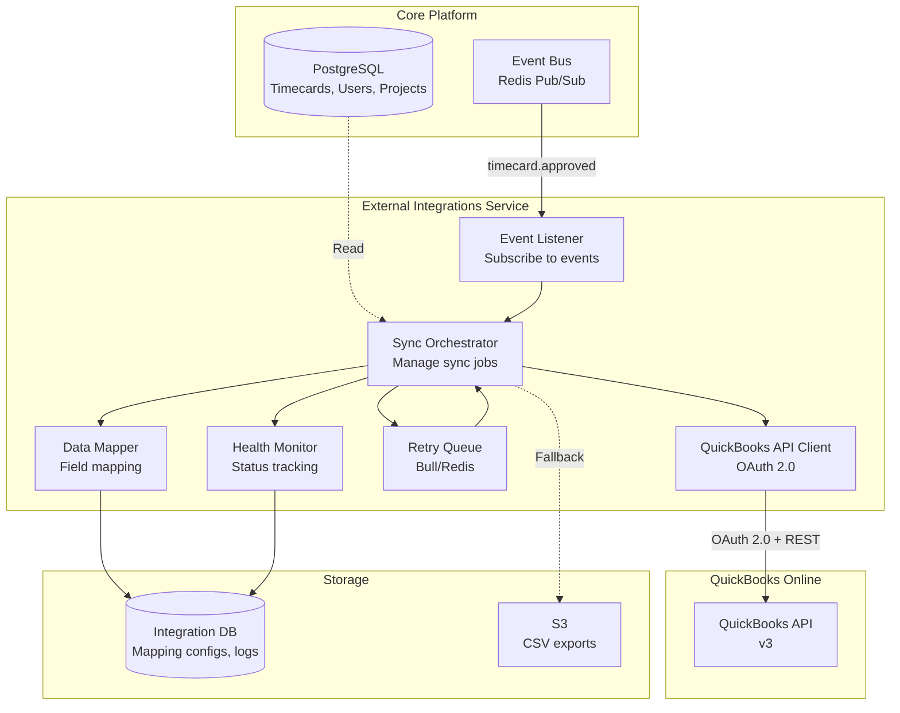
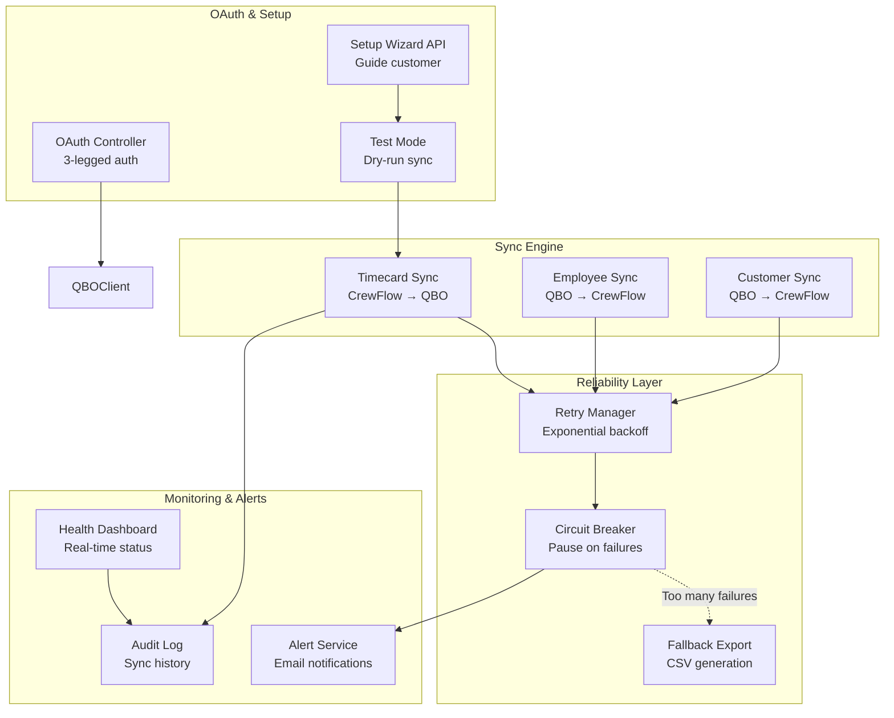
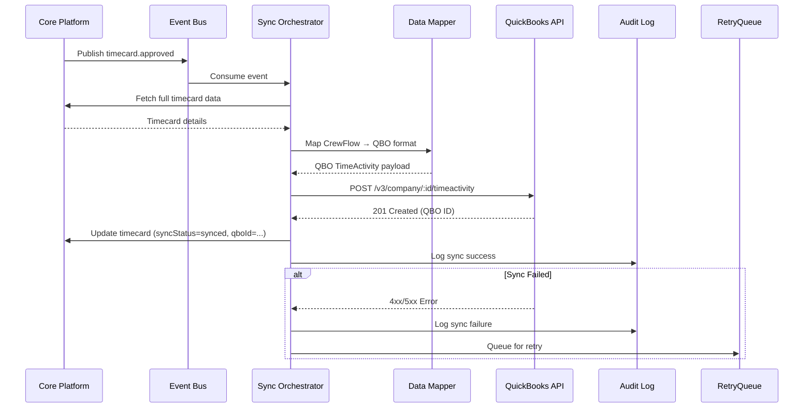
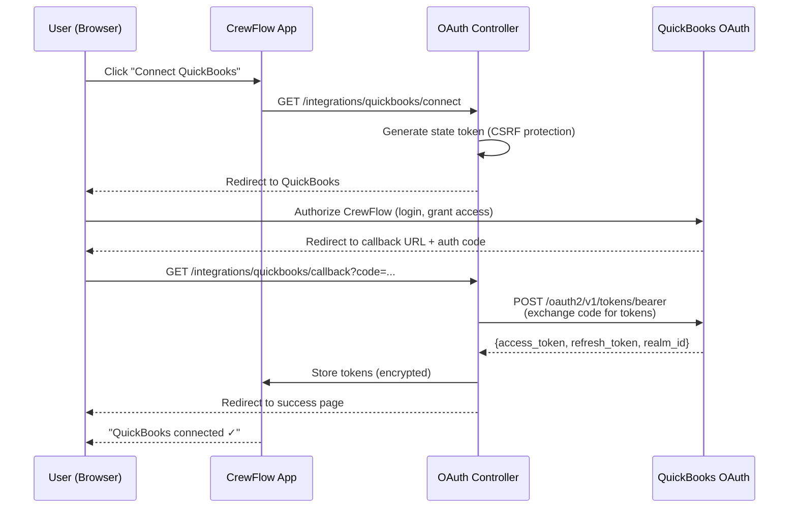

# External Integrations - MVP Technical PRD

## Document Metadata
- **Track**: External Integrations
- **Phase**: MVP (Phase 1)
- **Phase Timeline**: Months 1-4 (Weeks 1-16)
- **Version**: 1.0
- **Last Updated**: 2025-10-22
- **Authors**: Product & Engineering Team
- **Status**: Approved
- **Dependencies**: Core Platform (event bus, data models, admin APIs)

---

## 1. Executive Summary

### 1.1 Phase Objectives

The External Integrations MVP delivers a **production-ready QuickBooks Online integration** with a 48-hour setup guarantee. This phase focuses on reliable bidirectional sync of timecards, employees, and projects, with robust error handling, health monitoring, and automated recovery.

**Primary Goals:**
1. Deliver guaranteed QuickBooks Online integration (48-hour setup or free month)
2. Achieve 98%+ successful sync rate
3. Provide real-time integration health monitoring
4. Enable automated data mapping with visual wizard
5. Implement fallback CSV export if integration fails

### 1.2 Key Deliverables

**QuickBooks Online Integration:**
- OAuth 2.0 authentication (secure, user-authorized)
- Bidirectional sync:
  - CrewFlow → QuickBooks: Timecards (TimeActivity entities)
  - QuickBooks → CrewFlow: Employees, Customers (projects)
- Sync frequency: Every 15 minutes for approved timecards
- Real-time sync status dashboard

**Integration Setup Tools:**
- OAuth connection flow (3-step wizard)
- Visual data mapping wizard (drag-and-drop field matching)
- Test mode (dry-run sync with validation)
- Sandbox environment (test with sample data)

**Reliability & Monitoring:**
- Health check dashboard (real-time status)
- Automated retry logic (exponential backoff)
- Circuit breaker pattern (pause after 5 consecutive failures)
- Email alerts for integration failures
- Manual CSV export fallback

**48-Hour Setup Guarantee:**
- Onboarding checklist tracking setup time
- Video call support with integration specialist
- Automated health monitoring during setup
- SLA tracking (alert if approaching 48 hours)

### 1.3 Success Criteria

**Technical KPIs:**
- Sync success rate: 98%+
- Average sync latency: <5 minutes (from timecard approval to QBO)
- Integration setup time: <2 hours (average)
- API error rate: <1%
- Health check response time: <500ms
- Zero data corruption incidents

**Business KPIs:**
- 100% of beta customers using QuickBooks sync
- 48-hour guarantee met: 100% of customers
- Setup time <48 hours: 95% of customers
- Customer satisfaction (integration): 8+/10
- Support tickets (integration): <5 per customer during setup

**Quality Metrics:**
- Test coverage: 85% (critical for data integrity)
- All sync scenarios have integration tests
- Data validation: 100% accuracy (matches Core Platform data)
- API rate limit compliance: 100% (no throttling errors)

### 1.4 Timeline and Milestones

**Week 1-4: Foundation & Research**
- QuickBooks API research and sandbox setup
- OAuth 2.0 flow implementation
- Data model mapping (CrewFlow ↔ QuickBooks)
- Integration service architecture

**Week 5-8: Core Sync Logic**
- Timecard sync (CrewFlow → QuickBooks)
- Employee sync (QuickBooks → CrewFlow)
- Customer sync (QuickBooks → CrewFlow as Projects)
- Retry logic and error handling
- Data mapping configuration

**Week 9-12: Tools & Monitoring**
- Visual data mapping wizard
- Integration health dashboard
- OAuth setup wizard
- Test mode (dry-run sync)
- Email alerts

**Week 13-16: Reliability & Testing**
- Circuit breaker implementation
- Fallback CSV export
- Comprehensive integration tests
- Load testing (handle 50 customers)
- Beta customer onboarding

### 1.5 Dependencies on Other Tracks

**CRITICAL DEPENDENCY: Core Platform**
- **Required by Week 4**: Event bus (subscribe to `timecard.approved`)
- **Required by Week 4**: Timecard, user, project data models
- **Required by Week 8**: Admin API (manage integrations, company settings)

**Other Dependencies:**
- Field Operations: Not required (integrations happen server-side)
- Intelligence Layer: Not required (analytics can use Core Platform data)

**Blocking Issues:**
- Cannot sync timecards until Core Platform timecard model stable
- Cannot setup OAuth until Core Platform company management ready

---

## 2. Architecture Overview

### 2.1 System Context Diagram



### 2.2 Component Architecture



### 2.3 Data Flow Diagrams

#### Timecard Sync Flow


#### OAuth Setup Flow


### 2.4 Technology Stack (LOCKED Decisions)

**Integration Service:**
- Node.js 18+ with TypeScript [LOCKED] - Same as Core Platform
- Express.js [LOCKED] - API endpoints for OAuth, setup wizard
- Bull/Redis [LOCKED] - Job queue for sync operations

**QuickBooks API Client:**
- node-quickbooks [RECOMMENDED] - Unofficial but widely used library
- Alternative: Custom implementation using Axios
- OAuth 2.0 libraries: passport-quickbooks [RECOMMENDED]
- Decision by: Week 2

**Data Storage:**
- PostgreSQL [LOCKED] - Integration configs, mapping rules, audit logs
- Redis [LOCKED] - Retry queue, rate limiting
- S3 [LOCKED] - CSV export files (fallback)

**Reliability:**
- Circuit breaker: opossum [LOCKED]
- Retry logic: async-retry [LOCKED]
- Rate limiting: bottleneck [LOCKED] (respect QBO API limits)

**Monitoring:**
- Sentry [LOCKED] - Error tracking
- CloudWatch [LOCKED] - Metrics and logs
- Custom health check endpoint

### 2.5 Changes from Previous Phase

N/A - This is Phase 1 (MVP)

---

## 3. Technical Requirements

### 3.1 Functional Requirements

#### FR-1: QuickBooks OAuth Connection
**As an admin**, I want to securely connect CrewFlow to my QuickBooks account.

**Acceptance Criteria:**
- 3-step wizard: (1) Click connect, (2) Authorize in QuickBooks, (3) Confirm connection
- OAuth 2.0 three-legged authentication
- Access token and refresh token stored encrypted
- Realm ID (company ID) captured
- Test connection after OAuth (verify API access)
- Connection status shown in dashboard (green=connected, red=disconnected)
- Disconnect button (revoke tokens)

**OAuth Flow:**
```typescript
// Step 1: Initiate OAuth
GET /api/v1/integrations/quickbooks/connect?companyId=<id>
→ Redirects to QuickBooks authorization page

// Step 2: QuickBooks redirects back
GET /api/v1/integrations/quickbooks/callback?code=<auth_code>&realmId=<realm_id>&state=<state>
→ Exchange code for tokens
→ Store tokens (encrypted in database)

// Step 3: Verify connection
POST /api/v1/integrations/quickbooks/test-connection
→ Make test API call (GET /v3/company/:realmId/companyinfo)
→ Return success/failure
```

#### FR-2: Timecard Sync (CrewFlow → QuickBooks)
**As an admin**, I want approved timecards to automatically sync to QuickBooks as TimeActivity records.

**Acceptance Criteria:**
- Trigger: When timecard status changes to "approved"
- Sync frequency: Every 15 minutes (batch sync of approved timecards)
- Map fields:
  - CrewFlow Worker → QBO Employee
  - CrewFlow Project → QBO Customer
  - CrewFlow Cost Code → QBO ServiceItem (or Class)
  - Clock in/out times → TxnDate, StartTime, EndTime
  - Total hours → Hours
  - Billable status → BillableStatus
- Create new TimeActivity in QuickBooks
- Update CrewFlow timecard with QBO TimeActivity ID
- Mark as synced (syncStatus="synced", qboSyncedAt=timestamp)

**Data Mapping:**
```typescript
interface TimecardToTimeActivityMapping {
  TxnDate: string;           // Date of timecard (YYYY-MM-DD)
  EmployeeRef: {             // CrewFlow worker → QBO Employee
    value: string;           // QBO Employee ID
    name: string;            // Employee name
  };
  CustomerRef: {             // CrewFlow project → QBO Customer
    value: string;           // QBO Customer ID
    name: string;            // Customer/project name
  };
  ItemRef?: {                // CrewFlow cost code → QBO ServiceItem
    value: string;           // QBO ServiceItem ID
    name: string;            // Service item name
  };
  ClassRef?: {               // Alternative: CrewFlow cost code → QBO Class
    value: string;
    name: string;
  };
  StartTime: string;         // HH:MM:SS format
  EndTime: string;           // HH:MM:SS format
  Hours: number;             // Total hours (decimal)
  BreakHours?: number;       // Break deduction
  BillableStatus: 'Billable' | 'NotBillable' | 'HasBeenBilled';
  Description?: string;      // Timecard notes
}
```

#### FR-3: Employee Sync (QuickBooks → CrewFlow)
**As an admin**, I want to import employees from QuickBooks so I don't have to manually create them in CrewFlow.

**Acceptance Criteria:**
- Import all active employees from QuickBooks on first setup
- Incremental sync: Check for new/updated employees daily
- Map fields:
  - QBO Employee.DisplayName → CrewFlow User.name
  - QBO Employee.PrimaryEmailAddr → CrewFlow User.email
  - QBO Employee.Id → Store as externalId in CrewFlow
- Create user accounts in CrewFlow (role=field_worker by default)
- Update existing users if email matches
- Do NOT delete users if they're deleted in QuickBooks (soft delete)

#### FR-4: Customer/Project Sync (QuickBooks → CrewFlow)
**As an admin**, I want to import customers from QuickBooks as projects.

**Acceptance Criteria:**
- Import all active customers from QuickBooks
- Map fields:
  - QBO Customer.DisplayName → CrewFlow Project.name
  - QBO Customer.Id → Store as externalId
- Create projects in CrewFlow (status=active)
- Update existing projects if name matches
- Allow manual mapping (QBO Customer → CrewFlow Project) if names don't match

#### FR-5: Data Mapping Wizard
**As an admin**, I want to visually map CrewFlow fields to QuickBooks fields.

**Acceptance Criteria:**
- Visual interface: Drag-and-drop field matching
- Show sample data from both systems
- Required fields highlighted (must be mapped)
- Save mapping configuration to database
- Test mapping before saving (validate sample timecard)
- Support multiple mapping profiles (if company uses QBO differently)

**UI Example:**
```
┌───────────────────────────────────────────────┐
│ Map Fields: CrewFlow → QuickBooks             │
├───────────────────────────────────────────────┤
│ CrewFlow Field       QuickBooks Field         │
│ ─────────────────   ─────────────────         │
│ Worker            →  Employee        [✓]      │
│ Project           →  Customer        [✓]      │
│ Cost Code         →  [ ] ServiceItem          │
│                      [✓] Class                │
│ Clock In          →  StartTime       [✓]      │
│ Clock Out         →  EndTime         [✓]      │
│ Total Hours       →  Hours           [✓]      │
│                                               │
│ [Test Mapping]  [Save Configuration]         │
└───────────────────────────────────────────────┘
```

#### FR-6: Integration Health Dashboard
**As an admin**, I want to monitor the health of my QuickBooks integration in real-time.

**Acceptance Criteria:**
- Dashboard shows:
  - Connection status (green=healthy, yellow=degraded, red=failed)
  - Last successful sync timestamp
  - Recent sync activity (last 10 syncs)
  - Error count (last 24 hours)
  - Pending timecards (not yet synced)
  - API rate limit usage (% of daily limit)
- Auto-refresh every 30 seconds
- Click on error to see details (error message, affected timecard)
- Manual "Sync Now" button (trigger immediate sync)

**Dashboard UI:**
```
┌─────────────────────────────────────────────┐
│ QuickBooks Online Integration               │
├─────────────────────────────────────────────┤
│ Status: ✓ Healthy                           │
│ Last Sync: 2 minutes ago                    │
│ Synced Today: 47 timecards                  │
│ Errors (24h): 2                             │
│ Pending: 3 timecards                        │
│                                             │
│ Recent Activity:                            │
│ ✓ 2 min ago - Synced 5 timecards           │
│ ✓ 17 min ago - Synced 3 timecards          │
│ ✗ 32 min ago - Failed (Rate limit)         │
│                                             │
│ [Sync Now]  [View Logs]  [Settings]        │
└─────────────────────────────────────────────┘
```

#### FR-7: Retry Logic & Circuit Breaker
**As a system**, I want to automatically retry failed syncs and pause if QuickBooks is down.

**Acceptance Criteria:**
- Automatic retry for transient failures (network errors, rate limits)
- Exponential backoff: 1min → 5min → 15min → 1hr → 4hr
- Max retries: 5 attempts, then move to dead letter queue
- Circuit breaker: After 5 consecutive failures, pause for 30 minutes
- Circuit breaker notification: Email admin when triggered
- Resume automatically after cooldown period
- Manual reset button (admin can force resume)

**Retry Logic:**
```typescript
import retry from 'async-retry';

async function syncTimecardToQBO(timecard: Timecard) {
  await retry(
    async (bail) => {
      try {
        const qboTimeActivity = await mapTimecardToTimeActivity(timecard);
        const result = await qboClient.createTimeActivity(qboTimeActivity);
        return result;
      } catch (error) {
        if (error.code === 'INVALID_DATA') {
          // Don't retry - data issue
          bail(error);
        }
        // Retry for network/rate limit errors
        throw error;
      }
    },
    {
      retries: 5,
      factor: 2,
      minTimeout: 60 * 1000,   // 1 minute
      maxTimeout: 4 * 60 * 60 * 1000  // 4 hours
    }
  );
}
```

#### FR-8: Fallback CSV Export
**As an admin**, I want to export timecards as CSV if QuickBooks integration fails.

**Acceptance Criteria:**
- Manual export button (generate CSV of unsynced timecards)
- Automatic export triggered if circuit breaker opens
- CSV format compatible with QuickBooks import
- Columns: Employee name, Customer, Date, Start time, End time, Hours, Billable
- Email CSV to admin
- Store CSV in S3 for 30 days
- Instructions included (how to import into QuickBooks manually)

#### FR-9: Test Mode (Dry-Run Sync)
**As an admin**, I want to test the integration before going live.

**Acceptance Criteria:**
- Test mode: Simulate sync without actually writing to QuickBooks
- Use sandbox QuickBooks account (or production in test mode)
- Show preview of what would be synced
- Validation errors displayed clearly
- Success message if test passes
- Required before enabling live sync

#### FR-10: Audit Log
**As an admin**, I want to see a history of all sync operations for troubleshooting.

**Acceptance Criteria:**
- Log all sync attempts (success and failure)
- Store: Timestamp, Timecard ID, QBO TimeActivity ID, Status, Error message
- Searchable/filterable (by date, status, worker, project)
- Export audit log to CSV
- Retain 90 days

---

## 4. API Specifications

### 4.1 QuickBooks API (v3) Endpoints Used

**Authentication:**
```
POST https://oauth.platform.intuit.com/oauth2/v1/tokens/bearer
→ Exchange authorization code for access/refresh tokens

POST https://oauth.platform.intuit.com/oauth2/v1/tokens/bearer
→ Refresh access token using refresh token
```

**TimeActivity (Timecards):**
```
POST /v3/company/:realmId/timeactivity
→ Create new time activity

GET /v3/company/:realmId/timeactivity/:id
→ Get time activity by ID

POST /v3/company/:realmId/timeactivity/:id?operation=update
→ Update existing time activity
```

**Employee:**
```
GET /v3/company/:realmId/query?query=SELECT * FROM Employee WHERE Active = true
→ Get all active employees

GET /v3/company/:realmId/employee/:id
→ Get employee by ID
```

**Customer:**
```
GET /v3/company/:realmId/query?query=SELECT * FROM Customer WHERE Active = true
→ Get all active customers

GET /v3/company/:realmId/customer/:id
→ Get customer by ID
```

**ServiceItem & Class:**
```
GET /v3/company/:realmId/query?query=SELECT * FROM Item WHERE Type = 'Service'
→ Get all service items (for cost code mapping)

GET /v3/company/:realmId/query?query=SELECT * FROM Class WHERE Active = true
→ Get all classes (alternative for cost code mapping)
```

**Rate Limits:**
- OAuth token endpoint: No rate limit
- API calls: 500 requests per minute per realm (company)
- Concurrent requests: 10 max

### 4.2 CrewFlow Integration API

```typescript
// OAuth Setup

GET /api/v1/integrations/quickbooks/connect?companyId=<id>
→ Initiates OAuth flow, redirects to QuickBooks

GET /api/v1/integrations/quickbooks/callback?code=<code>&realmId=<id>&state=<state>
→ OAuth callback, exchanges code for tokens
Response: { success: true, realmId: string }

POST /api/v1/integrations/quickbooks/test-connection
Request: { companyId: string }
Response: { connected: boolean, companyName: string, error?: string }

DELETE /api/v1/integrations/quickbooks/disconnect
Request: { companyId: string }
Response: { success: boolean }

// Data Mapping

GET /api/v1/integrations/quickbooks/mapping?companyId=<id>
Response: {
  employeeMapping: { crewflowWorkerId: qboEmployeeId }[],
  customerMapping: { crewflowProjectId: qboCustomerId }[],
  costCodeMapping: { crewflowCostCodeId: qboServiceItemId | qboClassId }[]
}

PUT /api/v1/integrations/quickbooks/mapping
Request: { companyId: string, mapping: MappingConfig }
Response: { success: boolean }

POST /api/v1/integrations/quickbooks/test-mapping
Request: { companyId: string, timecardId: string }
Response: {
  valid: boolean,
  preview: QBOTimeActivityPayload,
  errors?: ValidationError[]
}

// Sync Operations

POST /api/v1/integrations/quickbooks/sync-now
Request: { companyId: string, timecardIds?: string[] }
Response: { jobId: string, message: 'Sync job queued' }

GET /api/v1/integrations/quickbooks/sync-status/:jobId
Response: {
  status: 'pending' | 'running' | 'completed' | 'failed',
  progress: number,  // 0-100
  results: { synced: number, failed: number, errors: SyncError[] }
}

// Health & Monitoring

GET /api/v1/integrations/quickbooks/health?companyId=<id>
Response: {
  status: 'healthy' | 'degraded' | 'failed',
  lastSync: string,  // ISO 8601
  syncedToday: number,
  errorsLast24h: number,
  pendingTimecards: number,
  rateLimitUsage: number  // Percentage
}

GET /api/v1/integrations/quickbooks/audit-log?companyId=<id>&page=1&limit=50
Response: {
  logs: AuditLogEntry[],
  pagination: Pagination
}

// Fallback Export

GET /api/v1/integrations/quickbooks/export-csv?companyId=<id>&startDate=<date>&endDate=<date>
Response: CSV file download
```

---

## 5. Data Models

### 5.1 Integration Config Table

```sql
CREATE TABLE integrations (
  id UUID PRIMARY KEY DEFAULT gen_random_uuid(),
  company_id UUID NOT NULL REFERENCES companies(id) ON DELETE CASCADE,
  type VARCHAR(50) NOT NULL CHECK (type = 'quickbooks'),  -- Only QBO in MVP
  enabled BOOLEAN DEFAULT FALSE,
  config JSONB NOT NULL DEFAULT '{}',
  last_sync_at TIMESTAMP,
  status VARCHAR(50) DEFAULT 'pending' CHECK (status IN ('pending', 'healthy', 'degraded', 'failed')),
  error_message TEXT,
  created_at TIMESTAMP DEFAULT NOW(),
  updated_at TIMESTAMP DEFAULT NOW(),
  UNIQUE(company_id, type)
);

-- Sample config JSONB:
-- {
--   "realmId": "123456789",
--   "accessToken": "<encrypted>",
--   "refreshToken": "<encrypted>",
--   "tokenExpiresAt": "2025-10-23T10:00:00Z",
--   "syncFrequency": 15,  // minutes
--   "mapping": {
--     "costCodeField": "Class",  // or "ServiceItem"
--     "employeeMapping": {},
--     "customerMapping": {},
--     "costCodeMapping": {}
--   }
-- }
```

### 5.2 Sync Jobs Table

```sql
CREATE TABLE sync_jobs (
  id UUID PRIMARY KEY DEFAULT gen_random_uuid(),
  integration_id UUID NOT NULL REFERENCES integrations(id) ON DELETE CASCADE,
  status VARCHAR(50) DEFAULT 'pending' CHECK (status IN ('pending', 'running', 'completed', 'failed')),
  started_at TIMESTAMP,
  completed_at TIMESTAMP,
  timecards_total INT DEFAULT 0,
  timecards_synced INT DEFAULT 0,
  timecards_failed INT DEFAULT 0,
  errors JSONB DEFAULT '[]',
  created_at TIMESTAMP DEFAULT NOW()
);

CREATE INDEX idx_sync_jobs_integration_id ON sync_jobs(integration_id);
CREATE INDEX idx_sync_jobs_status ON sync_jobs(status);
```

### 5.3 Audit Log Table

```sql
CREATE TABLE integration_audit_log (
  id UUID PRIMARY KEY DEFAULT gen_random_uuid(),
  integration_id UUID NOT NULL REFERENCES integrations(id) ON DELETE CASCADE,
  timecard_id UUID REFERENCES timecards(id),
  action VARCHAR(50) NOT NULL,  -- 'sync_timecard', 'sync_employee', 'test_connection', etc.
  status VARCHAR(50) NOT NULL CHECK (status IN ('success', 'failure')),
  request_payload JSONB,
  response_payload JSONB,
  error_message TEXT,
  created_at TIMESTAMP DEFAULT NOW()
);

CREATE INDEX idx_audit_log_integration_id ON integration_audit_log(integration_id, created_at DESC);
CREATE INDEX idx_audit_log_timecard_id ON integration_audit_log(timecard_id);
```

---

## 6. Critical Implementation Details

### 6.1 OAuth Token Management

```typescript
import crypto from 'crypto';

const ENCRYPTION_KEY = process.env.ENCRYPTION_KEY;  // 32-byte key
const ALGORITHM = 'aes-256-gcm';

function encryptToken(token: string): string {
  const iv = crypto.randomBytes(16);
  const cipher = crypto.createCipheriv(ALGORITHM, ENCRYPTION_KEY, iv);

  let encrypted = cipher.update(token, 'utf8', 'hex');
  encrypted += cipher.final('hex');

  const authTag = cipher.getAuthTag();

  return `${iv.toString('hex')}:${authTag.toString('hex')}:${encrypted}`;
}

function decryptToken(encryptedToken: string): string {
  const [ivHex, authTagHex, encrypted] = encryptedToken.split(':');

  const iv = Buffer.from(ivHex, 'hex');
  const authTag = Buffer.from(authTagHex, 'hex');
  const decipher = crypto.createDecipheriv(ALGORITHM, ENCRYPTION_KEY, iv);

  decipher.setAuthTag(authTag);

  let decrypted = decipher.update(encrypted, 'hex', 'utf8');
  decrypted += decipher.final('utf8');

  return decrypted;
}

// Store tokens
async function storeOAuthTokens(companyId: string, tokens: OAuthTokens) {
  const config = {
    realmId: tokens.realmId,
    accessToken: encryptToken(tokens.access_token),
    refreshToken: encryptToken(tokens.refresh_token),
    tokenExpiresAt: new Date(Date.now() + tokens.expires_in * 1000).toISOString()
  };

  await db.integrations.update({
    where: { companyId, type: 'quickbooks' },
    data: { config, enabled: true }
  });
}

// Refresh token before expiry
async function ensureValidToken(integration: Integration): Promise<string> {
  const expiresAt = new Date(integration.config.tokenExpiresAt);

  // Refresh if expiring within 5 minutes
  if (expiresAt.getTime() - Date.now() < 5 * 60 * 1000) {
    const refreshToken = decryptToken(integration.config.refreshToken);
    const newTokens = await refreshOAuthTokens(refreshToken);
    await storeOAuthTokens(integration.companyId, newTokens);
    return newTokens.access_token;
  }

  return decryptToken(integration.config.accessToken);
}
```

### 6.2 Rate Limiting

```typescript
import Bottleneck from 'bottleneck';

// QuickBooks allows 500 requests/minute per realm
const limiter = new Bottleneck({
  reservoir: 500,           // Initial capacity
  reservoirRefreshAmount: 500,
  reservoirRefreshInterval: 60 * 1000,  // 1 minute
  maxConcurrent: 10         // Max concurrent requests
});

async function callQBOAPI(method: string, url: string, data?: any) {
  return limiter.schedule(async () => {
    const accessToken = await ensureValidToken(integration);

    const response = await axios.request({
      method,
      url: `https://quickbooks.api.intuit.com/v3/company/${realmId}${url}`,
      headers: {
        'Authorization': `Bearer ${accessToken}`,
        'Accept': 'application/json',
        'Content-Type': 'application/json'
      },
      data
    });

    return response.data;
  });
}
```

### 6.3 Circuit Breaker

```typescript
import CircuitBreaker from 'opossum';

const circuitBreakerOptions = {
  timeout: 30000,           // 30 seconds
  errorThresholdPercentage: 50,  // Open if >50% fail
  resetTimeout: 30 * 60 * 1000,  // 30 minutes cooldown
  volumeThreshold: 5        // Min 5 requests before checking threshold
};

const breaker = new CircuitBreaker(syncTimecardToQBO, circuitBreakerOptions);

breaker.on('open', () => {
  console.error('Circuit breaker opened - QuickBooks integration paused');
  sendAlertEmail(integration.companyId, 'QuickBooks integration paused due to repeated failures');
});

breaker.on('halfOpen', () => {
  console.log('Circuit breaker half-open - testing QuickBooks integration');
});

breaker.on('close', () => {
  console.log('Circuit breaker closed - QuickBooks integration resumed');
  sendAlertEmail(integration.companyId, 'QuickBooks integration resumed');
});

// Usage
try {
  await breaker.fire(timecard);
} catch (error) {
  if (breaker.opened) {
    // Fallback: Queue for CSV export
    await queueForCSVExport(timecard);
  }
}
```

---

## 7. Testing Strategy

### 7.1 Integration Testing

**QuickBooks Sandbox:**
- Use QuickBooks Sandbox for all testing
- Create test company with sample data (employees, customers, service items)
- Test OAuth flow end-to-end
- Test all API endpoints

**Key Test Scenarios:**

```typescript
describe('QuickBooks Integration', () => {
  it('should complete OAuth flow and store tokens', async () => {
    // Simulate OAuth callback
    const result = await oauthCallback('auth_code', 'realm_id', 'state_token');
    expect(result.success).toBe(true);

    // Verify tokens stored
    const integration = await getIntegration(companyId, 'quickbooks');
    expect(integration.config.realmId).toBe('realm_id');
    expect(integration.config.accessToken).toBeDefined();
  });

  it('should sync approved timecard to QuickBooks', async () => {
    const timecard = await createTestTimecard({ status: 'approved' });

    await syncTimecardToQBO(timecard);

    // Verify QBO TimeActivity created
    const qboActivity = await qboClient.getTimeActivity(timecard.qboId);
    expect(qboActivity.Hours).toBe(timecard.totalHours);
  });

  it('should retry failed sync with exponential backoff', async () => {
    // Mock QBO API to fail first 2 attempts, succeed on 3rd
    let attempts = 0;
    qboClient.createTimeActivity = jest.fn(() => {
      attempts++;
      if (attempts < 3) throw new Error('Network error');
      return { Id: 'qbo-123' };
    });

    await syncTimecardToQBO(timecard);

    expect(attempts).toBe(3);
  });

  it('should open circuit breaker after 5 consecutive failures', async () => {
    // Mock QBO API to always fail
    qboClient.createTimeActivity = jest.fn(() => {
      throw new Error('Service unavailable');
    });

    for (let i = 0; i < 5; i++) {
      try {
        await breaker.fire(timecard);
      } catch (e) {
        // Expected
      }
    }

    expect(breaker.opened).toBe(true);
  });
});
```

---

## 8. Success Metrics

| Metric | Target | Measurement |
|--------|--------|-------------|
| Sync Success Rate | 98%+ | Audit log analysis |
| Average Sync Latency | <5 min | Timestamp tracking |
| Integration Setup Time | <2 hours | Onboarding tracking |
| 48-Hour Guarantee Met | 100% | SLA tracking |
| API Error Rate | <1% | Error logs |
| Data Accuracy | 100% | Reconciliation job |

---

## 9. Risks & Mitigations

| Risk | Probability | Impact | Mitigation |
|------|-------------|--------|------------|
| QuickBooks API changes | Low | Critical | Subscribe to API change notifications, version locking |
| Rate limiting errors | Medium | High | Bottleneck library, queue management, respect limits |
| OAuth token expiry issues | Medium | High | Auto-refresh 5 min before expiry, error recovery |
| Data mapping errors | High | Critical | Visual wizard, test mode, validation before sync |
| QuickBooks API downtime | Low | High | Circuit breaker, fallback CSV export, retry logic |

---

## 10. Open Questions

**Question**: Should we support QuickBooks Desktop in addition to Online?
- **Context**: Some contractors use Desktop version
- **Impact**: Significant additional complexity (different API)
- **Decision by**: Week 2
- **Recommendation**: No for MVP (QBO only), Desktop in Phase 2

**Question**: How do we handle deleted QuickBooks entities (employees, customers)?
- **Options**: Soft delete in CrewFlow, keep orphaned records, show warning
- **Decision by**: Week 4
- **Recommendation**: Keep orphaned records, show warning to admin

---

## Appendix

### A. Glossary

- **Realm ID**: QuickBooks company identifier
- **OAuth 2.0**: Authorization framework for secure API access
- **TimeActivity**: QuickBooks entity representing time worked
- **Circuit Breaker**: Pattern to prevent cascading failures
- **Exponential Backoff**: Retry strategy with increasing delays

### B. References

- QuickBooks API Docs: https://developer.intuit.com/app/developer/qbo/docs/api/accounting/all-entities/timeactivity
- OAuth 2.0 Spec: https://oauth.net/2/
- Circuit Breaker Pattern: https://martinfowler.com/bliki/CircuitBreaker.html

### C. Revision History

| Version | Date | Author | Changes |
|---------|------|--------|---------|
| 1.0 | 2025-10-22 | Claude | Initial PRD for External Integrations MVP |

---

**End of PRD-EI-01-MVP.md**
