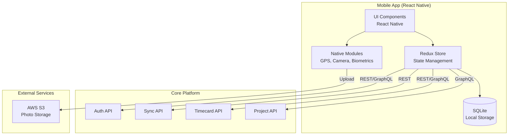
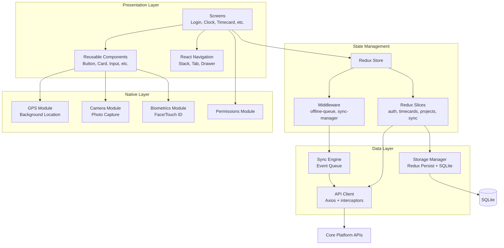
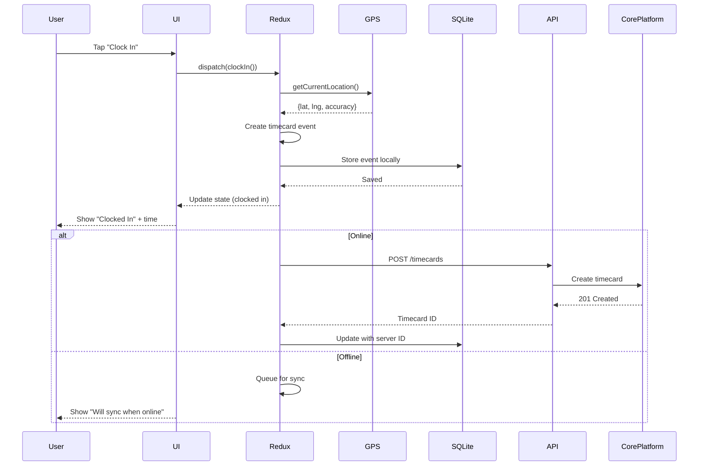
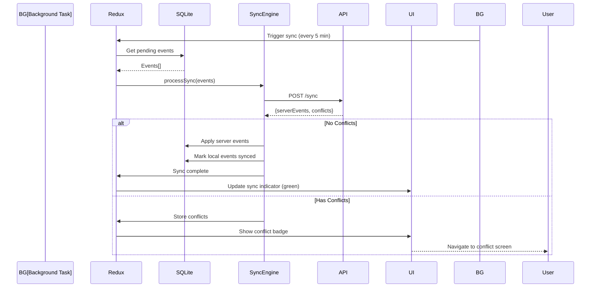

# Field Operations - MVP Technical PRD

## Document Metadata
- **Track**: Field Operations
- **Phase**: MVP (Phase 1)
- **Phase Timeline**: Months 1-4 (Weeks 1-16)
- **Version**: 1.0
- **Last Updated**: 2025-10-22
- **Authors**: Product & Engineering Team
- **Status**: Approved
- **Dependencies**: Core Platform (authentication, sync API, data models)

---

## 1. Executive Summary

### 1.1 Phase Objectives

The Field Operations MVP delivers mobile applications for iOS and Android that enable field workers and foremen to clock in/out, submit timecards, and manage daily work activities. This phase focuses on creating an intuitive, offline-first mobile experience that works reliably in construction environments with poor connectivity.

**Primary Goals:**
1. Enable one-tap clock in/out with GPS verification
2. Support offline operation for up to 30 days
3. Achieve <3 second clock-in time (target: <5 seconds for MVP)
4. Deliver battery-optimized GPS tracking
5. Provide photo documentation capabilities
6. Achieve 4.0+ app store rating from beta testers

### 1.2 Key Deliverables

**Mobile Applications:**
- iOS app (React Native) supporting iPhone and iPad
- Android app (React Native) supporting phones and tablets
- Biometric authentication (Face ID, Touch ID, fingerprint)
- Offline-first architecture with local SQLite storage

**Core Features:**
- One-tap clock in/out
- Timecard creation and submission
- GPS location tracking and geofencing
- Photo capture and compression
- Break tracking (manual)
- Project and cost code selection
- Simple "copy yesterday" duplication

**Offline Capabilities:**
- Store up to 30 days of data locally
- Background sync every 5 minutes when connected
- Visual sync status indicators
- Conflict resolution UI

**Battery Optimization:**
- Adaptive GPS polling (reduces frequency when stationary)
- Location tracking only during work hours
- Background task compliance (iOS/Android)

### 1.3 Success Criteria

**Technical KPIs:**
- Clock-in time: <5 seconds (from app open to confirmed)
- App launch time: <3 seconds
- Offline success rate: 95% (all operations work offline)
- Battery drain: <15% during 8-hour workday
- Crash rate: <1% of sessions
- App size: <50MB

**Business KPIs:**
- 500 mobile devices in use (beta)
- Daily Active Users: 60% of installed base
- Time to first clock-in: <24 hours after install
- Support tickets per 100 users: <10/month
- App store rating: 4.0+

**Quality Metrics:**
- Test coverage: 75% (mobile targets are lower)
- All critical flows have E2E tests
- Accessibility compliance (WCAG 2.1 Level AA)
- Supports iOS 14+ and Android 10+

### 1.4 Timeline and Milestones

**Week 1-4: Foundation (BLOCKED until Core Platform Week 4)**
- React Native project setup
- Navigation structure
- Authentication integration with Core Platform
- Design system and components

**Week 5-8: Core Features**
- Clock in/out UI and logic
- Timecard list and detail views
- GPS integration and geofencing
- Photo capture and upload
- Offline storage (SQLite setup)

**Week 9-12: Offline & Sync**
- Background sync implementation
- Conflict resolution UI
- Sync status indicators
- Battery optimization
- Push notifications

**Week 13-16: Polish & Beta**
- UI/UX refinement based on feedback
- Performance optimization
- E2E testing on real devices
- Beta distribution (TestFlight, Google Play Beta)
- App store submission preparation

### 1.5 Dependencies on Other Tracks

**CRITICAL DEPENDENCY: Core Platform**
- **Required by Week 4**: Authentication API, user data models
- **Required by Week 8**: Sync API, timecard CRUD APIs, project/cost code APIs
- **Required by Week 12**: Event bus for real-time updates, WebSocket support

**Other Dependencies:**
- Intelligence Layer: Not required for MVP
- External Integrations: Not required for MVP

**Blocking Issues:**
- Cannot start authentication until Core Platform auth API ready
- Cannot test sync until Core Platform sync endpoint ready
- Mobile development can proceed with mock data in parallel

---

## 2. Architecture Overview

### 2.1 System Context Diagram



### 2.2 Component Architecture



### 2.3 Data Flow Diagrams

#### Clock-In Flow


#### Offline Sync Flow


### 2.4 Technology Stack (LOCKED Decisions)

**Mobile Framework:**
- React Native 0.72+ [LOCKED]
- Reason: Code sharing (70%+ between iOS/Android), faster development, strong ecosystem

**State Management:**
- Redux Toolkit [LOCKED]
- Redux Persist [LOCKED] - Persist state to storage
- Reason: Predictable state, great dev tools, offline support

**Offline Storage:**
- SQLite (via react-native-sqlite-storage) [LOCKED]
- AsyncStorage (for simple key-value) [LOCKED]
- Reason: Relational data (timecards), robust, works offline

**Navigation:**
- React Navigation 6.x [LOCKED]
- Reason: De-facto standard, great documentation

**HTTP Client:**
- Axios [LOCKED]
- Reason: Interceptors, timeout, better error handling than fetch

**Native Modules:**
- **GPS**: react-native-geolocation-service [LOCKED]
- **Camera**: react-native-vision-camera [LOCKED] (better than built-in)
- **Biometrics**: react-native-biometrics [LOCKED]
- **Permissions**: react-native-permissions [LOCKED]

**UI Components:**
- Custom component library (construction-themed)
- React Native Paper [RECOMMENDED] as base (Material Design)
- Reason: Professional look, accessible, customizable

**Testing:**
- Jest [LOCKED] - Unit tests
- React Native Testing Library [LOCKED] - Component tests
- Detox [RECOMMENDED] - E2E tests (iOS/Android simulators)

**Build & Distribution:**
- EAS (Expo Application Services) [RECOMMENDED]
- Alternative: Fastlane (more control, steeper learning curve)
- Reason: Simplified build process, OTA updates

**Analytics & Monitoring:**
- Sentry React Native [LOCKED] - Crash reporting
- Firebase Analytics [RECOMMENDED] - User analytics
- Custom events sent to Core Platform

### 2.5 Changes from Previous Phase

N/A - This is Phase 1 (MVP)

---

## 3. Technical Requirements

### 3.1 Functional Requirements

#### FR-1: User Authentication (Biometric)
**As a field worker**, I want to log in quickly with Face ID or fingerprint so I don't waste time typing passwords.

**Acceptance Criteria:**
- Email/password login (first time only)
- Enable biometric auth during onboarding
- Subsequent logins use biometric (fallback to password if biometric fails)
- Biometric credentials encrypted and stored in device secure enclave
- Auto-logout after 7 days (require re-authentication)

**Implementation:**
```typescript
import ReactNativeBiometrics from 'react-native-biometrics';

async function enableBiometricLogin(userId: string, credentials: Credentials) {
  const { available, biometryType } = await ReactNativeBiometrics.isSensorAvailable();

  if (!available) {
    throw new Error('Biometric authentication not available');
  }

  // Store encrypted credentials
  await ReactNativeBiometrics.createKeys();
  await SecureStore.setItemAsync(`credentials:${userId}`, JSON.stringify(credentials));

  return biometryType; // 'FaceID', 'TouchID', 'Fingerprint'
}

async function biometricLogin() {
  const { success, signature } = await ReactNativeBiometrics.createSignature({
    promptMessage: 'Authenticate to clock in',
    payload: Date.now().toString()
  });

  if (success) {
    const credentials = await SecureStore.getItemAsync(`credentials:${userId}`);
    return loginWithCredentials(JSON.parse(credentials));
  }
}
```

#### FR-2: One-Tap Clock In/Out
**As a field worker**, I want to clock in with one tap so I can start work quickly.

**Acceptance Criteria:**
- Home screen shows large "Clock In" or "Clock Out" button based on current state
- Tapping button captures GPS location automatically
- Requires photo if project settings mandate it
- Defaults to last used project and cost code
- Confirmation shown with timestamp
- Works offline (queues for sync)
- Entire flow completes in <5 seconds

**UI Flow:**
```
[Clocked Out State]
  ↓
User taps "Clock In" button
  ↓
GPS capture (1-2 seconds)
  ↓
Photo capture (if required)
  ↓
Timecard created locally
  ↓
Show "Clocked In at [time]"
```

#### FR-3: Timecard Management
**As a field worker**, I want to view and edit my timecards before submitting them.

**Acceptance Criteria:**
- List view shows all timecards (grouped by week)
- Filter: This week, Last week, This month, Custom date range
- Status indicators: Draft (yellow), Submitted (blue), Approved (green), Rejected (red)
- Tap to view details (clock in/out times, breaks, photos, notes)
- Edit draft timecards (change project, cost code, add breaks, notes)
- Cannot edit submitted/approved timecards
- Submit timecard with swipe gesture or button
- Batch submit (select multiple, submit all)

**List View UI:**
```
┌────────────────────────────────────┐
│  This Week (Oct 21-27)             │
├────────────────────────────────────┤
│ ○ Mon Oct 21                       │
│   Miller Residential - 8.5 hrs     │
│   Status: Submitted                │
├────────────────────────────────────┤
│ ○ Tue Oct 22                       │
│   Miller Residential - 7.0 hrs     │
│   Status: Draft            [Edit]  │
├────────────────────────────────────┤
│ ○ Wed Oct 23                       │
│   Johnson Commercial - 9.0 hrs     │
│   Status: Approved ✓               │
└────────────────────────────────────┘
```

#### FR-4: GPS Location Tracking
**As a project manager**, I want to verify workers are on-site using GPS so I can ensure work is done at the right location.

**Acceptance Criteria:**
- GPS location captured at clock in and clock out
- Continuous GPS tracking (every 5 minutes) while clocked in
- Geofence validation: Warn if clocking in outside project geofence
- Show warning icon if outside geofence (don't block, just flag)
- GPS coordinates stored with timestamps
- Battery-optimized: Reduce polling when stationary
- Works in background (iOS/Android background location permissions)

**Battery Optimization:**
```typescript
// Adaptive polling strategy
const getPollingInterval = (movement: boolean, batteryLevel: number) => {
  if (batteryLevel < 20) return 15 * 60 * 1000; // 15 min (low battery)
  if (!movement) return 10 * 60 * 1000;         // 10 min (stationary)
  return 5 * 60 * 1000;                         // 5 min (moving)
};
```

#### FR-5: Photo Documentation
**As a foreman**, I want to attach photos to timecards so I can document work completed.

**Acceptance Criteria:**
- Take photo from camera or select from gallery
- Automatic compression (max 500KB per photo)
- Up to 10 photos per timecard
- Photos tagged with GPS location and timestamp
- Upload to S3 when online (background upload)
- Thumbnail preview in timecard list
- Full-size view in timecard details
- Delete photos before submission

**Photo Upload Flow:**
```typescript
async function uploadPhoto(photo: Photo, timecardId: string) {
  // 1. Compress photo
  const compressed = await ImageCompressor.compress(photo.uri, {
    maxWidth: 1920,
    maxHeight: 1080,
    quality: 0.8
  });

  // 2. Get presigned URL from backend
  const { uploadUrl, photoUrl } = await api.getPhotoUploadUrl(timecardId);

  // 3. Upload to S3 (background task)
  await BackgroundUpload.upload({
    url: uploadUrl,
    path: compressed.uri,
    method: 'PUT',
    headers: { 'Content-Type': 'image/jpeg' }
  });

  // 4. Update timecard with photo URL
  return photoUrl;
}
```

#### FR-6: Offline Operation
**As a field worker**, I want the app to work without internet so I can clock in at remote job sites.

**Acceptance Criteria:**
- All features work offline (clock in/out, view timecards, take photos)
- Data stored locally in SQLite
- Sync indicator shows connection status (green=synced, yellow=pending, red=offline)
- Auto-sync every 5 minutes when online
- Manual sync button
- Up to 30 days of offline storage
- Conflict resolution UI if changes conflict with server

**Offline Storage Schema:**
```sql
-- Local SQLite database
CREATE TABLE local_events (
  id TEXT PRIMARY KEY,
  type TEXT NOT NULL,
  entity_type TEXT NOT NULL,
  entity_id TEXT NOT NULL,
  data TEXT NOT NULL,  -- JSON blob
  timestamp TEXT NOT NULL,
  synced INTEGER DEFAULT 0,
  retry_count INTEGER DEFAULT 0
);

CREATE TABLE timecards (
  id TEXT PRIMARY KEY,
  worker_id TEXT NOT NULL,
  project_id TEXT NOT NULL,
  cost_code_id TEXT NOT NULL,
  clock_in TEXT NOT NULL,
  clock_out TEXT,
  status TEXT DEFAULT 'draft',
  data TEXT NOT NULL,  -- Full JSON
  synced INTEGER DEFAULT 0
);
```

#### FR-7: Break Tracking
**As a field worker**, I want to track my breaks so my timecard accurately reflects unpaid time.

**Acceptance Criteria:**
- "Start Break" and "End Break" buttons visible when clocked in
- Multiple breaks per day supported
- Break duration calculated automatically
- Manual break entry allowed (edit timecard, add break with start/end time)
- Breaks deducted from total hours
- Lunch break can be auto-applied (company setting: e.g., 30 min after 4 hours)

#### FR-8: Project and Cost Code Selection
**As a field worker**, I want to quickly select which project and cost code I'm working on.

**Acceptance Criteria:**
- Clock in screen shows project dropdown
- Recent projects shown first
- Search projects by name
- After selecting project, cost code dropdown appears
- Recent/favorite cost codes shown first
- Visual icons for common cost codes (hammer=rough work, wrench=finish, etc.)
- "Same as yesterday" option pre-fills last selection

#### FR-9: Simple Duplication ("Copy Yesterday")
**As a field worker**, I want to duplicate yesterday's entry so I don't re-enter the same information daily.

**Acceptance Criteria:**
- Home screen shows "Copy Yesterday" button if previous entry exists
- Button shows preview: "Miller Residential - Rough Electrical?"
- One tap pre-fills: project, cost code, default clock-in time
- User can edit before clocking in
- If yesterday had multiple entries, show list to choose from

#### FR-10: Push Notifications
**As a field worker**, I want to receive notifications for important updates.

**Acceptance Criteria:**
- Notification when timecard approved
- Notification when timecard rejected (with reason)
- Notification when shift reminder (e.g., "Time to clock in?")
- Notification for app updates available
- User can disable notifications in settings

### 3.2 Non-Functional Requirements

#### NFR-1: Performance
- App launch time: <3 seconds (cold start)
- Clock-in completion: <5 seconds (including GPS)
- Timecard list load: <1 second (100 timecards)
- Photo compression: <2 seconds per photo
- Sync time: <10 seconds (30 days of data)

#### NFR-2: Battery Consumption
- GPS tracking: <15% battery drain over 8-hour shift
- Background sync: <2% battery per hour
- Overall: App should not be top battery consumer

#### NFR-3: Storage
- App size: <50MB (download size)
- Local database: Support up to 1GB (30 days of data + photos)
- Auto-cleanup: Delete synced events older than 30 days

#### NFR-4: Offline Capability
- 95% of operations work offline
- Support 30 days of offline data
- Graceful degradation (show cached data if API fails)

#### NFR-5: Reliability
- Crash rate: <1% of sessions
- ANR (Application Not Responding): <0.5%
- Successful photo uploads: >95%
- Sync success rate: >95%

#### NFR-6: Accessibility
- WCAG 2.1 Level AA compliance
- Screen reader support (TalkBack, VoiceOver)
- Minimum touch target size: 44×44 pts (iOS), 48×48 dp (Android)
- Color contrast ratios: 4.5:1 for text

#### NFR-7: Platform Support
- iOS: 14.0+ (supports 95% of devices)
- Android: 10+ (API level 29+, supports 85% of devices)
- Tablets: iPad and Android tablets supported

### 3.3 Phase-Specific Scalability Targets

**Devices:** 500 mobile devices (beta)

**Users:**
- 500 active field workers
- 50 foremen
- ~60% daily active usage

**Data Volume:**
- Timecards: 500 users × 1 timecard/day = 500/day = 10,000/month
- Photos: 250 photos/day (50% of timecards) = ~2GB/month
- GPS points: 500 users × 96 points/day (every 5 min × 8 hrs) = 48,000 points/day

**API Requests:**
- Clock in/out: 1,000 requests/day (500 users × 2)
- Sync: 500 devices × 12 syncs/hour = 6,000 syncs/hour = 100/minute
- Photo uploads: 250 uploads/day (background)

### 3.4 Dependencies

**Core Platform APIs (CRITICAL):**
- POST /auth/login - Required Week 4
- POST /auth/refresh - Required Week 4
- POST /timecards - Required Week 8
- GET /timecards - Required Week 8
- POST /sync - Required Week 12
- GET /projects - Required Week 8
- GET /cost-codes - Required Week 8
- POST /photo-upload-url - Required Week 10

**Device Capabilities:**
- GPS (required)
- Camera (required)
- Biometric sensor (optional, falls back to password)
- Internet connectivity (optional, works offline)

---

## 4. API Specifications

### 4.1 REST Endpoints (Consumed from Core Platform)

See Core Platform PRD (PRD-CP-01-MVP.md) Section 4.1 for full API specifications.

**Key Endpoints Used:**

```typescript
// Authentication
POST /api/v1/auth/login
POST /api/v1/auth/refresh
POST /api/v1/auth/logout

// Timecards
POST /api/v1/timecards
GET /api/v1/timecards?workerId=<id>&startDate=<date>&endDate=<date>
GET /api/v1/timecards/:id
PUT /api/v1/timecards/:id
POST /api/v1/timecards/:id/submit

// Projects
GET /api/v1/projects?companyId=<id>&status=active

// Cost Codes
GET /api/v1/cost-codes?companyId=<id>&active=true

// Sync
POST /api/v1/sync

// Photo Upload
GET /api/v1/photo-upload-url?timecardId=<id>
```

### 4.2 API Client Implementation

```typescript
// api/client.ts
import axios from 'axios';
import { getAccessToken, refreshAccessToken } from '../auth/tokenManager';

const apiClient = axios.create({
  baseURL: process.env.API_BASE_URL || 'https://api.crewflow.com/api/v1',
  timeout: 10000
});

// Request interceptor: Add auth token
apiClient.interceptors.request.use(async (config) => {
  const token = await getAccessToken();
  if (token) {
    config.headers.Authorization = `Bearer ${token}`;
  }
  return config;
});

// Response interceptor: Handle 401, retry with refresh
apiClient.interceptors.response.use(
  (response) => response,
  async (error) => {
    const originalRequest = error.config;

    if (error.response?.status === 401 && !originalRequest._retry) {
      originalRequest._retry = true;

      try {
        await refreshAccessToken();
        const token = await getAccessToken();
        originalRequest.headers.Authorization = `Bearer ${token}`;
        return apiClient(originalRequest);
      } catch (refreshError) {
        // Refresh failed, logout user
        await logout();
        return Promise.reject(refreshError);
      }
    }

    return Promise.reject(error);
  }
);

export default apiClient;
```

### 4.3 Offline Queue Implementation

```typescript
// sync/offlineQueue.ts
import { db } from '../database/sqlite';

interface QueuedRequest {
  id: string;
  method: string;
  url: string;
  data: any;
  timestamp: string;
  retryCount: number;
}

export async function queueRequest(method: string, url: string, data: any) {
  const request: QueuedRequest = {
    id: uuid(),
    method,
    url,
    data,
    timestamp: new Date().toISOString(),
    retryCount: 0
  };

  await db.execute(
    'INSERT INTO offline_queue (id, method, url, data, timestamp) VALUES (?, ?, ?, ?, ?)',
    [request.id, method, url, JSON.stringify(data), request.timestamp]
  );

  return request.id;
}

export async function processOfflineQueue() {
  const queue = await db.query('SELECT * FROM offline_queue ORDER BY timestamp ASC');

  for (const request of queue) {
    try {
      await apiClient.request({
        method: request.method,
        url: request.url,
        data: JSON.parse(request.data)
      });

      // Success - remove from queue
      await db.execute('DELETE FROM offline_queue WHERE id = ?', [request.id]);
    } catch (error) {
      // Failure - increment retry count
      const newRetryCount = request.retryCount + 1;

      if (newRetryCount > 5) {
        // Too many retries - move to dead letter queue
        await db.execute('DELETE FROM offline_queue WHERE id = ?', [request.id]);
        await logFailedRequest(request, error);
      } else {
        await db.execute(
          'UPDATE offline_queue SET retry_count = ? WHERE id = ?',
          [newRetryCount, request.id]
        );
      }
    }
  }
}
```

---

## 5. Data Models

### 5.1 Local SQLite Schema

```sql
-- Users (cached)
CREATE TABLE users (
  id TEXT PRIMARY KEY,
  email TEXT NOT NULL,
  name TEXT NOT NULL,
  role TEXT NOT NULL,
  company_id TEXT NOT NULL,
  data TEXT NOT NULL,  -- Full JSON
  last_synced TEXT NOT NULL
);

-- Timecards
CREATE TABLE timecards (
  id TEXT PRIMARY KEY,
  worker_id TEXT NOT NULL,
  project_id TEXT NOT NULL,
  cost_code_id TEXT NOT NULL,
  clock_in TEXT NOT NULL,
  clock_out TEXT,
  breaks TEXT DEFAULT '[]',  -- JSON array
  gps_coordinates TEXT DEFAULT '[]',  -- JSON array
  photos TEXT DEFAULT '[]',  -- JSON array
  status TEXT DEFAULT 'draft',
  notes TEXT,
  synced INTEGER DEFAULT 0,
  data TEXT NOT NULL,  -- Full JSON
  created_at TEXT NOT NULL,
  updated_at TEXT NOT NULL
);

CREATE INDEX idx_timecards_worker_id ON timecards(worker_id);
CREATE INDEX idx_timecards_status ON timecards(status);
CREATE INDEX idx_timecards_synced ON timecards(synced);

-- Projects (cached)
CREATE TABLE projects (
  id TEXT PRIMARY KEY,
  name TEXT NOT NULL,
  company_id TEXT NOT NULL,
  status TEXT NOT NULL,
  data TEXT NOT NULL,
  last_synced TEXT NOT NULL
);

CREATE INDEX idx_projects_company_id ON projects(company_id);
CREATE INDEX idx_projects_status ON projects(status);

-- Cost Codes (cached)
CREATE TABLE cost_codes (
  id TEXT PRIMARY KEY,
  company_id TEXT NOT NULL,
  code TEXT NOT NULL,
  description TEXT NOT NULL,
  category TEXT,
  active INTEGER DEFAULT 1,
  data TEXT NOT NULL,
  last_synced TEXT NOT NULL
);

CREATE INDEX idx_cost_codes_company_id ON cost_codes(company_id);
CREATE INDEX idx_cost_codes_active ON cost_codes(active);

-- Offline Queue
CREATE TABLE offline_queue (
  id TEXT PRIMARY KEY,
  method TEXT NOT NULL,
  url TEXT NOT NULL,
  data TEXT NOT NULL,
  timestamp TEXT NOT NULL,
  retry_count INTEGER DEFAULT 0
);

CREATE INDEX idx_offline_queue_timestamp ON offline_queue(timestamp);

-- Sync State
CREATE TABLE sync_state (
  key TEXT PRIMARY KEY,
  value TEXT NOT NULL,
  updated_at TEXT NOT NULL
);

-- Insert initial sync state
INSERT INTO sync_state (key, value, updated_at) VALUES
('last_sync_timestamp', '1970-01-01T00:00:00Z', datetime('now'));
```

### 5.2 Redux State Shape

```typescript
interface RootState {
  auth: AuthState;
  timecards: TimecardsState;
  projects: ProjectsState;
  costCodes: CostCodesState;
  sync: SyncState;
  ui: UIState;
}

interface AuthState {
  user: User | null;
  accessToken: string | null;
  refreshToken: string | null;
  biometricEnabled: boolean;
  isAuthenticated: boolean;
}

interface TimecardsState {
  items: Record<string, Timecard>;
  currentTimecardId: string | null;  // Currently clocked in
  filter: TimecardFilter;
  loading: boolean;
  error: string | null;
}

interface ProjectsState {
  items: Record<string, Project>;
  recentProjectIds: string[];
  loading: boolean;
}

interface CostCodesState {
  items: Record<string, CostCode>;
  recentCostCodeIds: string[];
  loading: boolean;
}

interface SyncState {
  status: 'synced' | 'pending' | 'offline' | 'error';
  lastSyncTimestamp: string;
  pendingChanges: number;
  conflicts: Conflict[];
}

interface UIState {
  isOnline: boolean;
  activeScreen: string;
  notifications: Notification[];
}
```

---

## 6. Integration Contracts

### 6.1 Photo Upload to S3

**Flow:**
1. Mobile app requests presigned URL from backend
2. Backend generates presigned PUT URL (expires in 15 minutes)
3. Mobile app uploads photo directly to S3
4. Mobile app updates timecard with S3 photo URL

**Presigned URL Request:**
```typescript
GET /api/v1/photo-upload-url?timecardId=<id>&fileName=<name>

Response:
{
  uploadUrl: string;      // Presigned S3 PUT URL
  photoUrl: string;       // Final S3 URL (after upload)
  expiresAt: string;      // ISO 8601
}
```

**Upload Implementation:**
```typescript
async function uploadPhotoToS3(photoUri: string, timecardId: string) {
  // 1. Compress photo
  const compressed = await compressPhoto(photoUri);

  // 2. Get presigned URL
  const { uploadUrl, photoUrl } = await api.getPhotoUploadUrl(timecardId, 'photo.jpg');

  // 3. Upload to S3
  await fetch(uploadUrl, {
    method: 'PUT',
    headers: {
      'Content-Type': 'image/jpeg'
    },
    body: await readFileAsBlob(compressed.uri)
  });

  return photoUrl;
}
```

### 6.2 Background Sync Contract

See Core Platform PRD Section 4.1 for `/sync` endpoint specification.

**Mobile Implementation:**
```typescript
import BackgroundFetch from 'react-native-background-fetch';

BackgroundFetch.configure({
  minimumFetchInterval: 15,  // 15 minutes (iOS)
  stopOnTerminate: false,
  startOnBoot: true,
  enableHeadless: true
}, async (taskId) => {
  console.log('[BackgroundFetch] Task:', taskId);

  await syncWithServer();

  BackgroundFetch.finish(taskId);
});
```

---

## 7. Critical Implementation Details

### 7.1 Battery-Optimized GPS Tracking

**Adaptive Polling Strategy:**

```typescript
import Geolocation from 'react-native-geolocation-service';
import { AppState } from 'react-native';

class GPSTracker {
  private watchId: number | null = null;
  private lastLocation: Location | null = null;
  private pollingInterval = 5 * 60 * 1000; // 5 minutes

  startTracking() {
    this.watchId = Geolocation.watchPosition(
      (position) => this.handleLocationUpdate(position),
      (error) => console.error('GPS error:', error),
      {
        enableHighAccuracy: false,  // Use network location (battery-friendly)
        distanceFilter: 50,         // Only update if moved 50m
        interval: this.pollingInterval,
        fastestInterval: 60 * 1000  // Min 1 minute between updates
      }
    );
  }

  handleLocationUpdate(position: Position) {
    const newLocation = {
      latitude: position.coords.latitude,
      longitude: position.coords.longitude,
      accuracy: position.coords.accuracy,
      timestamp: new Date(position.timestamp).toISOString()
    };

    // Check if user is stationary
    if (this.lastLocation) {
      const distance = calculateDistance(this.lastLocation, newLocation);

      if (distance < 10) {
        // Stationary - reduce polling frequency
        this.pollingInterval = 10 * 60 * 1000; // 10 minutes
      } else {
        // Moving - increase polling frequency
        this.pollingInterval = 5 * 60 * 1000; // 5 minutes
      }
    }

    this.lastLocation = newLocation;

    // Store location
    store.dispatch(addGPSPoint(newLocation));
  }

  stopTracking() {
    if (this.watchId !== null) {
      Geolocation.clearWatch(this.watchId);
      this.watchId = null;
    }
  }
}

// Only track during work hours
function shouldTrackGPS(): boolean {
  const currentTimecard = selectCurrentTimecard(store.getState());
  return currentTimecard !== null && currentTimecard.clockOut === null;
}
```

### 7.2 Photo Compression

```typescript
import ImageResizer from 'react-native-image-resizer';

async function compressPhoto(uri: string): Promise<{ uri: string, size: number }> {
  const compressed = await ImageResizer.createResizedImage(
    uri,
    1920,  // Max width
    1080,  // Max height
    'JPEG',
    80,    // Quality (0-100)
    0,     // Rotation
    null,  // Output path (auto)
    false, // Keep metadata
    {
      mode: 'contain',  // Don't crop, fit within dimensions
      onlyScaleDown: true  // Don't upscale small images
    }
  );

  return {
    uri: compressed.uri,
    size: compressed.size
  };
}

// Validate size (should be <500KB)
const { uri, size } = await compressPhoto(originalUri);
if (size > 500 * 1024) {
  console.warn('Photo still too large after compression:', size);
  // Could reduce quality further or resize smaller
}
```

### 7.3 Sync Conflict Resolution UI

```typescript
// screens/ConflictResolutionScreen.tsx
import React from 'react';
import { View, Text, Button } from 'react-native';

interface ConflictResolutionScreenProps {
  conflict: Conflict;
}

export function ConflictResolutionScreen({ conflict }: ConflictResolutionScreenProps) {
  const { localVersion, serverVersion } = conflict;

  return (
    <View>
      <Text>Conflict Detected</Text>
      <Text>Your local changes conflict with server changes.</Text>

      <View style={{ flexDirection: 'row', marginTop: 20 }}>
        <View style={{ flex: 1 }}>
          <Text>Your Version</Text>
          <Text>Clock In: {localVersion.clockIn}</Text>
          <Text>Clock Out: {localVersion.clockOut}</Text>
          <Text>Hours: {localVersion.totalHours}</Text>
        </View>

        <View style={{ flex: 1 }}>
          <Text>Server Version</Text>
          <Text>Clock In: {serverVersion.clockIn}</Text>
          <Text>Clock Out: {serverVersion.clockOut}</Text>
          <Text>Hours: {serverVersion.totalHours}</Text>
        </View>
      </View>

      <Button
        title="Use My Version"
        onPress={() => resolveConflict(conflict.id, 'client_wins')}
      />
      <Button
        title="Use Server Version"
        onPress={() => resolveConflict(conflict.id, 'server_wins')}
      />
    </View>
  );
}
```

### 7.4 Biometric Authentication Setup

```typescript
import ReactNativeBiometrics from 'react-native-biometrics';
import * as Keychain from 'react-native-keychain';

async function setupBiometricAuth(credentials: { email: string, password: string }) {
  // 1. Check if biometrics available
  const { available, biometryType } = await ReactNativeBiometrics.isSensorAvailable();

  if (!available) {
    throw new Error('Biometric authentication not available');
  }

  // 2. Create biometric keys
  await ReactNativeBiometrics.createKeys();

  // 3. Store credentials in secure keychain
  await Keychain.setGenericPassword(
    credentials.email,
    credentials.password,
    {
      service: 'com.crewflow.auth',
      accessible: Keychain.ACCESSIBLE.WHEN_UNLOCKED_THIS_DEVICE_ONLY,
      accessControl: Keychain.ACCESS_CONTROL.BIOMETRY_ANY
    }
  );

  return biometryType;
}

async function loginWithBiometrics() {
  // 1. Prompt for biometric
  const { success } = await ReactNativeBiometrics.simplePrompt({
    promptMessage: 'Authenticate to log in'
  });

  if (!success) {
    throw new Error('Biometric authentication failed');
  }

  // 2. Retrieve stored credentials
  const credentials = await Keychain.getGenericPassword({
    service: 'com.crewflow.auth'
  });

  if (!credentials) {
    throw new Error('No stored credentials found');
  }

  // 3. Login with credentials
  return loginWithEmailPassword(credentials.username, credentials.password);
}
```

---

## 8. Testing Strategy

### 8.1 Unit Testing

**Coverage Target**: 75%

**Testing Framework**: Jest + React Native Testing Library

**Sample Tests:**

```typescript
// __tests__/utils/timeCalculator.test.ts
import { calculateTotalHours, calculateOvertimeHours } from '../timeCalculator';

describe('Time Calculator', () => {
  it('should calculate total hours correctly', () => {
    const clockIn = '2025-10-22T08:00:00Z';
    const clockOut = '2025-10-22T17:30:00Z';
    const breaks = [{ startTime: '2025-10-22T12:00:00Z', endTime: '2025-10-22T12:30:00Z', duration: 30 }];

    const totalHours = calculateTotalHours(clockIn, clockOut, breaks);
    expect(totalHours).toBe(9.0); // 9.5 hours - 0.5 hours break
  });

  it('should calculate overtime correctly', () => {
    const totalHours = 10;
    const overtimeThreshold = 8;

    const overtime = calculateOvertimeHours(totalHours, overtimeThreshold);
    expect(overtime).toBe(2.0);
  });
});

// __tests__/components/ClockButton.test.tsx
import React from 'react';
import { render, fireEvent } from '@testing-library/react-native';
import { ClockButton } from '../components/ClockButton';

describe('ClockButton', () => {
  it('should render "Clock In" when not clocked in', () => {
    const { getByText } = render(<ClockButton isClockedIn={false} onPress={jest.fn()} />);
    expect(getByText('Clock In')).toBeTruthy();
  });

  it('should call onPress when tapped', () => {
    const onPressMock = jest.fn();
    const { getByText } = render(<ClockButton isClockedIn={false} onPress={onPressMock} />);

    fireEvent.press(getByText('Clock In'));
    expect(onPressMock).toHaveBeenCalledTimes(1);
  });
});
```

### 8.2 E2E Testing

**Tool**: Detox

**Test Scenarios:**

```typescript
// e2e/clockInOut.e2e.ts
describe('Clock In/Out Flow', () => {
  beforeAll(async () => {
    await device.launchApp();
  });

  it('should allow user to clock in', async () => {
    // Login
    await element(by.id('email-input')).typeText('worker@example.com');
    await element(by.id('password-input')).typeText('password123');
    await element(by.id('login-button')).tap();

    // Wait for home screen
    await waitFor(element(by.id('clock-in-button')))
      .toBeVisible()
      .withTimeout(5000);

    // Tap clock in
    await element(by.id('clock-in-button')).tap();

    // Verify clocked in
    await expect(element(by.id('clock-out-button'))).toBeVisible();
    await expect(element(by.text('Clocked In'))).toBeVisible();
  });

  it('should allow user to clock out', async () => {
    await element(by.id('clock-out-button')).tap();

    // Verify clocked out
    await expect(element(by.id('clock-in-button'))).toBeVisible();
    await expect(element(by.text('Clocked Out'))).toBeVisible();
  });

  it('should create timecard after clock out', async () => {
    // Navigate to timecards
    await element(by.id('tab-timecards')).tap();

    // Verify timecard exists
    await expect(element(by.id('timecard-list'))).toBeVisible();
    await expect(element(by.text('Today'))).toBeVisible();
  });
});
```

### 8.3 Performance Testing

**Metrics to Monitor:**

| Metric | Target | Tool |
|--------|--------|------|
| App Launch Time | <3s | Detox performance |
| Clock-In Time | <5s | Custom timer in E2E test |
| List Scroll FPS | >55 FPS | React Native Performance Monitor |
| Photo Compression Time | <2s | Jest benchmark |
| Sync Time (30 days) | <10s | Integration test |

**Performance Test:**
```typescript
it('should clock in within 5 seconds', async () => {
  const startTime = Date.now();

  await element(by.id('clock-in-button')).tap();
  await waitFor(element(by.text('Clocked In'))).toBeVisible();

  const duration = Date.now() - startTime;
  expect(duration).toBeLessThan(5000);
});
```

### 8.4 UAT Criteria

| Test Case | Description | Expected Result |
|-----------|-------------|-----------------|
| UAT-FO-001 | Worker installs app and logs in with biometrics | Biometric setup complete, can login with Face ID/fingerprint |
| UAT-FO-002 | Worker clocks in at job site | GPS captured, timecard created, <5 seconds total |
| UAT-FO-003 | Worker works offline all day (no internet) | All actions work, data stored locally, syncs when connected |
| UAT-FO-004 | Worker takes 3 photos during day | Photos compressed (<500KB each), uploaded to S3 when online |
| UAT-FO-005 | Foreman approves timecard on mobile | Timecard status changes to "Approved", worker receives push notification |
| UAT-FO-006 | Worker clocks out outside geofence | Warning shown, but clock-out allowed, flagged for review |
| UAT-FO-007 | App runs in background for 8 hours | Battery drain <15%, GPS tracking continues |
| UAT-FO-008 | Worker submits 5 timecards at once (batch submit) | All timecards submitted, sync successful |

---

## 9. Deployment & Operations

### 9.1 Infrastructure Requirements

**App Distribution:**
- TestFlight (iOS beta) - Free, up to 10,000 testers
- Google Play Internal Testing (Android beta) - Free, unlimited testers
- Future: App Store (iOS) and Google Play Store (Android)

**CI/CD:**
- GitHub Actions for automated builds
- EAS Build (Expo Application Services) [RECOMMENDED]
  - Cloud-based builds (no need for Mac hardware)
  - Automatic signing (iOS certificates, Android keystores)
  - OTA updates for non-native code changes

**Backend Requirements:**
- Core Platform APIs (see dependencies)
- S3 bucket for photos (with CORS configured)
- Push notification service (Firebase Cloud Messaging)

### 9.2 Deployment Process

**GitHub Actions Workflow:**

```yaml
# .github/workflows/mobile-deploy.yml
name: Mobile App Deploy

on:
  push:
    branches: [main]
    paths:
      - 'mobile/**'

jobs:
  build-ios:
    runs-on: ubuntu-latest
    steps:
      - uses: actions/checkout@v3
      - uses: actions/setup-node@v3
        with:
          node-version: 18

      - name: Install dependencies
        run: cd mobile && npm ci

      - name: Run tests
        run: cd mobile && npm test

      - name: Build iOS (EAS)
        run: |
          cd mobile
          npm install -g eas-cli
          eas build --platform ios --non-interactive --no-wait
        env:
          EXPO_TOKEN: ${{ secrets.EXPO_TOKEN }}

  build-android:
    runs-on: ubuntu-latest
    steps:
      - uses: actions/checkout@v3
      - uses: actions/setup-node@v3

      - name: Install dependencies
        run: cd mobile && npm ci

      - name: Run tests
        run: cd mobile && npm test

      - name: Build Android (EAS)
        run: |
          cd mobile
          npm install -g eas-cli
          eas build --platform android --non-interactive --no-wait
        env:
          EXPO_TOKEN: ${{ secrets.EXPO_TOKEN }}
```

**Beta Distribution:**

1. **iOS (TestFlight)**:
   - Build uploaded to App Store Connect
   - Beta testers added via email
   - TestFlight link sent automatically
   - Users install via TestFlight app

2. **Android (Google Play Internal Testing)**:
   - APK/AAB uploaded to Google Play Console
   - Internal testing track created
   - Testers added via email or link
   - Users install via Google Play (testing)

**OTA Updates:**
- Use EAS Update for non-native changes (JS, assets)
- Users get updates automatically on next app launch
- No app store review needed for OTA updates
- Rollback capability if issues found

### 9.3 Monitoring & Alerting

**Crash Reporting: Sentry**

```typescript
import * as Sentry from '@sentry/react-native';

Sentry.init({
  dsn: process.env.SENTRY_DSN,
  environment: __DEV__ ? 'development' : 'production',
  enableAutoSessionTracking: true,
  tracesSampleRate: 0.2,  // 20% of transactions
  beforeSend(event, hint) {
    // Don't send events in development
    if (__DEV__) return null;
    return event;
  }
});

// Wrap root component
export default Sentry.wrap(App);
```

**Analytics: Firebase Analytics**

```typescript
import analytics from '@react-native-firebase/analytics';

// Track screen views
analytics().logScreenView({
  screen_name: 'ClockInScreen',
  screen_class: 'ClockInScreen'
});

// Track custom events
analytics().logEvent('clock_in', {
  project_id: projectId,
  duration_seconds: 3.5
});

// Track performance
const trace = await analytics().startTrace('photo_upload');
await uploadPhoto(photo);
await trace.stop();
```

**Key Metrics to Monitor:**

| Metric | Alert Threshold | Tool |
|--------|-----------------|------|
| Crash Rate | >1% | Sentry |
| ANR Rate | >0.5% | Sentry |
| Photo Upload Failures | >5% | Firebase Analytics |
| Sync Failures | >5% | Firebase Analytics |
| Clock-In Time (p95) | >8 seconds | Firebase Performance |
| Battery Drain | User reports >20% | Manual monitoring (beta feedback) |

### 9.4 Operational Runbooks

#### Runbook: High Crash Rate

**Symptoms**: Sentry alert "Crash rate > 1%"

**Diagnosis:**
1. Check Sentry dashboard for crash details
2. Identify affected OS versions, devices
3. Check recent code changes (last deploy)

**Resolution:**
- If specific OS version: Add version check, disable feature for that OS
- If recent deploy: Rollback via OTA update or new build
- If specific device: Add device detection, graceful degradation

#### Runbook: Photo Uploads Failing

**Symptoms**: Firebase Analytics shows >5% photo upload failures

**Diagnosis:**
1. Check S3 bucket permissions (CORS, presigned URLs)
2. Check backend logs for presigned URL generation errors
3. Check network errors in Sentry
4. Check photo compression (files too large?)

**Resolution:**
- CORS issue: Update S3 bucket CORS policy
- Presigned URL issue: Fix backend generation logic
- Network issue: Increase retry attempts, better error messages
- File size issue: Adjust compression settings

---

## 10. Success Metrics

### 10.1 Technical KPIs

| Metric | Target | Measurement |
|--------|--------|-------------|
| App Launch Time | <3s | Detox performance tests |
| Clock-In Time | <5s | Firebase Performance |
| Crash Rate | <1% | Sentry |
| ANR Rate | <0.5% | Sentry |
| Offline Success | 95% | Custom analytics events |
| Photo Upload Success | >95% | Firebase Analytics |
| Sync Success Rate | >95% | Firebase Analytics |
| Battery Drain | <15% per 8hr shift | Beta tester feedback |

### 10.2 Business KPIs

| Metric | Target | Measurement |
|--------|--------|-------------|
| Beta Installs | 500 devices | Firebase Analytics |
| Daily Active Users | 60% | Firebase Analytics |
| Time to First Clock-In | <24 hours | Custom event tracking |
| App Store Rating | 4.0+ | TestFlight/Play Console |
| Support Tickets | <10 per 100 users/month | Help desk |

### 10.3 Quality Metrics

| Metric | Target | Measurement |
|--------|--------|-------------|
| Test Coverage | 75% | Jest coverage report |
| E2E Test Pass Rate | 100% | Detox CI results |
| Accessibility Score | 90%+ | React Native Accessibility Inspector |
| Bundle Size | <50MB | Build artifacts |

---

## 11. Risks & Mitigations

### 11.1 Technical Risks

| Risk | Probability | Impact | Mitigation |
|------|-------------|--------|------------|
| Battery drain too high | Medium | Critical | Extensive testing on real devices, adaptive GPS polling, user controls |
| Offline sync conflicts overwhelming | High | Medium | Smart conflict resolution (auto-resolve 80%+), clear UI for manual resolution |
| Photo uploads fail frequently | Medium | High | Retry logic, queue for later, show clear status, allow manual retry |
| App crashes on specific devices | Medium | High | Comprehensive device testing, crash reporting (Sentry), graceful degradation |
| GPS inaccurate indoors | High | Medium | Use network location (less accurate, better battery), warn users, allow manual override |

### 11.2 Dependency Risks

| Risk | Probability | Impact | Mitigation |
|------|-------------|--------|------------|
| Core Platform API delays | Medium | Critical | Use mock data for parallel development, define API contracts early |
| React Native version issues | Low | Medium | Lock versions, test thoroughly before upgrading, monitor RN release notes |
| Third-party library bugs | Medium | Medium | Vet libraries carefully, have backup options, contribute fixes upstream |
| S3 upload failures | Low | High | Implement retry logic, store locally if upload fails, background retry |

### 11.3 Timeline Risks

| Risk | Probability | Impact | Mitigation |
|------|-------------|--------|------------|
| React Native learning curve | Medium | Medium | Hire experienced RN developer or provide training, pair programming |
| Offline sync more complex than estimated | High | High | Allocate 4 weeks (Weeks 9-12), consider using library (WatermelonDB, Realm) |
| iOS/Android platform differences | Medium | Medium | Test on both platforms frequently, use platform-specific code sparingly |
| App store review delays | Low | Low | Submit early, follow guidelines strictly, have fallback timeline |

---

## 12. Open Questions

### 12.1 Technical Decisions (TBD)

**Question**: Should we use React Native Paper (Material Design) or build custom components?
- **Options**:
  1. React Native Paper (faster, consistent, but generic look)
  2. Custom components (construction-themed, unique, but slower)
- **Decision by**: Week 2
- **Recommendation**: Start with Paper, customize later

**Question**: Should we use EAS or Fastlane for builds?
- **Options**:
  1. EAS (simpler, cloud-based, $99/month)
  2. Fastlane (free, more control, steeper learning curve)
- **Decision by**: Week 3
- **Recommendation**: EAS for MVP speed

**Question**: How do we handle photo storage limits?
- **Options**:
  1. Delete photos after 90 days (auto-cleanup)
  2. Compress more aggressively (<200KB)
  3. Charge for extra storage
- **Decision by**: Week 10
- **Recommendation**: Option 1 for MVP

### 12.2 Product Decisions (Stakeholder Input Required)

**Question**: Should we support landscape mode (tablets)?
- **Context**: Kiosk mode will need landscape
- **Impact**: UI complexity, testing effort
- **Decision by**: Week 4

**Question**: Should we allow clock-in without GPS (if GPS unavailable)?
- **Context**: Indoor work, GPS signal issues
- **Impact**: Verification accuracy vs. user frustration
- **Decision by**: Week 6

**Question**: What happens to photos if upload fails after 30 days?
- **Options**: Delete locally (data loss), keep indefinitely (storage issues), move to archive
- **Decision by**: Week 10

### 12.3 Research Spikes Needed

**Spike 1: Battery Consumption Testing**
- **Duration**: 3 days (Week 11)
- **Goal**: Measure actual battery drain on 5 different devices over 8-hour shift
- **Success Criteria**: <15% battery drain

**Spike 2: Offline Storage Limits**
- **Duration**: 2 days (Week 12)
- **Goal**: Test SQLite with 30 days of data (500 timecards + photos)
- **Success Criteria**: Database <100MB, queries <100ms

**Spike 3: Photo Compression Quality**
- **Duration**: 2 days (Week 9)
- **Goal**: Find optimal compression settings (quality vs. file size)
- **Success Criteria**: <500KB per photo, readable text/details

---

## Appendix

### A. Glossary

- **ANR**: Application Not Responding (Android term for frozen app)
- **Biometrics**: Face ID, Touch ID, fingerprint authentication
- **EAS**: Expo Application Services (build and deployment platform)
- **Geofence**: Virtual perimeter around a geographic area
- **OTA**: Over-The-Air (updates delivered without app store)
- **Presigned URL**: Temporary URL for uploading to S3 without credentials
- **SQLite**: Embedded relational database for mobile apps
- **TestFlight**: Apple's beta testing platform for iOS apps

### B. References

**External Documentation:**
- React Native Docs: https://reactnative.dev/docs/getting-started
- React Navigation: https://reactnavigation.org/docs/getting-started
- Redux Toolkit: https://redux-toolkit.js.org/
- EAS Build: https://docs.expo.dev/build/introduction/
- Detox: https://wix.github.io/Detox/

**Internal Documents:**
- Master Design Doc: `/docs/plans/2025-10-22-technical-architecture-prds-design.md`
- Core Platform PRD: `/docs/prds/core-platform/PRD-CP-01-MVP.md`

### C. Revision History

| Version | Date | Author | Changes |
|---------|------|--------|---------|
| 1.0 | 2025-10-22 | Claude | Initial PRD created for Field Operations MVP |

---

**End of PRD-FO-01-MVP.md**

**Next PRD**: PRD-IL-01-MVP.md (Intelligence Layer MVP)
