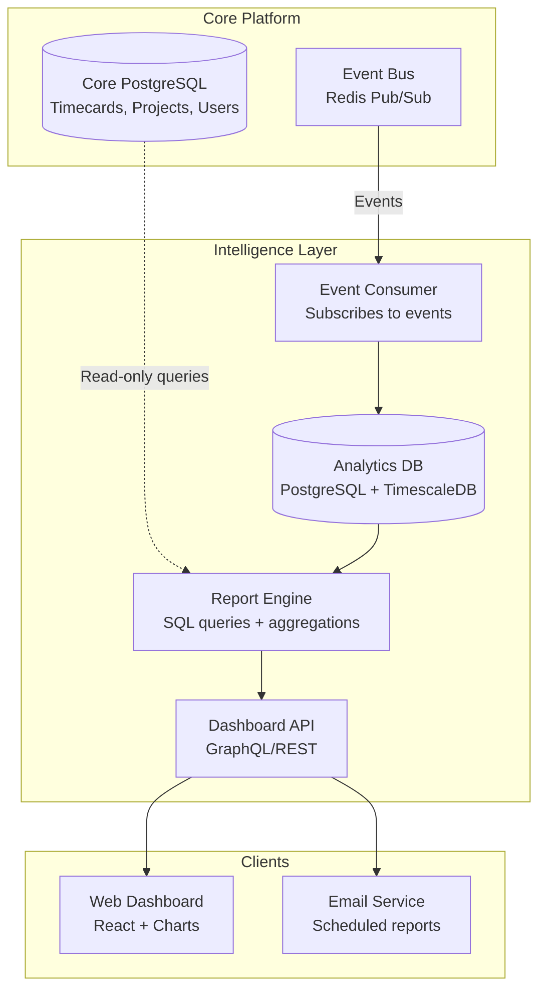
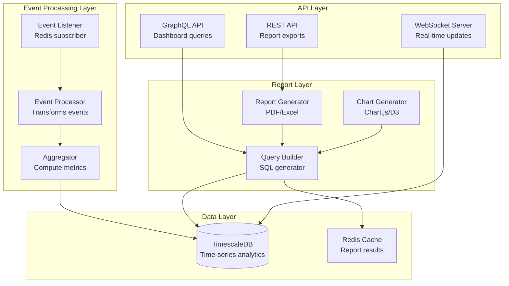
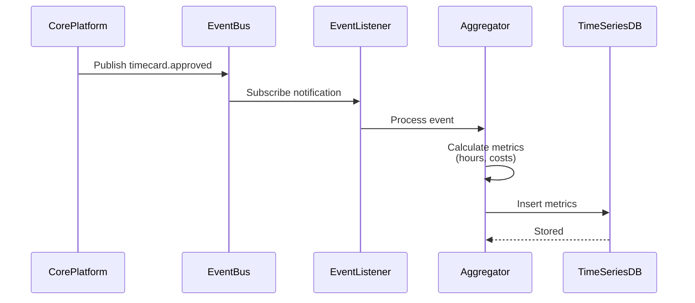
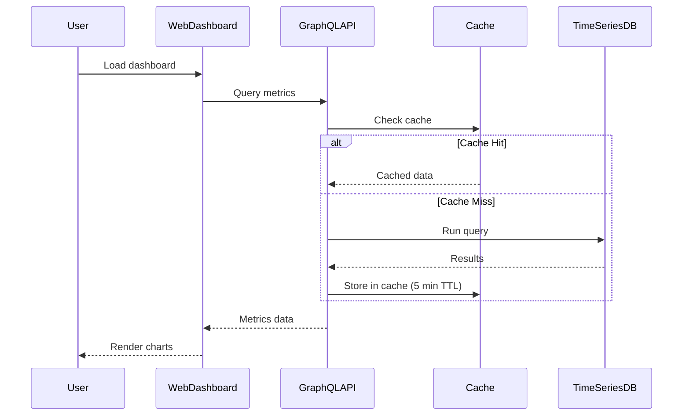

# Intelligence Layer - MVP Technical PRD

## Document Metadata
- **Track**: Intelligence Layer
- **Phase**: MVP (Phase 1)
- **Phase Timeline**: Months 1-4 (Weeks 1-16)
- **Version**: 1.0
- **Last Updated**: 2025-10-22
- **Authors**: Product & Engineering Team
- **Status**: Approved
- **Dependencies**: Core Platform (event bus, data access APIs)

---

## 1. Executive Summary

### 1.1 Phase Objectives

The Intelligence Layer MVP focuses on delivering **basic analytics and reporting** - NO machine learning or AI features in this phase. The goal is to provide essential insights for project managers and owners to track labor costs, project status, and crew productivity using simple aggregations and visualizations.

**Primary Goals:**
1. Deliver 10 pre-built reports (hours, costs, project status)
2. Provide real-time dashboard updates via WebSocket
3. Enable basic data export (PDF, Excel, CSV)
4. Achieve <5 second dashboard load time
5. **Collect data for future ML training** (Phase 3)

**Important**: This phase is about **reporting**, not **prediction**. All analytics are historical/current data visualizations using standard SQL aggregations.

### 1.2 Key Deliverables

**Analytics Dashboard (Web):**
- Executive dashboard (company-wide overview)
- Project manager dashboard (active projects)
- Foreman dashboard (crew status)
- Real-time updates (WebSocket integration)

**Pre-Built Reports (10 reports):**
1. Hours Summary (by worker, project, date range)
2. Labor Cost Report (hours × rates)
3. Project Budget vs. Actual
4. Overtime Report
5. Timecard Status Report (pending approvals)
6. Worker Productivity (hours per project/task)
7. Project Timeline (Gantt-style view)
8. Crew Utilization (% of time worked)
9. Cost Code Breakdown
10. Monthly Summary (aggregated metrics)

**Data Export:**
- PDF export (formatted reports)
- Excel export (raw data with charts)
- CSV export (raw data)
- Scheduled email reports (daily/weekly)

**Data Collection (for future ML):**
- Time-series data warehouse
- Event logging for pattern analysis
- No ML models in MVP - data collection only

### 1.3 Success Criteria

**Technical KPIs:**
- Dashboard load time: <5 seconds
- Report generation time: <10 seconds
- Real-time update latency: <1 second
- Data refresh frequency: Every 5 minutes
- Database query time (p95): <500ms
- Support 100 concurrent dashboard users

**Business KPIs:**
- 70%+ of users access reports weekly
- 5+ reports used regularly per company
- Report exports: 50+ per week (all companies)
- Data accuracy: 99.9%+ (matches timecard data exactly)

**Quality Metrics:**
- Test coverage: 80%
- All calculations verified against manual spreadsheets
- Visual regression tests for charts
- Accessibility: WCAG 2.1 Level AA

### 1.4 Timeline and Milestones

**Week 1-4: Foundation (Parallel with Core Platform)**
- Data warehouse schema (PostgreSQL + TimescaleDB)
- Event subscription (listen to Core Platform events)
- Basic aggregation queries
- Dashboard framework setup

**Week 5-8: Core Reports**
- Hours summary report
- Labor cost report
- Project budget vs. actual
- Timecard status report
- Data export functions (PDF, Excel, CSV)

**Week 9-12: Dashboards**
- Executive dashboard
- Project manager dashboard
- Foreman dashboard
- Real-time WebSocket updates
- Chart components

**Week 13-16: Additional Reports & Polish**
- Remaining 6 reports
- Scheduled email reports
- Performance optimization
- UI polish and testing

### 1.5 Dependencies on Other Tracks

**CRITICAL DEPENDENCY: Core Platform**
- **Required by Week 4**: Event bus (subscribe to timecard, project, user events)
- **Required by Week 4**: Data access APIs (read timecards, projects, users)
- **Required by Week 12**: WebSocket server for real-time updates

**Other Dependencies:**
- Field Operations: Not required for MVP (mobile doesn't consume analytics)
- External Integrations: Not required for MVP

**Data Flow:**
- Core Platform publishes events → Intelligence Layer consumes → Aggregates data → Serves to dashboards

---

## 2. Architecture Overview

### 2.1 System Context Diagram



### 2.2 Component Architecture



### 2.3 Data Flow Diagrams

#### Event Processing Flow


#### Dashboard Load Flow


### 2.4 Technology Stack (LOCKED Decisions)

**Database:**
- PostgreSQL 15+ [LOCKED] - Same as Core Platform
- TimescaleDB extension [LOCKED] - Time-series optimization
- Reason: Efficient time-series queries, automatic partitioning, compression

**Event Processing:**
- Node.js + TypeScript [LOCKED] - Same stack as Core Platform
- Redis Pub/Sub [LOCKED] - Event bus from Core Platform
- Bull queue [LOCKED] - Background aggregation jobs

**API Layer:**
- GraphQL (Apollo Server) [LOCKED] - Dashboard queries
- REST (Express) [LOCKED] - Report exports
- WebSocket (Socket.io) [LOCKED] - Real-time updates

**Charting & Visualization:**
- Chart.js [RECOMMENDED] - Simple, lightweight, good docs
- Alternative: Recharts (React-specific, better TypeScript support)
- D3.js [RECOMMENDED] - For complex custom charts
- Decision by: Week 6

**Report Generation:**
- pdfmake [LOCKED] - PDF generation (Node.js)
- ExcelJS [LOCKED] - Excel generation
- json2csv [LOCKED] - CSV export

**Dashboard Framework:**
- React 18+ [LOCKED]
- TypeScript [LOCKED]
- Redux Toolkit [LOCKED] - State management
- TailwindCSS [RECOMMENDED] - Styling

**Caching:**
- Redis [LOCKED] - Same instance as Core Platform
- Cache TTL: 5 minutes for dashboard data

**Scheduled Jobs:**
- node-cron [LOCKED] - Schedule email reports
- Bull queue [LOCKED] - Process reports in background

### 2.5 Changes from Previous Phase

N/A - This is Phase 1 (MVP)

---

## 3. Technical Requirements

### 3.1 Functional Requirements

#### FR-1: Hours Summary Report
**As a project manager**, I want to see total hours worked by worker, project, or date range.

**Acceptance Criteria:**
- Filter by: worker, project, date range, cost code
- Group by: worker, project, day, week, month
- Columns: Worker name, Project, Date, Regular hours, Overtime hours, Total hours
- Sortable by any column
- Export to PDF, Excel, CSV
- Load time: <5 seconds for 1,000 timecards

**Sample Query:**
```sql
SELECT
  u.name AS worker_name,
  p.name AS project_name,
  DATE(t.clock_in) AS work_date,
  SUM(t.regular_hours) AS regular_hours,
  SUM(t.overtime_hours) AS overtime_hours,
  SUM(t.total_hours) AS total_hours
FROM timecards t
JOIN users u ON t.worker_id = u.id
JOIN projects p ON t.project_id = p.id
WHERE t.company_id = $1
  AND t.clock_in >= $2
  AND t.clock_in < $3
  AND t.status = 'approved'
GROUP BY u.name, p.name, DATE(t.clock_in)
ORDER BY work_date DESC, worker_name;
```

#### FR-2: Labor Cost Report
**As an owner**, I want to see total labor costs to understand project profitability.

**Acceptance Criteria:**
- Calculate: hours × worker hourly rate
- Filter by: project, date range, cost code
- Group by: project, cost code, worker
- Columns: Project, Cost code, Worker, Hours, Rate, Total cost
- Show budget vs. actual
- Highlight overbudget projects (red)
- Export to PDF, Excel, CSV

**Calculation:**
```typescript
interface LaborCost {
  projectId: string;
  projectName: string;
  costCode: string;
  totalHours: number;
  averageRate: number;  // Weighted average of worker rates
  totalCost: number;    // hours × average rate
  budgeted: number;
  variance: number;     // budgeted - totalCost
  percentOver: number;  // (variance / budgeted) × 100
}
```

#### FR-3: Project Budget vs. Actual
**As a project manager**, I want to track project spending against budget.

**Acceptance Criteria:**
- Show all active projects
- Columns: Project name, Budgeted hours, Actual hours, Budgeted cost, Actual cost, Variance, % Complete
- Visual indicator: Green (<90%), Yellow (90-100%), Red (>100%)
- Drill down to cost code breakdown
- Forecast completion based on burn rate
- Update real-time as timecards approved

**Dashboard Widget:**
```
┌─────────────────────────────────────────────┐
│ Miller Residential                          │
│ Progress: 68% ████████████░░░░░░░           │
│ Budget:   $45,000    Actual: $32,500        │
│ Status:   On track ✓                        │
└─────────────────────────────────────────────┘
```

#### FR-4: Overtime Report
**As an admin**, I want to identify workers with excessive overtime for payroll planning.

**Acceptance Criteria:**
- List all workers with overtime hours in date range
- Columns: Worker, Regular hours, Overtime hours, Total hours, OT %
- Sort by: Overtime hours (descending)
- Highlight: Workers with >20% overtime (yellow), >40% overtime (red)
- Filter by: date range, project, crew
- Export to Excel for payroll processing

#### FR-5: Timecard Status Report
**As a foreman**, I want to see which timecards need approval.

**Acceptance Criteria:**
- Show all timecards in "submitted" status
- Group by: project, worker, date
- Columns: Worker, Project, Date, Hours, Submitted at, Days pending
- Highlight: Pending >3 days (yellow), >7 days (red)
- Quick approval action (bulk approve)
- Real-time updates (WebSocket)

#### FR-6: Worker Productivity Report
**As a project manager**, I want to see productivity by worker to identify training needs.

**Acceptance Criteria:**
- Metric: Hours worked per project/task
- Columns: Worker, Project, Task, Hours this month, Avg hours per task
- Compare to: Company average, crew average
- Show trend: Improving (↑), Declining (↓), Stable (→)
- **No AI/ML predictions** - just historical averages
- Filter by: date range, project, crew

#### FR-7: Real-Time Dashboard Updates
**As a project manager**, I want my dashboard to update automatically without refreshing.

**Acceptance Criteria:**
- Dashboard connects via WebSocket on load
- Updates pushed when events occur (timecard approved, etc.)
- Visual notification of update (subtle fade-in)
- No full page refresh required
- Reconnect automatically if connection lost
- Fallback to polling if WebSocket fails

#### FR-8: Data Export
**As an admin**, I want to export reports for external analysis.

**Acceptance Criteria:**
- Formats: PDF (formatted), Excel (with charts), CSV (raw data)
- All reports exportable
- PDF: Company logo, formatted tables, charts
- Excel: Multiple sheets, formulas, charts
- CSV: All data fields, no formatting
- Download or email options

**PDF Generation:**
```typescript
import pdfMake from 'pdfmake';

function generatePDFReport(data: ReportData) {
  const docDefinition = {
    content: [
      { text: 'Hours Summary Report', style: 'header' },
      { text: `Date Range: ${data.startDate} - ${data.endDate}`, style: 'subheader' },
      {
        table: {
          headerRows: 1,
          widths: ['*', '*', 'auto', 'auto', 'auto'],
          body: [
            ['Worker', 'Project', 'Regular Hrs', 'OT Hrs', 'Total Hrs'],
            ...data.rows.map(row => [
              row.workerName,
              row.projectName,
              row.regularHours,
              row.overtimeHours,
              row.totalHours
            ])
          ]
        }
      }
    ],
    styles: {
      header: { fontSize: 18, bold: true },
      subheader: { fontSize: 12, italics: true }
    }
  };

  return pdfMake.createPdf(docDefinition);
}
```

#### FR-9: Scheduled Email Reports
**As an owner**, I want to receive weekly summary reports via email.

**Acceptance Criteria:**
- Configure schedule: daily, weekly, monthly
- Select reports to include
- Email recipients (multiple)
- Delivery time (e.g., Mon 8am)
- Attach as PDF or Excel
- Email body includes summary highlights

#### FR-10: Executive Dashboard
**As an owner**, I want a high-level overview of company performance.

**Acceptance Criteria:**
- Widgets: Total labor costs (this month), Active projects, Total hours, Overtime %
- Charts: Labor cost trend (12 months), Top 5 projects by cost, Crew utilization
- Real-time updates
- Responsive (works on desktop, tablet)
- Customizable widgets (future: drag and drop)

**Dashboard Layout:**
```
┌─────────────────────────────────────────────────────┐
│  Executive Dashboard                    Oct 22, 2025│
├─────────────────────────────────────────────────────┤
│  ┌──────────┐  ┌──────────┐  ┌──────────┐          │
│  │ $125,000 │  │ 12       │  │ 3,480    │          │
│  │ Labor    │  │ Active   │  │ Hours    │          │
│  │ Costs    │  │ Projects │  │ Worked   │          │
│  └──────────┘  └──────────┘  └──────────┘          │
│                                                     │
│  ┌─────────────────────────────────────────┐       │
│  │ Labor Cost Trend (Last 12 Months)       │       │
│  │ ▂▃▅▇█▇▅▃▂▁▂▃ (Line chart)               │       │
│  └─────────────────────────────────────────┘       │
│                                                     │
│  ┌─────────────────────────────────────────┐       │
│  │ Top 5 Projects by Cost                  │       │
│  │ 1. Miller Residential    $32,500        │       │
│  │ 2. Johnson Commercial    $28,000        │       │
│  │ 3. Davis Remodel         $18,500        │       │
│  └─────────────────────────────────────────┘       │
└─────────────────────────────────────────────────────┘
```

### 3.2 Non-Functional Requirements

#### NFR-1: Performance
- Dashboard load: <5 seconds
- Report generation: <10 seconds (1,000 timecards)
- Real-time update latency: <1 second
- Chart rendering: <2 seconds
- Database queries (p95): <500ms

#### NFR-2: Scalability
- Support 100 concurrent dashboard users
- Process 50,000 timecard events/day
- Store 1 year of time-series data (18M records)
- Report queue: Handle 50 concurrent report generations

#### NFR-3: Data Accuracy
- 99.9% accuracy (matches Core Platform data exactly)
- Zero discrepancies in calculations
- Hourly data reconciliation job (verify aggregates match source)

#### NFR-4: Availability
- Dashboard uptime: 99% (same as Core Platform)
- Graceful degradation (show cached data if database slow)
- Fallback to polling if WebSocket fails

#### NFR-5: Data Retention
- Time-series data: Retain 2 years, compress after 90 days
- Report cache: 5-minute TTL
- Exported reports: Store 30 days (S3)

### 3.3 Phase-Specific Scalability Targets

**Data Volume:**
- Timecards: 50,000/day (from Core Platform events)
- Time-series metrics: 150,000 rows/day (3 metrics per timecard)
- Total storage (1 year): ~55M rows × 200 bytes = ~11GB (compressed)

**Query Performance:**
- Dashboard queries: <500ms (p95) with proper indexes
- Report queries: <5 seconds for 1-year date range
- Aggregation queries: <2 seconds for monthly rollups

**Concurrent Users:**
- 100 dashboard users (simultaneous)
- 20 report generations (concurrent)
- 500 WebSocket connections (if all users online)

### 3.4 Dependencies

**Core Platform APIs (CRITICAL):**
- Event Bus: Subscribe to `timecard.submitted`, `timecard.approved`, `project.created`, etc.
- Data APIs: Read timecards, projects, users, cost codes (read-only)
- WebSocket: Integrate with Core Platform WebSocket server

**External Services:**
- SendGrid or AWS SES (email delivery for scheduled reports)
- S3 (store exported reports for 30 days)

---

## 4. API Specifications

### 4.1 GraphQL Schema (Dashboard Queries)

```graphql
# Analytics Queries

type Query {
  # Dashboard queries
  executiveDashboard(companyId: ID!, dateRange: DateRangeInput): ExecutiveDashboard!
  projectManagerDashboard(userId: ID!, companyId: ID!): ProjectManagerDashboard!
  foremanDashboard(userId: ID!): ForemanDashboard!

  # Report queries
  hoursReport(
    companyId: ID!
    filters: ReportFiltersInput!
    groupBy: GroupByOption!
  ): HoursReport!

  laborCostReport(
    companyId: ID!
    filters: ReportFiltersInput!
  ): LaborCostReport!

  projectBudgetReport(companyId: ID!): [ProjectBudget!]!

  overtimeReport(
    companyId: ID!
    dateRange: DateRangeInput!
  ): OvertimeReport!
}

# Dashboard Types

type ExecutiveDashboard {
  totalLaborCosts: Float!
  totalHours: Float!
  activeProjects: Int!
  overtimePercentage: Float!
  laborCostTrend: [MonthlyMetric!]!
  topProjectsByCost: [ProjectCostSummary!]!
  crewUtilization: [CrewUtilization!]!
}

type ProjectManagerDashboard {
  activeProjects: [ProjectSummary!]!
  crewsStatus: [CrewStatus!]!
  pendingTimecards: Int!
  budgetAlerts: [BudgetAlert!]!
}

type ForemanDashboard {
  myCrews: [Crew!]!
  todaySchedule: [WorkAssignment!]!
  pendingApprovals: [Timecard!]!
  crewProductivity: CrewProductivityMetrics!
}

# Report Types

type HoursReport {
  rows: [HoursReportRow!]!
  totals: HoursReportTotals!
  filters: ReportFilters!
}

type HoursReportRow {
  workerName: String!
  projectName: String!
  date: Date!
  regularHours: Float!
  overtimeHours: Float!
  totalHours: Float!
}

type HoursReportTotals {
  totalRegularHours: Float!
  totalOvertimeHours: Float!
  totalHours: Float!
}

type LaborCostReport {
  rows: [LaborCostRow!]!
  totals: LaborCostTotals!
}

type LaborCostRow {
  projectName: String!
  costCode: String!
  totalHours: Float!
  averageRate: Float!
  totalCost: Float!
  budgeted: Float!
  variance: Float!
  percentOver: Float!
}

type ProjectBudget {
  projectId: ID!
  projectName: String!
  budgetedHours: Float!
  actualHours: Float!
  budgetedCost: Float!
  actualCost: Float!
  variance: Float!
  percentComplete: Float!
  status: BudgetStatus!
}

enum BudgetStatus {
  ON_TRACK
  WARNING
  OVER_BUDGET
}

type OvertimeReport {
  rows: [OvertimeRow!]!
  averageOvertimePercentage: Float!
}

type OvertimeRow {
  workerName: String!
  regularHours: Float!
  overtimeHours: Float!
  totalHours: Float!
  overtimePercentage: Float!
}

# Input Types

input DateRangeInput {
  startDate: Date!
  endDate: Date!
}

input ReportFiltersInput {
  dateRange: DateRangeInput!
  workerIds: [ID!]
  projectIds: [ID!]
  costCodeIds: [ID!]
}

enum GroupByOption {
  WORKER
  PROJECT
  DAY
  WEEK
  MONTH
  COST_CODE
}

# Subscriptions (Real-time updates)

type Subscription {
  dashboardUpdated(companyId: ID!): DashboardUpdate!
  reportReady(reportId: ID!): Report!
}

type DashboardUpdate {
  type: String!
  data: JSON!
  timestamp: DateTime!
}
```

### 4.2 REST Endpoints (Report Exports)

```typescript
// Export Reports

GET /api/v1/analytics/reports/hours/export?format=pdf&...
GET /api/v1/analytics/reports/labor-cost/export?format=excel&...
GET /api/v1/analytics/reports/project-budget/export?format=csv&...

Query Parameters:
  format: 'pdf' | 'excel' | 'csv'
  companyId: string
  startDate: string (ISO 8601)
  endDate: string (ISO 8601)
  workerIds?: string[] (comma-separated)
  projectIds?: string[] (comma-separated)

Response (PDF/Excel):
  Content-Type: application/pdf | application/vnd.openxmlformats-officedocument.spreadsheetml.sheet
  Content-Disposition: attachment; filename="hours-report-2025-10-22.pdf"
  Body: Binary file

Response (CSV):
  Content-Type: text/csv
  Content-Disposition: attachment; filename="hours-report-2025-10-22.csv"
  Body: CSV text

// Scheduled Reports

POST /api/v1/analytics/scheduled-reports
Request: {
  companyId: string;
  reportType: 'hours' | 'labor_cost' | 'project_budget' | 'overtime';
  schedule: 'daily' | 'weekly' | 'monthly';
  emailTo: string[];
  format: 'pdf' | 'excel';
}
Response: { id: string, ... }

GET /api/v1/analytics/scheduled-reports?companyId=<id>
DELETE /api/v1/analytics/scheduled-reports/:id
```

### 4.3 Data Model (TimescaleDB)

```sql
-- Time-series metrics table (hypertable)
CREATE TABLE timecard_metrics (
  time TIMESTAMPTZ NOT NULL,
  company_id UUID NOT NULL,
  project_id UUID NOT NULL,
  worker_id UUID NOT NULL,
  cost_code_id UUID NOT NULL,
  regular_hours DECIMAL(5,2) NOT NULL,
  overtime_hours DECIMAL(5,2) NOT NULL,
  total_hours DECIMAL(5,2) NOT NULL,
  labor_cost DECIMAL(10,2) NOT NULL
);

-- Convert to hypertable (TimescaleDB)
SELECT create_hypertable('timecard_metrics', 'time');

-- Indexes
CREATE INDEX idx_timecard_metrics_company_time ON timecard_metrics (company_id, time DESC);
CREATE INDEX idx_timecard_metrics_project ON timecard_metrics (project_id, time DESC);
CREATE INDEX idx_timecard_metrics_worker ON timecard_metrics (worker_id, time DESC);

-- Continuous aggregates (for fast queries)
CREATE MATERIALIZED VIEW daily_project_metrics
WITH (timescaledb.continuous) AS
SELECT
  time_bucket('1 day', time) AS bucket,
  company_id,
  project_id,
  SUM(regular_hours) AS total_regular_hours,
  SUM(overtime_hours) AS total_overtime_hours,
  SUM(total_hours) AS total_hours,
  SUM(labor_cost) AS total_labor_cost
FROM timecard_metrics
GROUP BY bucket, company_id, project_id;

-- Refresh policy (update every hour)
SELECT add_continuous_aggregate_policy('daily_project_metrics',
  start_offset => INTERVAL '3 days',
  end_offset => INTERVAL '1 hour',
  schedule_interval => INTERVAL '1 hour');

-- Compression (compress data older than 90 days)
ALTER TABLE timecard_metrics SET (
  timescaledb.compress,
  timescaledb.compress_segmentby = 'company_id, project_id'
);

SELECT add_compression_policy('timecard_metrics', INTERVAL '90 days');
```

---

## 5. Critical Implementation Details

### 5.1 Event Processing

```typescript
// analytics/eventProcessor.ts
import Redis from 'ioredis';
import { db } from './database';

const subscriber = new Redis({
  host: process.env.REDIS_HOST,
  port: process.env.REDIS_PORT
});

subscriber.subscribe('crewflow:events', (err, count) => {
  if (err) {
    console.error('Failed to subscribe:', err);
  } else {
    console.log(`Subscribed to ${count} channel(s)`);
  }
});

subscriber.on('message', async (channel, message) => {
  const event = JSON.parse(message);

  switch (event.type) {
    case 'timecard.approved':
      await processTimecardApproved(event);
      break;
    case 'timecard.rejected':
      await processTimecardRejected(event);
      break;
    case 'project.created':
      await processProjectCreated(event);
      break;
    // ... other event types
  }
});

async function processTimecardApproved(event: Event) {
  const timecard = event.data;

  // Calculate metrics
  const metrics = {
    time: new Date(timecard.clockIn),
    company_id: event.companyId,
    project_id: timecard.projectId,
    worker_id: timecard.workerId,
    cost_code_id: timecard.costCodeId,
    regular_hours: timecard.regularHours,
    overtime_hours: timecard.overtimeHours,
    total_hours: timecard.totalHours,
    labor_cost: calculateLaborCost(timecard)
  };

  // Insert into time-series database
  await db.query(
    `INSERT INTO timecard_metrics
     (time, company_id, project_id, worker_id, cost_code_id, regular_hours, overtime_hours, total_hours, labor_cost)
     VALUES ($1, $2, $3, $4, $5, $6, $7, $8, $9)`,
    [
      metrics.time,
      metrics.company_id,
      metrics.project_id,
      metrics.worker_id,
      metrics.cost_code_id,
      metrics.regular_hours,
      metrics.overtime_hours,
      metrics.total_hours,
      metrics.labor_cost
    ]
  );

  // Invalidate cache
  await invalidateDashboardCache(event.companyId);

  // Push real-time update to dashboards
  await pushDashboardUpdate(event.companyId, {
    type: 'timecard.approved',
    data: metrics
  });
}

function calculateLaborCost(timecard: Timecard): number {
  // Simple calculation: hours × worker rate
  // In production, get worker's hourly rate from database
  const hourlyRate = 25; // Placeholder
  const regularCost = timecard.regularHours * hourlyRate;
  const overtimeCost = timecard.overtimeHours * hourlyRate * 1.5;
  return regularCost + overtimeCost;
}
```

### 5.2 Caching Strategy

```typescript
// analytics/cache.ts
import Redis from 'ioredis';

const redis = new Redis(...);

const CACHE_TTL = 5 * 60; // 5 minutes

export async function getCachedReport<T>(
  key: string,
  generator: () => Promise<T>
): Promise<T> {
  // Try cache first
  const cached = await redis.get(key);
  if (cached) {
    return JSON.parse(cached);
  }

  // Cache miss - generate report
  const data = await generator();

  // Store in cache
  await redis.setex(key, CACHE_TTL, JSON.stringify(data));

  return data;
}

export async function invalidateDashboardCache(companyId: string) {
  const pattern = `dashboard:${companyId}:*`;
  const keys = await redis.keys(pattern);

  if (keys.length > 0) {
    await redis.del(...keys);
  }
}

// Usage
export async function getExecutiveDashboard(companyId: string, dateRange: DateRange) {
  const cacheKey = `dashboard:${companyId}:executive:${dateRange.startDate}:${dateRange.endDate}`;

  return getCachedReport(cacheKey, async () => {
    // Run expensive queries
    const totalLaborCosts = await calculateTotalLaborCosts(companyId, dateRange);
    const activeProjects = await countActiveProjects(companyId);
    // ...

    return {
      totalLaborCosts,
      activeProjects,
      // ...
    };
  });
}
```

### 5.3 Report Generation (PDF)

```typescript
// analytics/reportGenerator.ts
import pdfMake from 'pdfmake/build/pdfmake';
import pdfFonts from 'pdfmake/build/vfs_fonts';

pdfMake.vfs = pdfFonts.pdfMake.vfs;

export async function generateHoursReportPDF(data: HoursReportData): Promise<Buffer> {
  const docDefinition = {
    content: [
      // Header
      {
        columns: [
          { text: 'CrewFlow', style: 'logo' },
          { text: 'Hours Summary Report', style: 'title', alignment: 'right' }
        ]
      },
      { text: `${data.companyName}`, style: 'company' },
      { text: `Date Range: ${data.startDate} - ${data.endDate}`, style: 'dateRange' },
      { text: '\n' },

      // Summary
      {
        table: {
          widths: ['*', '*', '*'],
          body: [
            [
              { text: 'Total Regular Hours', style: 'summaryLabel' },
              { text: 'Total Overtime Hours', style: 'summaryLabel' },
              { text: 'Total Hours', style: 'summaryLabel' }
            ],
            [
              { text: data.totals.regularHours.toFixed(2), style: 'summaryValue' },
              { text: data.totals.overtimeHours.toFixed(2), style: 'summaryValue' },
              { text: data.totals.totalHours.toFixed(2), style: 'summaryValue' }
            ]
          ]
        },
        layout: 'lightHorizontalLines'
      },
      { text: '\n' },

      // Detail table
      {
        table: {
          headerRows: 1,
          widths: ['*', '*', 'auto', 'auto', 'auto', 'auto'],
          body: [
            [
              { text: 'Worker', style: 'tableHeader' },
              { text: 'Project', style: 'tableHeader' },
              { text: 'Date', style: 'tableHeader' },
              { text: 'Regular Hrs', style: 'tableHeader' },
              { text: 'OT Hrs', style: 'tableHeader' },
              { text: 'Total Hrs', style: 'tableHeader' }
            ],
            ...data.rows.map(row => [
              row.workerName,
              row.projectName,
              row.date,
              row.regularHours.toFixed(2),
              row.overtimeHours.toFixed(2),
              row.totalHours.toFixed(2)
            ])
          ]
        },
        layout: 'lightHorizontalLines'
      },

      // Footer
      {
        text: `Generated on ${new Date().toLocaleString()}`,
        style: 'footer',
        margin: [0, 20, 0, 0]
      }
    ],
    styles: {
      logo: { fontSize: 20, bold: true, color: '#2563eb' },
      title: { fontSize: 18, bold: true },
      company: { fontSize: 14, margin: [0, 10, 0, 0] },
      dateRange: { fontSize: 10, italics: true, color: '#666' },
      summaryLabel: { bold: true, fillColor: '#f3f4f6' },
      summaryValue: { fontSize: 14, alignment: 'center' },
      tableHeader: { bold: true, fillColor: '#e5e7eb' },
      footer: { fontSize: 8, color: '#999', alignment: 'center' }
    }
  };

  return new Promise((resolve, reject) => {
    const pdfDoc = pdfMake.createPdf(docDefinition);
    pdfDoc.getBuffer((buffer) => {
      resolve(buffer);
    });
  });
}
```

---

## 6. Testing Strategy

### 6.1 Unit Testing

**Coverage Target**: 80%

**Critical Tests:**
- Event processing (timecard.approved → metrics inserted)
- Calculation accuracy (hours, overtime, costs)
- Report generation (PDF, Excel, CSV)
- Cache invalidation
- Query builders

```typescript
// __tests__/analytics/calculations.test.ts
describe('Labor Cost Calculations', () => {
  it('should calculate regular cost correctly', () => {
    const timecard = {
      regularHours: 8.0,
      overtimeHours: 0,
      hourlyRate: 25
    };

    const cost = calculateLaborCost(timecard);
    expect(cost).toBe(200.0); // 8 × 25
  });

  it('should calculate overtime cost with 1.5× multiplier', () => {
    const timecard = {
      regularHours: 8.0,
      overtimeHours: 2.0,
      hourlyRate: 25
    };

    const cost = calculateLaborCost(timecard);
    expect(cost).toBe(275.0); // (8 × 25) + (2 × 25 × 1.5)
  });
});
```

### 6.2 Integration Testing

**Test Scenarios:**
- Event published → Metrics stored in TimescaleDB
- Dashboard query → Correct data returned
- Report export → PDF generated correctly
- Cache invalidation → Fresh data after event

### 6.3 Performance Testing

**Benchmark Queries:**

```typescript
describe('Query Performance', () => {
  it('should load executive dashboard in <5 seconds', async () => {
    const startTime = Date.now();

    await getExecutiveDashboard('company-1', {
      startDate: '2025-01-01',
      endDate: '2025-10-22'
    });

    const duration = Date.now() - startTime;
    expect(duration).toBeLessThan(5000);
  });

  it('should generate hours report (1 year) in <10 seconds', async () => {
    const startTime = Date.now();

    await generateHoursReport('company-1', {
      startDate: '2024-10-22',
      endDate: '2025-10-22'
    });

    const duration = Date.now() - startTime;
    expect(duration).toBeLessThan(10000);
  });
});
```

---

## 7. Deployment & Operations

### 7.1 Infrastructure

**TimescaleDB Setup:**
- Use same PostgreSQL instance as Core Platform (add TimescaleDB extension)
- Continuous aggregates for performance
- Compression policy (90 days)
- Retention policy (2 years)

**Monitoring:**
- Query performance (CloudWatch RDS Performance Insights)
- Event processing lag (custom metric)
- Cache hit rate (Redis INFO)
- Report generation time (custom metric)

---

## 8. Success Metrics

| Metric | Target | Measurement |
|--------|--------|-------------|
| Dashboard Load Time | <5s | Performance monitoring |
| Report Generation | <10s | Performance monitoring |
| Data Accuracy | 99.9% | Reconciliation job |
| Weekly Active Users (Reports) | 70% | Analytics tracking |
| Cache Hit Rate | >80% | Redis metrics |

---

## 9. Risks & Mitigations

| Risk | Probability | Impact | Mitigation |
|------|-------------|--------|------------|
| TimescaleDB queries slow | Medium | High | Use continuous aggregates, optimize queries, add indexes |
| Event processing lag | Medium | Medium | Use queue, monitor lag, scale consumers |
| Report generation slow | Medium | High | Cache results, background jobs, optimize PDF generation |

---

## 10. Open Questions

**Question**: Should we use Chart.js or Recharts for charts?
- **Decision by**: Week 6
- **Recommendation**: Chart.js (simpler, lighter)

**Question**: How long should we retain time-series data?
- **Current**: 2 years
- **Alternative**: 5 years (compliance), 1 year (cost savings)
- **Decision by**: Week 8

---

## Appendix

### A. Glossary

- **TimescaleDB**: PostgreSQL extension optimized for time-series data
- **Continuous Aggregate**: Materialized view that auto-updates (TimescaleDB feature)
- **Hypertable**: TimescaleDB table with automatic partitioning by time

### B. References

- TimescaleDB Docs: https://docs.timescale.com/
- Chart.js Docs: https://www.chartjs.org/docs/
- pdfmake Docs: http://pdfmake.org/

### C. Revision History

| Version | Date | Author | Changes |
|---------|------|--------|---------|
| 1.0 | 2025-10-22 | Claude | Initial PRD for Intelligence Layer MVP |

---

**End of PRD-IL-01-MVP.md**

**Next PRD**: PRD-EI-01-MVP.md (External Integrations MVP)
