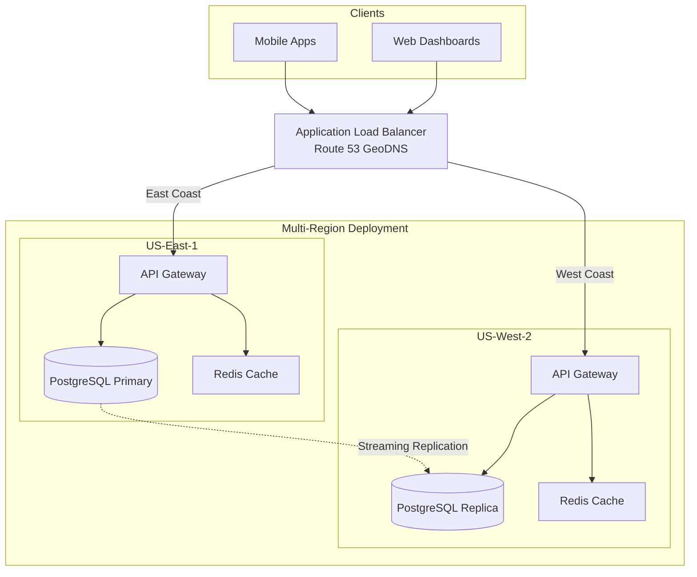

# Core Platform - Competitive Parity Technical PRD

## Document Metadata
- **Track**: Core Platform
- **Phase**: Competitive Parity (Phase 2)
- **Phase Timeline**: Months 5-7 (Weeks 17-28)
- **Version**: 1.0
- **Last Updated**: 2025-10-22
- **Authors**: Product & Engineering Team
- **Status**: Approved
- **Dependencies**: Core Platform MVP (PRD-CP-01-MVP.md) must be complete

---

## 1. Executive Summary

### 1.1 Phase Objectives

Phase 2 builds on the MVP foundation to achieve **competitive parity** with established players (Workyard, ClockShark). This phase adds cost code management, advanced project features, crew management, and performance optimizations to support 100 paying customers.

**Primary Goals:**
1. Scale to 100 customers with 5,000 concurrent users
2. Add cost code management system
3. Implement crew management and assignment
4. Support multi-region deployment (us-west-2)
5. Improve performance: 99.5% uptime, <150ms API latency (p95)

### 1.2 Key Deliverables

**Cost Code Management:**
- Company-level cost code library
- Project-specific custom codes
- Cost code categories and hierarchies
- Import/export cost codes
- Usage analytics

**Crew Management:**
- Create and manage crews
- Assign foreman and members
- Assign crews to projects
- Crew scheduling
- Crew performance tracking

**Advanced Project Features:**
- Project phases/milestones
- Sub-projects (for large jobs)
- Project templates
- Change order tracking
- Project documents (drawings, permits)

**Performance & Scalability:**
- Database read replicas
- API response caching improvements
- Query optimization
- Multi-region deployment (active-active)

**Admin Tools:**
- Bulk user import (CSV)
- Advanced permissions (custom roles)
- Audit trail (who changed what, when)
- System health dashboard

### 1.3 Success Criteria

**Technical KPIs:**
- API latency p95: <150ms (improved from 200ms)
- API latency p99: <300ms (improved from 500ms)
- Uptime SLA: 99.5% (improved from 99%)
- Support 5,000 concurrent users (5× increase)
- Database query time p95: <100ms (improved from 500ms)

**Business KPIs:**
- 100 paying customers (5× increase from MVP)
- $40K MRR
- Customer setup time: <2 hours (improved from 4 hours)
- Churn rate: <5% monthly
- Support tickets: <3 per customer/month (improved from 5)

**Quality Metrics:**
- Test coverage: 85% (improved from 80%)
- Zero critical bugs in production
- All APIs backward compatible (no breaking changes)

### 1.4 Timeline and Milestones

**Week 17-20: Cost Code Management**
- Cost code CRUD APIs
- Category and hierarchy support
- Project-specific custom codes
- Import/export functionality

**Week 21-24: Crew Management**
- Crew CRUD APIs
- Assignment logic (foreman, members, projects)
- Crew scheduling API
- Performance tracking integration

**Week 25-28: Performance & Scale**
- Database read replicas setup
- Multi-region deployment (us-west-2)
- Caching improvements
- Load testing (5,000 users)
- Query optimization

### 1.5 Changes from Previous Phase

**New Features:**
- Cost code management system
- Crew management system
- Project phases and milestones
- Advanced permissions (custom roles)
- Audit trail

**Performance Improvements:**
- 99.5% uptime (from 99%)
- <150ms p95 latency (from <200ms)
- 5,000 concurrent users (from 1,000)
- Multi-region deployment

**Infrastructure Changes:**
- PostgreSQL read replicas (3 replicas)
- Multi-region: us-west-2 (addition to us-east-1)
- Increased Redis memory (8GB from 4GB)
- Upgraded RDS instance (db.r5.large from db.t3.medium)

---

## 2. Architecture Overview

### 2.1 System Context Diagram



### 2.2 New Data Models

**Cost Codes:**
```sql
-- Enhanced cost codes table
CREATE TABLE cost_codes (
  id UUID PRIMARY KEY DEFAULT gen_random_uuid(),
  company_id UUID NOT NULL REFERENCES companies(id) ON DELETE CASCADE,
  code VARCHAR(50) NOT NULL,
  description VARCHAR(255) NOT NULL,
  category VARCHAR(100),
  parent_id UUID REFERENCES cost_codes(id),  -- NEW: Hierarchical codes
  rate DECIMAL(10,2),  -- NEW: Standard rate for this code
  active BOOLEAN DEFAULT TRUE,
  usage_count INT DEFAULT 0,  -- NEW: Track usage
  created_at TIMESTAMP DEFAULT NOW(),
  updated_at TIMESTAMP DEFAULT NOW(),
  UNIQUE(company_id, code)
);

-- Project-specific cost codes
CREATE TABLE project_cost_codes (
  id UUID PRIMARY KEY DEFAULT gen_random_uuid(),
  project_id UUID NOT NULL REFERENCES projects(id) ON DELETE CASCADE,
  cost_code_id UUID REFERENCES cost_codes(id),  -- Reference company code
  custom_code VARCHAR(50),  -- Or custom code for this project
  custom_description VARCHAR(255),
  rate DECIMAL(10,2),  -- Project-specific rate override
  budgeted_hours DECIMAL(8,2),
  created_at TIMESTAMP DEFAULT NOW(),
  UNIQUE(project_id, cost_code_id)
);
```

**Crews:**
```sql
CREATE TABLE crews (
  id UUID PRIMARY KEY DEFAULT gen_random_uuid(),
  name VARCHAR(255) NOT NULL,
  company_id UUID NOT NULL REFERENCES companies(id) ON DELETE CASCADE,
  foreman_id UUID NOT NULL REFERENCES users(id),
  description TEXT,
  active BOOLEAN DEFAULT TRUE,
  created_at TIMESTAMP DEFAULT NOW(),
  updated_at TIMESTAMP DEFAULT NOW()
);

CREATE TABLE crew_members (
  crew_id UUID NOT NULL REFERENCES crews(id) ON DELETE CASCADE,
  user_id UUID NOT NULL REFERENCES users(id) ON DELETE CASCADE,
  role VARCHAR(50) DEFAULT 'member',  -- 'member', 'lead', 'apprentice'
  joined_at TIMESTAMP DEFAULT NOW(),
  PRIMARY KEY (crew_id, user_id)
);

CREATE TABLE crew_assignments (
  id UUID PRIMARY KEY DEFAULT gen_random_uuid(),
  crew_id UUID NOT NULL REFERENCES crews(id) ON DELETE CASCADE,
  project_id UUID NOT NULL REFERENCES projects(id) ON DELETE CASCADE,
  start_date DATE NOT NULL,
  end_date DATE,
  status VARCHAR(50) DEFAULT 'active' CHECK (status IN ('active', 'completed', 'paused')),
  created_at TIMESTAMP DEFAULT NOW()
);

CREATE INDEX idx_crew_members_user_id ON crew_members(user_id);
CREATE INDEX idx_crew_assignments_project ON crew_assignments(project_id, status);
```

**Project Phases:**
```sql
CREATE TABLE project_phases (
  id UUID PRIMARY KEY DEFAULT gen_random_uuid(),
  project_id UUID NOT NULL REFERENCES projects(id) ON DELETE CASCADE,
  name VARCHAR(255) NOT NULL,
  description TEXT,
  sequence INT NOT NULL,  -- Order of phases
  start_date DATE,
  end_date DATE,
  budgeted_hours DECIMAL(8,2),
  status VARCHAR(50) DEFAULT 'pending' CHECK (status IN ('pending', 'active', 'completed')),
  created_at TIMESTAMP DEFAULT NOW(),
  updated_at TIMESTAMP DEFAULT NOW()
);

CREATE INDEX idx_project_phases_project ON project_phases(project_id, sequence);
```

**Audit Trail:**
```sql
CREATE TABLE audit_trail (
  id UUID PRIMARY KEY DEFAULT gen_random_uuid(),
  company_id UUID NOT NULL REFERENCES companies(id),
  user_id UUID REFERENCES users(id),
  entity_type VARCHAR(50) NOT NULL,  -- 'timecard', 'user', 'project', etc.
  entity_id UUID NOT NULL,
  action VARCHAR(50) NOT NULL,  -- 'created', 'updated', 'deleted', 'approved', etc.
  changes JSONB,  -- Before/after values
  ip_address INET,
  user_agent TEXT,
  created_at TIMESTAMP DEFAULT NOW()
);

CREATE INDEX idx_audit_trail_company ON audit_trail(company_id, created_at DESC);
CREATE INDEX idx_audit_trail_entity ON audit_trail(entity_type, entity_id);
CREATE INDEX idx_audit_trail_user ON audit_trail(user_id, created_at DESC);
```

---

## 3. Technical Requirements

### 3.1 New Functional Requirements

#### FR-11: Cost Code Library Management
**As an admin**, I want to manage a company-wide cost code library.

**Acceptance Criteria:**
- Create, update, delete cost codes
- Organize codes by category (e.g., "Electrical", "Plumbing", "Framing")
- Hierarchical codes (parent-child relationships)
- Set standard rates per cost code
- Track usage (how many timecards use each code)
- Deactivate codes (don't delete - preserve history)

**API Endpoints:**
```typescript
POST   /api/v1/cost-codes              // Create cost code
GET    /api/v1/cost-codes              // List with filters, categories
GET    /api/v1/cost-codes/:id          // Get by ID
PUT    /api/v1/cost-codes/:id          // Update
DELETE /api/v1/cost-codes/:id          // Soft delete (set active=false)
GET    /api/v1/cost-codes/usage        // Usage analytics
POST   /api/v1/cost-codes/import       // Bulk import from CSV
GET    /api/v1/cost-codes/export       // Export to CSV
```

#### FR-12: Crew Management
**As a project manager**, I want to create and manage crews.

**Acceptance Criteria:**
- Create crew with name and foreman
- Add/remove crew members
- Assign crew to multiple projects
- View crew schedule (which projects, when)
- Track crew productivity (from Intelligence Layer)
- Crew history (past assignments)

**API Endpoints:**
```typescript
POST   /api/v1/crews                   // Create crew
GET    /api/v1/crews                   // List crews
GET    /api/v1/crews/:id               // Get crew details
PUT    /api/v1/crews/:id               // Update crew
DELETE /api/v1/crews/:id               // Delete crew
POST   /api/v1/crews/:id/members       // Add member
DELETE /api/v1/crews/:id/members/:userId  // Remove member
POST   /api/v1/crews/:id/assign        // Assign to project
GET    /api/v1/crews/:id/schedule      // Get crew schedule
```

#### FR-13: Project Phases
**As a project manager**, I want to break projects into phases.

**Acceptance Criteria:**
- Define phases (e.g., "Foundation", "Rough-in", "Finish")
- Set sequence, dates, budgets per phase
- Track timecards against specific phase
- Phase completion status
- Budget vs. actual per phase

#### FR-14: Advanced Permissions (Custom Roles)
**As an owner**, I want to create custom roles beyond the 5 default roles.

**Acceptance Criteria:**
- Create custom role with specific permissions
- Assign permissions granularly (e.g., "can approve timecards but not edit projects")
- Role templates (start from existing role, customize)
- Assign custom roles to users
- Backward compatible with existing 5 roles

#### FR-15: Audit Trail
**As an owner**, I want to see who made changes to critical data.

**Acceptance Criteria:**
- Log all changes to: timecards, projects, users, cost codes
- Store: Who, What, When, Before/After values
- Searchable by entity, user, date range
- Export audit log to CSV
- Retain 2 years

**Audit Log Entry Example:**
```json
{
  "id": "audit-123",
  "companyId": "company-1",
  "userId": "user-456",
  "entityType": "timecard",
  "entityId": "timecard-789",
  "action": "approved",
  "changes": {
    "status": {"before": "submitted", "after": "approved"},
    "approvedBy": {"before": null, "after": "user-456"}
  },
  "ipAddress": "192.168.1.1",
  "userAgent": "Mozilla/5.0...",
  "createdAt": "2025-10-22T14:30:00Z"
}
```

### 3.2 Performance Requirements

**Updated Targets:**
- API latency p50: <50ms
- API latency p95: <150ms (improved from 200ms)
- API latency p99: <300ms (improved from 500ms)
- Database query time p95: <100ms (improved from 500ms)
- Cache hit rate: >85%
- Support 5,000 concurrent users (5× increase)

**Scalability Targets:**
- 100 companies
- 5,000 total users
- 250,000 time entries/day (5× increase)
- 100 requests/second average (10× increase)
- 500 requests/second peak

---

## 4. Performance Optimizations

### 4.1 Database Read Replicas

**Setup:**
- Primary (us-east-1): Write operations
- 3 Read Replicas: Read operations (queries, reports)
- Automatic failover if primary fails

**Query Routing:**
```typescript
import { PrismaClient } from '@prisma/client';

const primaryDB = new PrismaClient({
  datasources: {
    db: { url: process.env.DATABASE_PRIMARY_URL }
  }
});

const replicaDB = new PrismaClient({
  datasources: {
    db: { url: process.env.DATABASE_REPLICA_URL }
  }
});

// Write operations → Primary
async function createTimecard(data: TimecardInput) {
  return primaryDB.timecard.create({ data });
}

// Read operations → Replica
async function getTimecards(filters: TimecardFilters) {
  return replicaDB.timecard.findMany({ where: filters });
}
```

### 4.2 Multi-Region Deployment

**Architecture:**
- Active-Active: Both regions serve traffic
- Route 53 GeoDNS: Route to nearest region
- Database: Primary in us-east-1, streaming replication to us-west-2
- Redis: Per-region cache (eventually consistent)

**Latency Improvements:**
- East Coast users: <50ms (from us-east-1)
- West Coast users: <50ms (from us-west-2)
- Cross-region reads: <100ms

### 4.3 Enhanced Caching

**Cache Strategy:**
```typescript
// Multi-level cache: Redis (L1) + In-memory (L2)
import NodeCache from 'node-cache';

const memoryCache = new NodeCache({ stdTTL: 60 }); // 1 minute

async function getCachedData<T>(key: string, fetcher: () => Promise<T>): Promise<T> {
  // L2: Check in-memory cache
  const memoryCached = memoryCache.get<T>(key);
  if (memoryCached) return memoryCached;

  // L1: Check Redis
  const redisCached = await redis.get(key);
  if (redisCached) {
    const data = JSON.parse(redisCached);
    memoryCache.set(key, data);
    return data;
  }

  // Cache miss - fetch from DB
  const data = await fetcher();

  // Store in both caches
  await redis.setex(key, 300, JSON.stringify(data)); // 5 min
  memoryCache.set(key, data);

  return data;
}
```

---

## 5. Migration Strategy

### 5.1 Backward Compatibility

**API Versioning:**
- Maintain /api/v1 endpoints (no breaking changes)
- Add new endpoints for new features
- Deprecation warnings for old endpoints (6-month notice)

**Database Migrations:**
- Additive only (new tables, new columns with defaults)
- No column drops or renames in Phase 2
- Use views for complex migrations

---

## 6. Testing Strategy

### 6.1 Load Testing

**Targets:**
- 5,000 concurrent users
- 100 requests/second sustained
- 500 requests/second peak
- 99.5% success rate

**Load Test Scenario:**
```yaml
# artillery-load-test.yml
config:
  target: 'https://api.crewflow.com'
  phases:
    - duration: 300
      arrivalRate: 50  # Ramp to 50 req/sec
    - duration: 600
      arrivalRate: 100  # Sustained 100 req/sec
    - duration: 120
      arrivalRate: 500  # Peak 500 req/sec

scenarios:
  - name: Mixed workload
    weight: 70
    flow:
      - get:
          url: "/api/v1/timecards"
      - post:
          url: "/api/v1/timecards"
  - name: Dashboard load
    weight: 30
    flow:
      - get:
          url: "/api/v1/projects"
      - get:
          url: "/api/v1/users"
```

---

## 7. Success Metrics

| Metric | MVP Target | Phase 2 Target | Improvement |
|--------|-----------|----------------|-------------|
| Customers | 20 | 100 | 5× |
| Concurrent Users | 1,000 | 5,000 | 5× |
| API Latency p95 | <200ms | <150ms | 25% faster |
| Uptime | 99% | 99.5% | 0.5% |
| Time Entries/Day | 50,000 | 250,000 | 5× |

---

## 8. Risks & Mitigations

| Risk | Mitigation |
|------|------------|
| Multi-region complexity | Extensive testing, phased rollout, fallback to single region |
| Database replication lag | Monitor lag, alert if >5 seconds, read from primary if critical |
| Migration downtime | Zero-downtime migrations, blue-green deployment |
| Breaking API changes | Strict versioning policy, automated compatibility tests |

---

## 9. Open Questions

**Question**: Should cost codes support decimal precision (e.g., 0.5 hours)?
- **Decision by**: Week 18
- **Recommendation**: Yes, support 2 decimal places

**Question**: How many read replicas are needed?
- **Options**: 2, 3, or 5 replicas
- **Decision by**: Week 25
- **Recommendation**: Start with 3, scale to 5 if needed

---

## Appendix

### A. Revision History

| Version | Date | Author | Changes |
|---------|------|--------|---------|
| 1.0 | 2025-10-22 | Claude | Initial PRD for Core Platform Competitive Parity |

---

**End of PRD-CP-02-CompetitiveParity.md**

**Next PRD**: PRD-FO-02-CompetitiveParity.md
