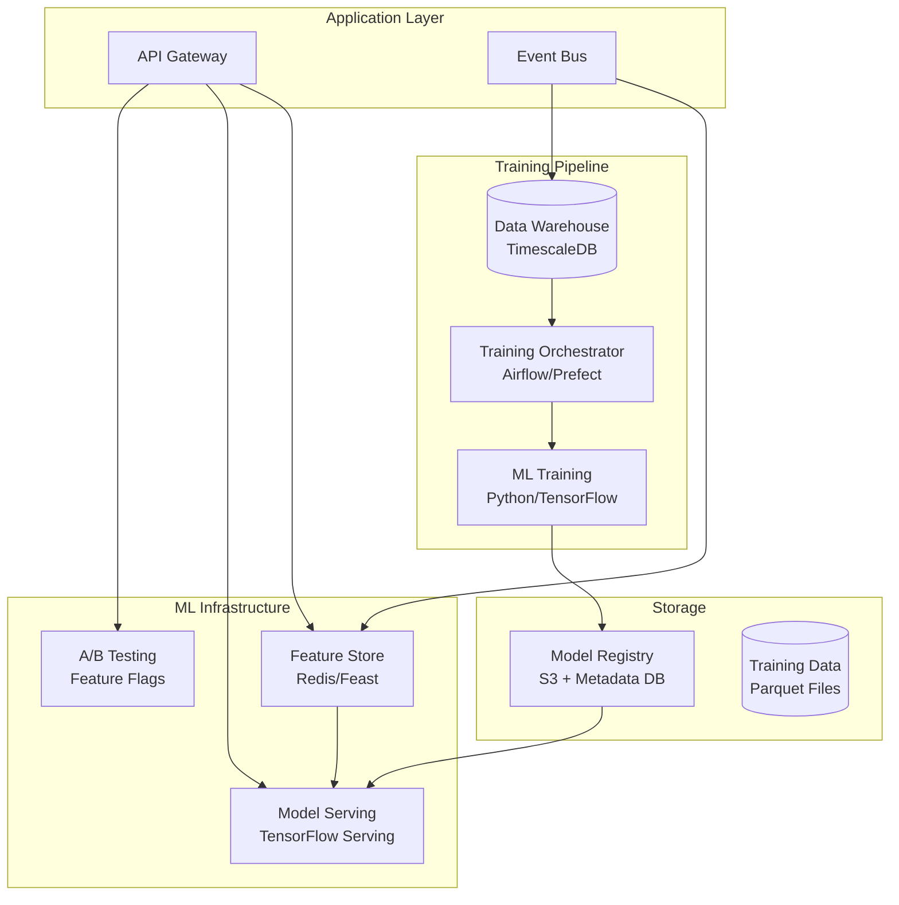

# Core Platform - AI Differentiation Technical PRD

## Document Metadata
- **Track**: Core Platform
- **Phase**: AI Differentiation (Phase 3)
- **Phase Timeline**: Months 8-10 (Weeks 29-40)
- **Version**: 1.0
- **Last Updated**: 2025-10-22
- **Status**: Approved
- **Dependencies**: Core Platform Phase 2, Intelligence Layer Phase 3 (ML infrastructure)

---

## 1. Executive Summary

### 1.1 Phase Objectives

Phase 3 establishes the infrastructure to support AI/ML features across the platform. Core Platform provides ML model serving, feature store, A/B testing framework, and enhanced data pipelines. This phase supports 200+ customers with 10,000 users while enabling predictive capabilities.

**Primary Goals:**
1. Build ML infrastructure (feature store, model serving, training pipelines)
2. Implement A/B testing framework for AI features
3. Support real-time ML inference (<500ms latency)
4. Scale to 200 customers, 10,000 users
5. Maintain 99.9% uptime

### 1.2 Key Deliverables

**ML Infrastructure:**
- Feature store (Feast or Redis-based)
- Model serving layer (TensorFlow Serving)
- Training pipeline orchestration
- Model versioning and rollback
- ML monitoring and observability

**Data Pipeline Enhancements:**
- Real-time feature computation
- ML-optimized data warehouse (denormalized views)
- Training data export tools
- Data quality monitoring

**A/B Testing Framework:**
- Feature flags for ML models
- Experiment tracking (which users see which model)
- Metrics collection per experiment
- Statistical significance testing
- Gradual rollout controls

**Performance & Scale:**
- 99.9% uptime (from 99.5%)
- <100ms API latency p95 (from <150ms)
- 10,000 concurrent users (from 5,000)
- Support 500,000 time entries/day (from 250,000)

### 1.3 Success Criteria

**Technical KPIs:**
- ML inference latency: <500ms p95
- Model training time: <4 hours (for weekly retraining)
- Feature store latency: <50ms p95
- API latency p95: <100ms
- Uptime: 99.9%

**Business KPIs:**
- 200 customers
- $80K MRR
- ML feature adoption: 60%+ of customers use at least 1 AI feature
- Customer satisfaction with AI: 8+/10

### 1.4 Timeline

**Week 29-32: ML Infrastructure Foundation**
- Feature store setup
- Model serving infrastructure
- Training pipeline (initial)

**Week 33-36: A/B Testing & Experimentation**
- Feature flag system
- Experiment tracking
- Metrics collection

**Week 37-40: Scale & Optimization**
- Performance tuning
- ML monitoring
- Support Intelligence Layer ML models

---

## 2. ML Infrastructure Architecture

### 2.1 System Architecture



### 2.2 Feature Store

**Purpose**: Store and serve features for ML models in real-time

**Technology Choice:**
- **Option 1**: Feast (open-source feature store) [RECOMMENDED]
- **Option 2**: Custom Redis-based implementation
- **Decision by**: Week 29

**Features to Store:**
```typescript
// Worker features (for crew optimization, productivity scoring)
interface WorkerFeatures {
  workerId: string;
  totalHoursLast30Days: number;
  avgHoursPerDay: number;
  projectCount: number;
  overtimePercentage: number;
  certificationCount: number;
  skillTags: string[];
  productivityScore: number;  // From historical data
}

// Project features (for budget prediction, crew matching)
interface ProjectFeatures {
  projectId: string;
  totalBudget: number;
  hoursRemaining: number;
  daysElapsed: number;
  crewCount: number;
  phaseCount: number;
  projectType: string;
  complexity: 'low' | 'medium' | 'high';
}

// Crew features (for chemistry analysis)
interface CrewFeatures {
  crewId: string;
  avgProductivity: number;
  projectsCompleted: number;
  memberTenure: number;  // Average days together
  skillDiversity: number;
  pastPerformance: number[];  // Historical scores
}
```

**Feature Store API:**
```typescript
import { FeatureStore } from '@feast-dev/feast';

const featureStore = new FeatureStore({
  repoPath: './feature_repo'
});

// Get features for inference
async function getWorkerFeatures(workerId: string): Promise<WorkerFeatures> {
  const features = await featureStore.getOnlineFeatures({
    features: [
      'worker_features:total_hours_last_30_days',
      'worker_features:avg_hours_per_day',
      'worker_features:overtime_percentage',
      'worker_features:productivity_score'
    ],
    entities: { worker_id: workerId }
  });

  return features.toDict();
}
```

### 2.3 Model Serving

**TensorFlow Serving Setup:**
```yaml
# docker-compose.yml
services:
  tf-serving:
    image: tensorflow/serving:latest
    ports:
      - "8501:8501"  # REST API
      - "8500:8500"  # gRPC
    volumes:
      - ./models:/models
    environment:
      - MODEL_NAME=crew_optimizer
      - MODEL_BASE_PATH=/models
    command:
      - --model_config_file=/models/model_config.txt
      - --model_config_file_poll_wait_seconds=60
```

**Inference API Wrapper:**
```typescript
import axios from 'axios';

class MLModelClient {
  private baseUrl = 'http://tf-serving:8501/v1/models';

  async predict(modelName: string, version: string, input: any) {
    const response = await axios.post(
      `${this.baseUrl}/${modelName}/versions/${version}:predict`,
      { instances: [input] },
      { timeout: 2000 }  // 2s timeout
    );

    return response.data.predictions[0];
  }

  async getModelMetadata(modelName: string, version: string) {
    const response = await axios.get(
      `${this.baseUrl}/${modelName}/versions/${version}/metadata`
    );

    return response.data;
  }
}

// Usage
const mlClient = new MLModelClient();

async function getCrewOptimizationSuggestion(projectId: string) {
  const projectFeatures = await getProjectFeatures(projectId);
  const availableCrews = await getAvailableCrews();

  const crewFeatures = await Promise.all(
    availableCrews.map(crew => getCrewFeatures(crew.id))
  );

  const prediction = await mlClient.predict('crew_optimizer', '1', {
    project_features: projectFeatures,
    crew_features: crewFeatures
  });

  return prediction;  // { recommended_crew_id: '...', confidence: 0.87 }
}
```

### 2.4 A/B Testing Framework

**Feature Flag System:**
```typescript
import { FeatureFlag } from './featureFlags';

interface Experiment {
  id: string;
  name: string;
  variants: {
    control: { weight: number };  // Existing behavior
    treatment: { weight: number };  // New ML model
  };
  targetAudience: {
    companyIds?: string[];
    userRoles?: string[];
    percentage?: number;  // Gradual rollout
  };
  metrics: string[];  // Which metrics to track
  startDate: Date;
  endDate: Date;
}

class ABTestingService {
  async getVariant(experimentId: string, userId: string): Promise<'control' | 'treatment'> {
    const experiment = await this.getExperiment(experimentId);

    // Check if user in target audience
    if (!this.isUserInAudience(userId, experiment.targetAudience)) {
      return 'control';
    }

    // Deterministic assignment (same user always gets same variant)
    const hash = hashCode(`${experimentId}:${userId}`);
    const bucket = hash % 100;

    if (bucket < experiment.variants.treatment.weight) {
      return 'treatment';
    }

    return 'control';
  }

  async trackMetric(experimentId: string, userId: string, metric: string, value: number) {
    const variant = await this.getVariant(experimentId, userId);

    await db.experimentMetrics.create({
      data: {
        experimentId,
        userId,
        variant,
        metric,
        value,
        timestamp: new Date()
      }
    });
  }
}

// Usage: Crew optimization with A/B test
async function suggestCrew(projectId: string, userId: string) {
  const variant = await abTest.getVariant('crew_optimization_v1', userId);

  if (variant === 'treatment') {
    // Use ML model
    const suggestion = await getCrewOptimizationSuggestion(projectId);
    await abTest.trackMetric('crew_optimization_v1', userId, 'suggestion_shown', 1);
    return suggestion;
  } else {
    // Use rule-based logic (control)
    const suggestion = await getRuleBasedCrewSuggestion(projectId);
    return suggestion;
  }
}
```

### 2.5 Training Pipeline

**Orchestration with Airflow (or Prefect):**
```python
from airflow import DAG
from airflow.operators.python import PythonOperator
from datetime import datetime, timedelta

default_args = {
    'owner': 'ml-team',
    'retries': 2,
    'retry_delay': timedelta(minutes=5)
}

dag = DAG(
    'crew_optimizer_training',
    default_args=default_args,
    description='Train crew optimization model weekly',
    schedule_interval='0 2 * * 0',  # Sunday 2am
    start_date=datetime(2025, 10, 22),
    catchup=False
)

def extract_training_data(**context):
    # Query TimescaleDB for last 6 months of data
    # Export to Parquet
    pass

def train_model(**context):
    # Load training data
    # Train TensorFlow model
    # Save model to S3
    # Register in model registry
    pass

def evaluate_model(**context):
    # Load test dataset
    # Evaluate model performance
    # Compare to previous version
    # Fail if worse than threshold
    pass

def deploy_model(**context):
    # Update TensorFlow Serving config
    # Gradual rollout (10% -> 50% -> 100%)
    pass

extract_task = PythonOperator(
    task_id='extract_training_data',
    python_callable=extract_training_data,
    dag=dag
)

train_task = PythonOperator(
    task_id='train_model',
    python_callable=train_model,
    dag=dag
)

evaluate_task = PythonOperator(
    task_id='evaluate_model',
    python_callable=evaluate_model,
    dag=dag
)

deploy_task = PythonOperator(
    task_id='deploy_model',
    python_callable=deploy_model,
    dag=dag
)

extract_task >> train_task >> evaluate_task >> deploy_task
```

---

## 3. Data Models

### 3.1 ML Model Registry

```sql
CREATE TABLE ml_models (
  id UUID PRIMARY KEY DEFAULT gen_random_uuid(),
  name VARCHAR(255) NOT NULL,  -- 'crew_optimizer', 'productivity_scorer', etc.
  version VARCHAR(50) NOT NULL,  -- '1.0', '1.1', etc.
  framework VARCHAR(50) NOT NULL,  -- 'tensorflow', 'scikit-learn', 'xgboost'
  s3_path VARCHAR(500) NOT NULL,  -- S3 location
  metrics JSONB,  -- Accuracy, precision, recall, etc.
  training_date TIMESTAMP NOT NULL,
  deployed BOOLEAN DEFAULT FALSE,
  deployed_at TIMESTAMP,
  status VARCHAR(50) DEFAULT 'trained' CHECK (status IN ('training', 'trained', 'deployed', 'archived')),
  created_at TIMESTAMP DEFAULT NOW(),
  UNIQUE(name, version)
);

-- Sample metrics JSONB:
-- {
--   "accuracy": 0.87,
--   "precision": 0.85,
--   "recall": 0.89,
--   "f1_score": 0.87,
--   "test_samples": 10000
-- }
```

### 3.2 Experiments & Metrics

```sql
CREATE TABLE experiments (
  id UUID PRIMARY KEY DEFAULT gen_random_uuid(),
  name VARCHAR(255) NOT NULL,
  description TEXT,
  model_id UUID REFERENCES ml_models(id),
  variants JSONB NOT NULL,  -- { control: { weight: 50 }, treatment: { weight: 50 } }
  target_audience JSONB,
  metrics_tracked TEXT[],
  start_date TIMESTAMP NOT NULL,
  end_date TIMESTAMP,
  status VARCHAR(50) DEFAULT 'draft' CHECK (status IN ('draft', 'running', 'completed', 'archived')),
  created_at TIMESTAMP DEFAULT NOW()
);

CREATE TABLE experiment_assignments (
  experiment_id UUID NOT NULL REFERENCES experiments(id),
  user_id UUID NOT NULL REFERENCES users(id),
  variant VARCHAR(50) NOT NULL,  -- 'control' or 'treatment'
  assigned_at TIMESTAMP DEFAULT NOW(),
  PRIMARY KEY (experiment_id, user_id)
);

CREATE TABLE experiment_metrics (
  id UUID PRIMARY KEY DEFAULT gen_random_uuid(),
  experiment_id UUID NOT NULL REFERENCES experiments(id),
  user_id UUID NOT NULL REFERENCES users(id),
  variant VARCHAR(50) NOT NULL,
  metric VARCHAR(100) NOT NULL,
  value DECIMAL(10,4),
  metadata JSONB,
  created_at TIMESTAMP DEFAULT NOW()
);

CREATE INDEX idx_experiment_metrics_experiment ON experiment_metrics(experiment_id, metric, variant);
```

---

## 4. Performance & Scale

### 4.1 ML Inference Performance

**Targets:**
- Inference latency p95: <500ms
- Inference latency p99: <1000ms
- Throughput: 50 inferences/second

**Optimization Strategies:**
- Model quantization (reduce model size)
- Batch inference (process multiple requests together)
- Caching predictions (for frequently requested items)
- Async inference (return immediately, callback with result)

**Caching Strategy:**
```typescript
// Cache ML predictions for frequently requested items
async function getPredictionWithCache(key: string, modelFn: () => Promise<any>) {
  const cached = await redis.get(`ml:prediction:${key}`);
  if (cached) return JSON.parse(cached);

  const prediction = await modelFn();

  // Cache for 1 hour
  await redis.setex(`ml:prediction:${key}`, 3600, JSON.stringify(prediction));

  return prediction;
}
```

### 4.2 Horizontal Scaling

**Scale Targets:**
- 200 companies
- 10,000 users
- 500,000 time entries/day
- 100 ML inferences/second

**Infrastructure:**
- 5 API servers (from 2)
- 5 database read replicas (from 3)
- 3 TensorFlow Serving instances (HA)
- Redis cluster (3 nodes, from single instance)

---

## 5. ML Monitoring & Observability

### 5.1 Model Performance Monitoring

**Metrics to Track:**
- Prediction latency (p50, p95, p99)
- Prediction accuracy (compared to actual outcomes)
- Model drift (feature distribution changes)
- Data quality (missing features, outliers)

**Alerting:**
```typescript
// Monitor model performance
async function checkModelPerformance(modelName: string) {
  const predictions = await getRecentPredictions(modelName, { hours: 24 });
  const actuals = await getActualOutcomes(predictions);

  const accuracy = calculateAccuracy(predictions, actuals);

  if (accuracy < 0.75) {
    await sendAlert({
      severity: 'high',
      message: `Model ${modelName} accuracy dropped to ${accuracy.toFixed(2)}`,
      action: 'Consider retraining model'
    });
  }
}
```

### 5.2 Feature Store Monitoring

**Metrics:**
- Feature store latency
- Feature staleness (time since last update)
- Missing features (% of requests with missing data)
- Feature distribution drift

---

## 6. Success Metrics

| Metric | Phase 2 | Phase 3 | Improvement |
|--------|---------|---------|-------------|
| Customers | 100 | 200 | 2× |
| Concurrent Users | 5,000 | 10,000 | 2× |
| API Latency p95 | <150ms | <100ms | 33% faster |
| Uptime | 99.5% | 99.9% | 0.4% |
| **NEW: ML Inference** | N/A | <500ms p95 | New capability |
| **NEW: AI Feature Adoption** | N/A | 60%+ | New metric |

---

## 7. Risks & Mitigations

| Risk | Mitigation |
|------|------------|
| ML model accuracy insufficient | Extensive testing, A/B testing, fallback to rule-based |
| Inference latency too high | Caching, model optimization, async inference |
| Training pipeline failures | Automated retries, monitoring, manual fallback |
| Model drift over time | Weekly retraining, drift detection, alerts |
| Feature store downtime | Graceful degradation, use cached features, fallback to simple model |

---

## 8. Open Questions

**Question**: Should we use Feast or build custom feature store?
- **Decision by**: Week 29
- **Recommendation**: Feast (proven, open-source, community support)

**Question**: How often should we retrain models?
- **Options**: Daily, weekly, monthly
- **Decision by**: Week 32
- **Recommendation**: Weekly (balance freshness vs. cost)

---

## Appendix

### A. ML Model Catalog (Phase 3)

| Model Name | Purpose | Algorithm | Input Features | Output |
|------------|---------|-----------|----------------|--------|
| crew_optimizer | Recommend best crew for project | Collaborative filtering | Project features, crew features | Crew ID + confidence |
| productivity_scorer | Score worker productivity | XGBoost | Worker features, timecard data | Score 0-100 |
| cost_code_suggester | Suggest cost code for timecard | NLP (GPT-4 API) | Project name, description | Top 3 cost codes |
| smart_duplication | Predict likely timecard | Pattern recognition | User history, day of week | Timecard suggestion + confidence |

### B. Revision History

| Version | Date | Author | Changes |
|---------|------|--------|---------|
| 1.0 | 2025-10-22 | Claude | Initial PRD for Core Platform AI Differentiation |

---

**End of PRD-CP-03-AIDifferentiation.md**
