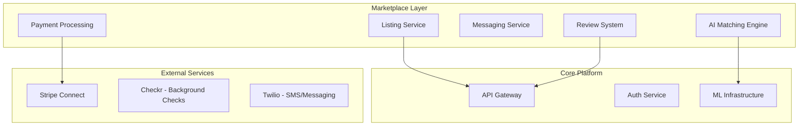

# Core Platform - Marketplace Technical PRD

## Document Metadata
- **Track**: Core Platform
- **Phase**: Marketplace (Phase 4)
- **Phase Timeline**: Months 11-14 (Weeks 41-56)
- **Version**: 1.0
- **Last Updated**: 2025-10-22
- **Status**: Approved
- **Dependencies**: Core Platform Phase 3 (ML infrastructure), All Phase 3 PRDs (AI features operational)

---

## 1. Executive Summary

### 1.1 Phase Objectives

Phase 4 launches the CrewFlow Marketplace - a two-sided platform connecting contractors with skilled workers, subcontractors, and equipment rentals. Built on advanced ML matching algorithms, the marketplace creates a network effect that differentiates CrewFlow from traditional workforce management tools.

**Primary Goals:**
1. Launch worker marketplace (contractors find workers)
2. Launch subcontractor marketplace (find specialized crews)
3. Equipment rental marketplace
4. AI-powered matching engine (95%+ match quality)
5. Scale to 500 customers, 25,000 users, 10,000 marketplace participants

### 1.2 Key Deliverables

**Worker Marketplace:**
- Worker profiles (skills, certifications, ratings, availability)
- Job posting system (contractors post openings)
- AI matching (rank workers by fit score)
- In-app messaging
- Background check integration
- Rating and review system

**Subcontractor Marketplace:**
- Subcontractor company profiles
- RFQ (Request for Quote) system
- Bid management
- License and insurance verification
- Performance tracking

**Equipment Rental Marketplace:**
- Equipment listings (excavators, lifts, tools)
- Availability calendar
- Pricing engine (hourly/daily/weekly rates)
- Delivery coordination
- Usage tracking

**AI Matching Engine:**
- Multi-factor scoring (skills, location, availability, past performance)
- Real-time ranking (<1s latency)
- Learning from hiring outcomes
- **95%+ match quality** (measured by hire rate + retention)

**Platform Economics:**
- Transaction fees: 10% on worker placements, 5% on subcontractor jobs, 8% on equipment
- Payment processing (Stripe Connect)
- Escrow for milestone payments
- Insurance verification

### 1.3 Success Criteria

**Technical KPIs:**
- Match quality score: 95%+
- Matching latency: <1 second
- Payment processing: 99.9% success rate
- Search response time: <200ms
- Platform uptime: 99.95%

**Business KPIs:**
- 500 customers (contractors)
- 10,000 marketplace participants (workers, subs, equipment owners)
- 1,000 placements per month
- $50K+ monthly marketplace revenue (transaction fees)
- NPS: 50+ (marketplace users)

### 1.4 Timeline

**Week 41-44**: Worker marketplace foundation
**Week 45-48**: AI matching engine, subcontractor marketplace
**Week 49-52**: Equipment marketplace, payment processing
**Week 53-56**: Network effects, optimization, launch

---

## 2. Marketplace Architecture

### 2.1 System Overview



### 2.2 Core Services

**Listing Service:**
```typescript
// Manages job postings, worker profiles, equipment listings

interface JobListing {
  id: string;
  contractor_id: string;
  title: string;
  description: string;

  requirements: {
    trade: string;  // 'electrician', 'plumber', etc.
    certifications: string[];  // ['OSHA-30', 'Journeyman']
    experience_years: number;
    skills: string[];
  };

  location: {
    address: string;
    latitude: number;
    longitude: number;
    radius_miles: number;  // Search radius
  };

  schedule: {
    start_date: Date;
    end_date?: Date;
    duration_days?: number;
    hours_per_day: number;
  };

  compensation: {
    pay_rate: number;
    pay_type: 'hourly' | 'daily' | 'project';
    overtime_rate?: number;
  };

  status: 'draft' | 'active' | 'filled' | 'expired' | 'cancelled';
  created_at: Date;
  expires_at: Date;
}

interface WorkerProfile {
  id: string;
  user_id: string;

  basics: {
    name: string;
    trade: string;
    experience_years: number;
    hourly_rate: number;
  };

  skills: string[];
  certifications: Certification[];

  availability: {
    status: 'available' | 'employed' | 'not_looking';
    available_date?: Date;
    preferred_schedule: 'full_time' | 'part_time' | 'contract';
  };

  location: {
    city: string;
    state: string;
    latitude: number;
    longitude: number;
    willing_to_travel_miles: number;
  };

  background_check: {
    status: 'pending' | 'clear' | 'review_required';
    completed_at?: Date;
    checkr_report_id?: string;
  };

  ratings: {
    average_rating: number;  // 0-5
    total_reviews: number;
    recent_jobs: number;
  };

  created_at: Date;
  updated_at: Date;
}
```

**Matching Service:**
```typescript
// AI-powered matching between jobs and workers

class MatchingEngine {
  async findMatches(
    jobListing: JobListing,
    options?: MatchOptions
  ): Promise<RankedMatch[]> {
    // 1. Filter workers by basic criteria
    const candidates = await this.filterCandidates(jobListing);

    // 2. Compute match scores using ML
    const scoredMatches = await this.scoreMatches(jobListing, candidates);

    // 3. Rank by score
    const ranked = scoredMatches.sort((a, b) => b.score - a.score);

    // 4. Return top N
    return ranked.slice(0, options?.limit || 20);
  }

  private async filterCandidates(job: JobListing): Promise<WorkerProfile[]> {
    return await db.worker_profiles.findMany({
      where: {
        // Must-have criteria
        'basics.trade': job.requirements.trade,
        'basics.experience_years': { gte: job.requirements.experience_years },
        'availability.status': { in: ['available', 'employed'] },

        // Location: within travel radius
        location: {
          distance: {
            from: job.location,
            lte: job.location.radius_miles
          }
        },

        // Background check
        'background_check.status': 'clear'
      }
    });
  }

  private async scoreMatches(
    job: JobListing,
    candidates: WorkerProfile[]
  ): Promise<ScoredMatch[]> {
    const mlClient = new MLClient();

    const features = candidates.map(worker => this.buildMatchFeatures(job, worker));

    const predictions = await mlClient.predictBatch('worker_matching', '1.0', {
      job_features: this.extractJobFeatures(job),
      worker_features: features
    });

    return candidates.map((worker, i) => ({
      worker,
      score: predictions[i].match_score,  // 0-1
      explanation: predictions[i].explanation,
      factors: predictions[i].ranking_factors
    }));
  }

  private buildMatchFeatures(job: JobListing, worker: WorkerProfile) {
    return {
      // Skill match
      skill_overlap: this.calculateSkillOverlap(job.requirements.skills, worker.skills),
      certification_match: job.requirements.certifications.every(c =>
        worker.certifications.some(wc => wc.type === c)
      ),

      // Location
      distance_miles: this.calculateDistance(job.location, worker.location),

      // Experience
      experience_gap: worker.basics.experience_years - job.requirements.experience_years,

      // Compensation match
      pay_match: this.calculatePayMatch(job.compensation.pay_rate, worker.basics.hourly_rate),

      // Historical performance
      avg_rating: worker.ratings.average_rating,
      completion_rate: await this.getCompletionRate(worker.id),

      // Availability
      days_until_available: this.daysBetween(new Date(), worker.availability.available_date)
    };
  }
}
```

**AI Matching Model:**
```python
import torch
import torch.nn as nn

class WorkerMatchingModel(nn.Module):
    """
    Neural network to score worker-job matches.

    Input: Combined job + worker features
    Output: Match score 0-1
    """
    def __init__(self, input_dim=50):
        super().__init__()

        self.network = nn.Sequential(
            nn.Linear(input_dim, 128),
            nn.ReLU(),
            nn.Dropout(0.2),
            nn.Linear(128, 64),
            nn.ReLU(),
            nn.Dropout(0.2),
            nn.Linear(64, 32),
            nn.ReLU(),
            nn.Linear(32, 1),
            nn.Sigmoid()  # Output: 0-1 match score
        )

    def forward(self, x):
        return self.network(x)

# Training on historical hiring data
def train_matching_model(historical_data):
    """
    Train on past job postings + worker applications + outcomes

    Positive samples: Worker was hired and completed job successfully
    Negative samples: Worker was not hired, or was hired but churned early
    """
    model = WorkerMatchingModel(input_dim=50)

    X = []  # Features: job + worker combination
    y = []  # Labels: 1 = successful hire, 0 = not hired or failed

    for sample in historical_data:
        features = extract_features(sample.job, sample.worker)
        label = 1 if sample.hired and sample.completed_successfully else 0

        X.append(features)
        y.append(label)

    # Train with weighted loss (positive samples are rare)
    criterion = nn.BCELoss()
    optimizer = torch.optim.Adam(model.parameters(), lr=0.001)

    # Training loop...

    return model
```

### 2.3 Payment Processing

**Stripe Connect Integration:**
```typescript
import Stripe from 'stripe';

class MarketplacePayments {
  private stripe: Stripe;

  async createConnectedAccount(userId: string, type: 'worker' | 'contractor'): Promise<string> {
    // Create Stripe Connect account
    const account = await this.stripe.accounts.create({
      type: 'express',  // Simplified onboarding
      country: 'US',
      email: await this.getUserEmail(userId),
      capabilities: {
        card_payments: { requested: true },
        transfers: { requested: true }
      }
    });

    // Store Stripe account ID
    await db.users.update({
      where: { id: userId },
      data: { stripe_account_id: account.id }
    });

    return account.id;
  }

  async createJobPayment(
    jobId: string,
    workerId: string,
    amount: number
  ): Promise<PaymentIntent> {
    const job = await this.getJob(jobId);
    const worker = await this.getWorker(workerId);

    // Platform fee: 10% on worker placements
    const platformFee = Math.round(amount * 0.10);
    const workerAmount = amount - platformFee;

    // Create payment intent with destination charge
    const paymentIntent = await this.stripe.paymentIntents.create({
      amount: Math.round(amount * 100),  // Convert to cents
      currency: 'usd',
      customer: job.contractor.stripe_customer_id,

      // Transfer to worker's connected account
      transfer_data: {
        destination: worker.stripe_account_id,
        amount: Math.round(workerAmount * 100)
      },

      // Platform keeps the fee
      application_fee_amount: Math.round(platformFee * 100),

      metadata: {
        job_id: jobId,
        worker_id: workerId,
        type: 'worker_placement'
      }
    });

    return paymentIntent;
  }

  async createMilestonePayment(
    subcontractorJobId: string,
    milestoneId: string,
    amount: number
  ): Promise<EscrowPayment> {
    // Hold payment in escrow until milestone approved
    const escrow = await db.escrow_payments.create({
      data: {
        subcontractor_job_id: subcontractorJobId,
        milestone_id: milestoneId,
        amount,
        status: 'held',
        created_at: new Date()
      }
    });

    // Charge contractor
    await this.stripe.paymentIntents.create({
      amount: Math.round(amount * 100),
      currency: 'usd',
      metadata: { escrow_id: escrow.id }
    });

    return escrow;
  }

  async releaseMilestonePayment(escrowId: string) {
    const escrow = await db.escrow_payments.findUnique({
      where: { id: escrowId },
      include: { subcontractor_job: true }
    });

    // Platform fee: 5% on subcontractor jobs
    const platformFee = Math.round(escrow.amount * 0.05);
    const subAmount = escrow.amount - platformFee;

    // Transfer to subcontractor
    await this.stripe.transfers.create({
      amount: Math.round(subAmount * 100),
      currency: 'usd',
      destination: escrow.subcontractor_job.subcontractor.stripe_account_id,
      metadata: { escrow_id: escrowId }
    });

    // Update escrow status
    await db.escrow_payments.update({
      where: { id: escrowId },
      data: { status: 'released', released_at: new Date() }
    });
  }
}
```

### 2.4 Review and Rating System

```typescript
interface Review {
  id: string;
  job_id: string;
  reviewer_id: string;  // Who wrote the review
  reviewee_id: string;  // Who is being reviewed
  reviewer_type: 'contractor' | 'worker' | 'subcontractor';

  rating: number;  // 1-5 stars

  categories: {
    quality: number;      // 1-5
    communication: number;
    reliability: number;
    professionalism: number;
  };

  comment: string;

  verified: boolean;  // Only users who completed job can review
  created_at: Date;
}

async function submitReview(review: Review): Promise<void> {
  // 1. Verify reviewer actually worked with reviewee
  const jobParticipation = await verifyJobParticipation(
    review.job_id,
    review.reviewer_id,
    review.reviewee_id
  );

  if (!jobParticipation) {
    throw new Error('Cannot review someone you did not work with');
  }

  // 2. Check for duplicate review
  const existing = await db.reviews.findFirst({
    where: {
      job_id: review.job_id,
      reviewer_id: review.reviewer_id,
      reviewee_id: review.reviewee_id
    }
  });

  if (existing) {
    throw new Error('You already reviewed this person for this job');
  }

  // 3. Create review
  await db.reviews.create({ data: review });

  // 4. Update aggregate ratings
  await updateAggregateRating(review.reviewee_id);

  // 5. Check for review quality (ML fraud detection)
  await detectFakeReview(review);
}

async function updateAggregateRating(userId: string) {
  const reviews = await db.reviews.findMany({
    where: { reviewee_id: userId }
  });

  const avgRating = reviews.reduce((sum, r) => sum + r.rating, 0) / reviews.length;

  await db.worker_profiles.update({
    where: { user_id: userId },
    data: {
      'ratings.average_rating': avgRating,
      'ratings.total_reviews': reviews.length
    }
  });
}
```

---

## 3. Database Schema

### 3.1 Marketplace Tables

```sql
-- Job listings (contractors post openings)
CREATE TABLE job_listings (
  id UUID PRIMARY KEY DEFAULT gen_random_uuid(),
  contractor_id UUID NOT NULL REFERENCES companies(id),
  posted_by_user_id UUID NOT NULL REFERENCES users(id),

  title VARCHAR(255) NOT NULL,
  description TEXT NOT NULL,

  trade VARCHAR(100) NOT NULL,
  required_certifications TEXT[],
  required_experience_years INTEGER,
  required_skills TEXT[],

  location_address TEXT NOT NULL,
  location_lat DECIMAL(10, 8) NOT NULL,
  location_lng DECIMAL(11, 8) NOT NULL,
  location_radius_miles INTEGER DEFAULT 25,

  start_date DATE NOT NULL,
  end_date DATE,
  duration_days INTEGER,
  hours_per_day DECIMAL(4,2),

  pay_rate DECIMAL(10,2) NOT NULL,
  pay_type VARCHAR(50) NOT NULL,  -- 'hourly', 'daily', 'project'

  status VARCHAR(50) DEFAULT 'active',  -- 'draft', 'active', 'filled', 'expired', 'cancelled'

  created_at TIMESTAMPTZ DEFAULT NOW(),
  updated_at TIMESTAMPTZ DEFAULT NOW(),
  expires_at TIMESTAMPTZ NOT NULL,

  -- Search optimization
  search_vector tsvector GENERATED ALWAYS AS (
    to_tsvector('english', title || ' ' || description || ' ' || trade)
  ) STORED
);

CREATE INDEX idx_job_listings_location ON job_listings USING GIST (
  ll_to_earth(location_lat, location_lng)
);

CREATE INDEX idx_job_listings_search ON job_listings USING GIN (search_vector);

CREATE INDEX idx_job_listings_status_created ON job_listings(status, created_at DESC);

-- Worker profiles (workers seeking jobs)
CREATE TABLE worker_profiles (
  id UUID PRIMARY KEY DEFAULT gen_random_uuid(),
  user_id UUID NOT NULL REFERENCES users(id) UNIQUE,

  trade VARCHAR(100) NOT NULL,
  experience_years INTEGER NOT NULL,
  hourly_rate DECIMAL(10,2),

  skills TEXT[],
  bio TEXT,

  availability_status VARCHAR(50) DEFAULT 'available',  -- 'available', 'employed', 'not_looking'
  available_date DATE,
  preferred_schedule VARCHAR(50),  -- 'full_time', 'part_time', 'contract'

  location_city VARCHAR(100),
  location_state VARCHAR(2),
  location_lat DECIMAL(10, 8),
  location_lng DECIMAL(11, 8),
  willing_to_travel_miles INTEGER DEFAULT 25,

  background_check_status VARCHAR(50),  -- 'pending', 'clear', 'review_required'
  background_check_completed_at TIMESTAMPTZ,
  checkr_report_id VARCHAR(255),

  avg_rating DECIMAL(3,2) DEFAULT 0.00,
  total_reviews INTEGER DEFAULT 0,
  total_jobs_completed INTEGER DEFAULT 0,

  created_at TIMESTAMPTZ DEFAULT NOW(),
  updated_at TIMESTAMPTZ DEFAULT NOW()
);

CREATE INDEX idx_worker_profiles_trade ON worker_profiles(trade);
CREATE INDEX idx_worker_profiles_location ON worker_profiles USING GIST (
  ll_to_earth(location_lat, location_lng)
);

-- Certifications
CREATE TABLE worker_certifications (
  id UUID PRIMARY KEY DEFAULT gen_random_uuid(),
  worker_profile_id UUID NOT NULL REFERENCES worker_profiles(id) ON DELETE CASCADE,

  certification_type VARCHAR(100) NOT NULL,  -- 'OSHA-30', 'Journeyman', 'Master Electrician'
  certification_number VARCHAR(255),
  issued_by VARCHAR(255),
  issued_date DATE,
  expiration_date DATE,

  verified BOOLEAN DEFAULT FALSE,
  verified_at TIMESTAMPTZ,

  created_at TIMESTAMPTZ DEFAULT NOW()
);

-- Job applications (workers apply to jobs)
CREATE TABLE job_applications (
  id UUID PRIMARY KEY DEFAULT gen_random_uuid(),
  job_listing_id UUID NOT NULL REFERENCES job_listings(id),
  worker_profile_id UUID NOT NULL REFERENCES worker_profiles(id),

  status VARCHAR(50) DEFAULT 'applied',  -- 'applied', 'viewed', 'shortlisted', 'interviewed', 'accepted', 'rejected', 'withdrawn'

  cover_letter TEXT,
  proposed_rate DECIMAL(10,2),  -- Worker can propose different rate

  match_score DECIMAL(5,4),  -- AI-generated match score
  match_explanation JSONB,    -- Why this is a good match

  applied_at TIMESTAMPTZ DEFAULT NOW(),
  updated_at TIMESTAMPTZ DEFAULT NOW(),

  UNIQUE(job_listing_id, worker_profile_id)
);

CREATE INDEX idx_job_applications_listing ON job_applications(job_listing_id, status);
CREATE INDEX idx_job_applications_worker ON job_applications(worker_profile_id, status);

-- Job placements (hired workers)
CREATE TABLE job_placements (
  id UUID PRIMARY KEY DEFAULT gen_random_uuid(),
  job_listing_id UUID NOT NULL REFERENCES job_listings(id),
  job_application_id UUID REFERENCES job_applications(id),
  worker_profile_id UUID NOT NULL REFERENCES worker_profiles(id),
  contractor_id UUID NOT NULL REFERENCES companies(id),

  start_date DATE NOT NULL,
  end_date DATE,
  hourly_rate DECIMAL(10,2) NOT NULL,

  status VARCHAR(50) DEFAULT 'active',  -- 'active', 'completed', 'terminated'

  payment_status VARCHAR(50) DEFAULT 'pending',  -- 'pending', 'processing', 'paid'
  total_hours DECIMAL(10,2),
  total_amount DECIMAL(12,2),
  platform_fee DECIMAL(12,2),

  created_at TIMESTAMPTZ DEFAULT NOW(),
  completed_at TIMESTAMPTZ,

  -- Link to actual timecards
  project_id UUID REFERENCES projects(id)
);

-- Reviews
CREATE TABLE marketplace_reviews (
  id UUID PRIMARY KEY DEFAULT gen_random_uuid(),
  job_placement_id UUID REFERENCES job_placements(id),

  reviewer_id UUID NOT NULL REFERENCES users(id),
  reviewee_id UUID NOT NULL REFERENCES users(id),
  reviewer_type VARCHAR(50) NOT NULL,  -- 'contractor', 'worker'

  rating INTEGER NOT NULL CHECK (rating >= 1 AND rating <= 5),

  quality_rating INTEGER CHECK (quality_rating >= 1 AND quality_rating <= 5),
  communication_rating INTEGER CHECK (communication_rating >= 1 AND communication_rating <= 5),
  reliability_rating INTEGER CHECK (reliability_rating >= 1 AND reliability_rating <= 5),
  professionalism_rating INTEGER CHECK (professionalism_rating >= 1 AND professionalism_rating <= 5),

  comment TEXT,

  verified BOOLEAN DEFAULT TRUE,  -- Verified they worked together
  flagged BOOLEAN DEFAULT FALSE,  -- Flagged for review (AI fraud detection)

  created_at TIMESTAMPTZ DEFAULT NOW(),

  UNIQUE(job_placement_id, reviewer_id)
);

CREATE INDEX idx_reviews_reviewee ON marketplace_reviews(reviewee_id, created_at DESC);

-- Subcontractor companies
CREATE TABLE subcontractor_profiles (
  id UUID PRIMARY KEY DEFAULT gen_random_uuid(),
  company_id UUID NOT NULL REFERENCES companies(id) UNIQUE,

  specialty VARCHAR(100) NOT NULL,  -- 'electrical', 'plumbing', 'HVAC', etc.
  services_offered TEXT[],

  crew_size_min INTEGER,
  crew_size_max INTEGER,

  service_radius_miles INTEGER,

  license_number VARCHAR(255),
  license_state VARCHAR(2),
  license_expiration DATE,

  insurance_general_liability DECIMAL(15,2),
  insurance_workers_comp BOOLEAN,
  insurance_expiration DATE,

  avg_rating DECIMAL(3,2) DEFAULT 0.00,
  total_reviews INTEGER DEFAULT 0,
  total_jobs_completed INTEGER DEFAULT 0,

  created_at TIMESTAMPTZ DEFAULT NOW(),
  updated_at TIMESTAMPTZ DEFAULT NOW()
);

-- RFQs (Request for Quotes)
CREATE TABLE rfqs (
  id UUID PRIMARY KEY DEFAULT gen_random_uuid(),
  contractor_id UUID NOT NULL REFERENCES companies(id),

  title VARCHAR(255) NOT NULL,
  description TEXT NOT NULL,
  scope_of_work TEXT NOT NULL,

  project_id UUID REFERENCES projects(id),

  trade VARCHAR(100) NOT NULL,
  required_licenses TEXT[],

  start_date DATE NOT NULL,
  estimated_duration_days INTEGER,

  budget_min DECIMAL(12,2),
  budget_max DECIMAL(12,2),

  status VARCHAR(50) DEFAULT 'open',  -- 'draft', 'open', 'closed', 'awarded', 'cancelled'

  created_at TIMESTAMPTZ DEFAULT NOW(),
  expires_at TIMESTAMPTZ NOT NULL
);

-- Bids on RFQs
CREATE TABLE rfq_bids (
  id UUID PRIMARY KEY DEFAULT gen_random_uuid(),
  rfq_id UUID NOT NULL REFERENCES rfqs(id),
  subcontractor_profile_id UUID NOT NULL REFERENCES subcontractor_profiles(id),

  bid_amount DECIMAL(12,2) NOT NULL,
  estimated_duration_days INTEGER,

  proposal TEXT NOT NULL,

  status VARCHAR(50) DEFAULT 'submitted',  -- 'submitted', 'shortlisted', 'accepted', 'rejected', 'withdrawn'

  submitted_at TIMESTAMPTZ DEFAULT NOW(),
  updated_at TIMESTAMPTZ DEFAULT NOW(),

  UNIQUE(rfq_id, subcontractor_profile_id)
);

-- Equipment listings
CREATE TABLE equipment_listings (
  id UUID PRIMARY KEY DEFAULT gen_random_uuid(),
  owner_company_id UUID NOT NULL REFERENCES companies(id),

  equipment_type VARCHAR(100) NOT NULL,  -- 'excavator', 'boom_lift', 'compressor', etc.
  make VARCHAR(100),
  model VARCHAR(100),
  year INTEGER,

  description TEXT,
  photos TEXT[],

  location_address TEXT,
  location_lat DECIMAL(10, 8),
  location_lng DECIMAL(11, 8),

  hourly_rate DECIMAL(10,2),
  daily_rate DECIMAL(10,2),
  weekly_rate DECIMAL(10,2),

  delivery_available BOOLEAN DEFAULT FALSE,
  delivery_fee DECIMAL(10,2),

  status VARCHAR(50) DEFAULT 'available',  -- 'available', 'rented', 'maintenance', 'inactive'

  created_at TIMESTAMPTZ DEFAULT NOW(),
  updated_at TIMESTAMPTZ DEFAULT NOW()
);

-- Equipment rentals
CREATE TABLE equipment_rentals (
  id UUID PRIMARY KEY DEFAULT gen_random_uuid(),
  equipment_listing_id UUID NOT NULL REFERENCES equipment_listings(id),
  renter_company_id UUID NOT NULL REFERENCES companies(id),

  start_date DATE NOT NULL,
  end_date DATE NOT NULL,

  rental_rate DECIMAL(10,2) NOT NULL,
  rental_period VARCHAR(50) NOT NULL,  -- 'hourly', 'daily', 'weekly'

  delivery_requested BOOLEAN DEFAULT FALSE,
  delivery_address TEXT,

  total_amount DECIMAL(12,2),
  platform_fee DECIMAL(12,2),

  status VARCHAR(50) DEFAULT 'pending',  -- 'pending', 'confirmed', 'active', 'completed', 'cancelled'

  created_at TIMESTAMPTZ DEFAULT NOW()
);
```

---

## 4. Network Effects & Growth

### 4.1 Viral Loop

```typescript
// Referral system to grow both sides of marketplace

interface ReferralProgram {
  // Contractors invite workers
  contractor_invites_worker: {
    incentive_contractor: '$50 credit after worker completes first job';
    incentive_worker: '$25 signup bonus';
  };

  // Workers invite workers
  worker_invites_worker: {
    incentive_referrer: '$25 after referee completes first job';
    incentive_referee: '$25 signup bonus';
  };

  // Contractors invite contractors
  contractor_invites_contractor: {
    incentive_referrer: '$100 credit after referee hires first worker';
    incentive_referee: '$100 credit';
  };
}

async function trackReferral(referrerId: string, refereeEmail: string, type: string) {
  await db.referrals.create({
    data: {
      referrer_id: referrerId,
      referee_email: refereeEmail,
      referral_type: type,
      status: 'pending',
      created_at: new Date()
    }
  });

  // Send invite email
  await sendReferralEmail(refereeEmail, referrerId);
}

async function processReferralReward(referralId: string) {
  const referral = await db.referrals.findUnique({
    where: { id: referralId },
    include: { referrer: true, referee: true }
  });

  // Credit both parties
  await creditAccount(referral.referrer_id, 50.00, 'Referral bonus');
  await creditAccount(referral.referee_id, 25.00, 'Signup bonus');

  // Update referral status
  await db.referrals.update({
    where: { id: referralId },
    data: { status: 'rewarded', rewarded_at: new Date() }
  });
}
```

### 4.2 Marketplace Liquidity Metrics

```typescript
// Track marketplace health

interface MarketplaceLiquidity {
  supply: {
    active_workers: number;
    workers_by_trade: Record<string, number>;
    avg_response_time_hours: number;
  };

  demand: {
    active_jobs: number;
    jobs_by_trade: Record<string, number>;
    avg_time_to_fill_days: number;
  };

  transaction_velocity: {
    placements_per_week: number;
    avg_placement_value: number;
    fill_rate: number;  // % of jobs that get filled
  };

  quality: {
    avg_match_score: number;
    avg_rating: number;
    completion_rate: number;  // % of placements that complete successfully
  };
}

async function calculateMarketplaceLiquidity(): Promise<MarketplaceLiquidity> {
  // Calculate all metrics
  const metrics = {
    supply: await calculateSupplyMetrics(),
    demand: await calculateDemandMetrics(),
    transaction_velocity: await calculateVelocity(),
    quality: await calculateQuality()
  };

  // Alert if liquidity drops
  if (metrics.demand.active_jobs > metrics.supply.active_workers * 3) {
    await sendAlert({
      type: 'low_supply',
      message: `Worker supply low: ${metrics.supply.active_workers} workers, ${metrics.demand.active_jobs} jobs`
    });
  }

  return metrics;
}
```

---

## 5. Success Metrics

| Metric | Phase 3 | Phase 4 | Improvement |
|--------|---------|---------|-------------|
| Customers | 200 | 500 | 2.5× |
| Total Users | 10,000 | 25,000 | 2.5× |
| Marketplace Participants | 0 | 10,000 | New |
| Monthly Placements | 0 | 1,000 | New |
| Marketplace Revenue | $0 | $50K/mo | New revenue stream |
| Match Quality | N/A | 95%+ | New capability |

---

## 6. Risks & Mitigations

| Risk | Mitigation |
|------|------------|
| Chicken-and-egg (need both supply and demand) | Seed with existing CrewFlow workers, incentivize early adopters |
| Bad actors (fraud, fake reviews) | Background checks, review fraud detection ML, verified badges |
| Payment disputes | Escrow system, clear terms, dispute resolution process |
| Regulatory compliance (employment classification) | Workers are independent contractors, clear terms, legal review |
| Competition from established platforms (Indeed, ZipRecruiter) | Construction-specific, integrated with existing CrewFlow workflows |

---

## Appendix

### A. Marketplace Economics

**Revenue Model:**
- Worker placements: 10% transaction fee
- Subcontractor jobs: 5% transaction fee
- Equipment rentals: 8% transaction fee

**Projected Monthly Revenue (Month 14):**
- 1,000 worker placements × $3,000 avg × 10% = $300K
- 100 subcontractor jobs × $25,000 avg × 5% = $125K
- 200 equipment rentals × $500 avg × 8% = $8K
- **Total: $433K/month gross marketplace revenue**

**After payment processing fees (2.9% + $0.30):**
- Net revenue: ~$420K/month

### B. Go-to-Market Strategy

**Phase 1 (Week 41-44): Worker Marketplace Soft Launch**
- Invite 100 top-rated workers from existing customer base
- 10 pilot contractors post jobs
- Validate matching algorithm

**Phase 2 (Week 45-48): Public Launch**
- Open to all CrewFlow customers
- PR campaign, industry press
- Referral program launch

**Phase 3 (Week 49-52): Expansion**
- Subcontractor marketplace launch
- Equipment rentals launch
- Geographic expansion

**Phase 4 (Week 53-56): Optimization**
- Network effects kicking in
- Liquidity improvements
- Scale operations

### C. Revision History

| Version | Date | Author | Changes |
|---------|------|--------|---------|
| 1.0 | 2025-10-22 | Claude | Initial PRD for Core Platform Marketplace |

---

**End of PRD-CP-04-Marketplace.md**
